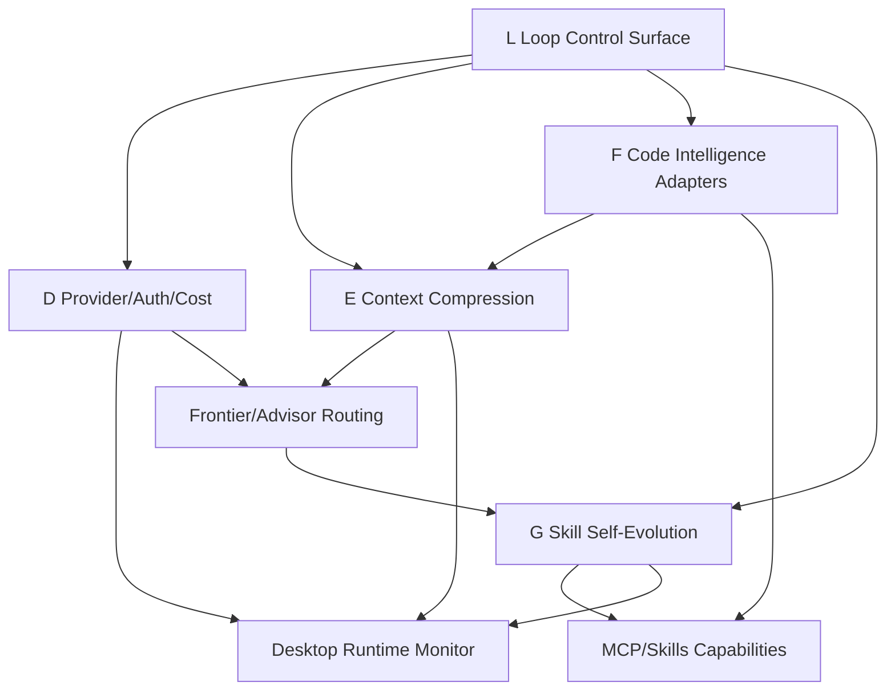
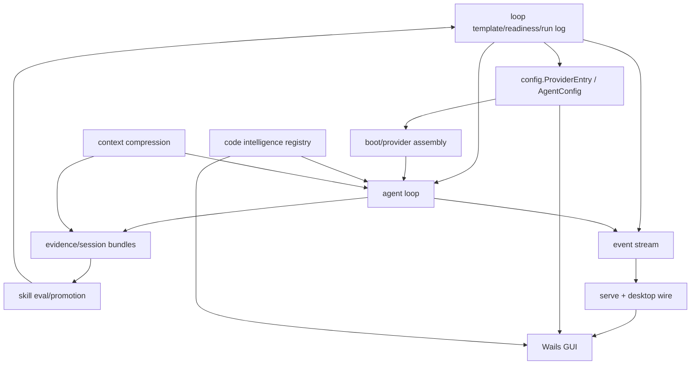

# Maddog 外部四组方案增强开发计划

## 概述

本计划把 `research/github-stars-sekkit-2026-06-27/analysis.md` 中筛出的四组方案转成 Maddog 下一轮可执行开发工作。它不是替换 `docs/cc/maddog-fusion--3949/plan.md`，而是在原有 Reasonix × tinyctx 融合基础上继续增强：

1. **Provider/auth/成本组合**：借鉴 LiteLLM、CodexBar、goose，补齐 provider profile、official auth/API key/icodeeasy、中转、预算、状态与成本可见性。
2. **Context 组合**：借鉴 Headroom、rtk、context-mode、Dirac，补齐 tool output 压缩、shell 输出过滤、raw data 外置、上下文节省指标。
3. **Code intelligence 组合**：借鉴 codebase-memory-mcp、Serena、claude-context、CodeGraph，补齐可插拔 code intelligence 后端和 MCP 评测。
4. **Skill 自进化组合**：借鉴 SkillOpt、skills-manage、open-code-review，补齐 replay eval、skill 版本晋升、GUI 管理与规则/LLM 混合 review。
5. **Loop 治理底座**：借鉴 loop-engineering 的 template registry、readiness audit、budget/run log、maker-checker，把四组方案收束到可启动、可中止、可审计的执行闭环。

当前 Maddog 已有 provider registry、frontier/advisor、dynamic skill、MCP/skills drawer、CodeGraph、memory suggestions、runtime event stream、Wails desktop。计划重点是把这些能力从“可用”推进到“可配置、可观测、可评测、可治理”。

## 问题框架

原融合方案已经锁定单体架构：以 Reasonix Go kernel + Wails desktop 为基座，移植 tinyctx 的智能机制，不引入 Python proxy 到请求路径。外部星标项目调研进一步说明，Maddog 最缺的不是另一个 agent host，而是四类工程化能力：

- Provider 能力需要完整呈现在 GUI 中，并把 frontier/小模型/官方 auth/API key/中转/预算统一成一个 profile 模型。
- Context 优化需要进入 agent loop 和 tool result 路径，否则只靠 `/compact` 无法控制长任务中 shell/log/RAG 输出膨胀。
- Code intelligence 需要可选后端和评测，不应只依赖单一 CodeGraph 实现。
- Skill 自进化需要可回放证据、验证门禁和桌面管理，否则 dynamic skill 只能停留在运行时临时提示。
- Loop 执行需要运行前 readiness、运行中预算/kill/human gate、运行后 report，否则四组增强会变成分散功能，用户无法判断真实任务是否安全 working。

## 需求追溯

- R1. 保持单体 Maddog app；不引入外部 CLI host 或 Python provider proxy 到主请求路径。
- R2. Frontier、小模型、后台页面、provider/auth/预算状态必须能在 desktop GUI 中配置和显示。
- R3. OpenAI、Anthropic、icodeeasy/OpenAI-compatible、official auth/API key 必须走同一 provider profile 与可观测事件模型。
- R4. Tool output、shell/test/log/code search 输出需要可配置压缩与 token delta 统计，不能破坏 provider cache 前缀稳定性。
- R5. Code intelligence 后端必须可插拔、可健康检查、可评测，并能在 MCP/Skills 管理页显示状态。
- R6. Skill 自进化必须基于 evidence/session replay、guardrail、held-out eval 和人工可见的 promotion 记录。
- R7. 所有新增能力都要有 CLI/headless 与 desktop 两面行为一致性，至少通过 event/wire contract 保证。
- R8. 每个真实任务必须能绑定 loop template，启动前生成 readiness result，运行中记录 budget/run log、human gate、maker-checker verdict，结束后生成 run report。
- R9. Loop/run 日志、replay bundle、desktop snapshot 必须使用 Maddog 存储目录和命名，不再出现 Reasonix 目录或产品名漂移。
- R10. Run log、replay、raw output、export、event payload 必须统一通过共享 sanitizer/redaction 模块，禁止各路径自行实现脱敏。
- R11. MCP/code backend 权限必须落成 capability/risk enum，并由 readiness 检查 template requirement 与当前授权是否匹配。

## 范围边界

- 不迁移到 LiteLLM/Goose/OpenHands/DeepAgents 等外部 agent framework。
- 不把 Headroom/rtk/context-mode 作为强制 sidecar；优先移植策略接口与本地实现。
- 不把 codebase-memory-mcp/Serena/claude-context 变成默认必需依赖；作为 optional backend 或 benchmark reference。
- 不做在线自我改写；skill promotion 必须经 replay eval 和 guardrail。
- 不把 official auth 凭证明文写入 TOML；继续通过环境变量、系统凭据或 provider auth store 解引用。
- 不直接移植 loop-engineering 的 CLI、Grok `/loop` 语义或外部 agent host；只吸收 template/readiness/run-log/budget/human-gate/maker-checker 模式。

## 上下文与研究

### 相关代码与模式

- `DeepSeek-Reasonix/internal/config/config.go`：provider、agent、desktop、codegraph、MCP、skills 配置模型。
- `DeepSeek-Reasonix/internal/provider/provider.go` 与 `DeepSeek-Reasonix/internal/provider/auth.go`：provider abstraction、auth config、request contract。
- `DeepSeek-Reasonix/internal/provider/openai/` 与 `DeepSeek-Reasonix/internal/provider/anthropic/`：OpenAI-compatible 与 Anthropic native provider。
- `DeepSeek-Reasonix/internal/agent/agent.go`、`DeepSeek-Reasonix/internal/agent/upgrade.go`：agent loop、frontier/advisor 路由。
- `DeepSeek-Reasonix/internal/evidence/`：tool receipts、failure signal、readiness。
- `DeepSeek-Reasonix/internal/control/controller.go`：controller、slash commands、MCP/runtime wiring、tool result query。
- `DeepSeek-Reasonix/internal/codegraph/`：内置 CodeGraph lifecycle。
- `DeepSeek-Reasonix/internal/skill/`：dynamic skill generation、validator、store injection。
- `DeepSeek-Reasonix/internal/serve/wire.go` 与 `DeepSeek-Reasonix/desktop/wire.go`：event 到 GUI 的 wire contract。
- `DeepSeek-Reasonix/desktop/app.go`：Settings、Capabilities、Models、Balance、ContextUsage、MCP/Skill 管理绑定。
- `DeepSeek-Reasonix/desktop/frontend/src/components/SettingsPanel.tsx`：模型、provider、auth、官方 provider 的 GUI 主入口。
- `DeepSeek-Reasonix/desktop/frontend/src/components/CapabilitiesPanel.tsx`：MCP 与 Skills 管理页。
- `DeepSeek-Reasonix/desktop/frontend/src/components/MemoryPanel.tsx`：memory/skill suggestions 的 GUI 参考。
- `DeepSeek-Reasonix/desktop/frontend/src/components/StatusBar.tsx`：token/context/cost/status 显示模式。

### 外部参考资料

- `research/github-stars-sekkit-2026-06-27/analysis.md`
- `research/github-stars-sekkit-2026-06-27/readmes/BerriAI__litellm.md`
- `research/github-stars-sekkit-2026-06-27/readmes/steipete__CodexBar.md`
- `research/github-stars-sekkit-2026-06-27/readmes/aaif-goose__goose.md`
- `research/github-stars-sekkit-2026-06-27/readmes/headroomlabs-ai__headroom.md`
- `research/github-stars-sekkit-2026-06-27/readmes/rtk-ai__rtk.md`
- `research/github-stars-sekkit-2026-06-27/readmes/mksglu__context-mode.md`
- `research/github-stars-sekkit-2026-06-27/readmes/dirac-run__dirac.md`
- `research/github-stars-sekkit-2026-06-27/readmes/DeusData__codebase-memory-mcp.md`
- `research/github-stars-sekkit-2026-06-27/readmes/oraios__serena.md`
- `research/github-stars-sekkit-2026-06-27/readmes/zilliztech__claude-context.md`
- `research/github-stars-sekkit-2026-06-27/readmes/microsoft__SkillOpt.md`
- `research/github-stars-sekkit-2026-06-27/readmes/iamzhihuix__skills-manage.md`
- `research/github-stars-sekkit-2026-06-27/readmes/alibaba__open-code-review.md`
- `https://github.com/cobusgreyling/loop-engineering`
- `https://github.com/cobusgreyling/loop-engineering/blob/main/docs/primitives.md`
- `https://github.com/cobusgreyling/loop-engineering/blob/main/docs/loop-design-checklist.md`
- `https://github.com/cobusgreyling/loop-engineering/blob/main/patterns/registry.yaml`
- `docs/cc/maddog-fusion--3949/external-candidate-review-2026-06-28.md`
- `https://github.com/PabloNAX/ultracode-skill`
- `https://github.com/pat-jj/harness-1`
- `https://github.com/microsoft/fastcontext`
- `https://github.com/alibaba/zvec`
- `https://github.com/ryoiki-tokuiten/Iterative-Contextual-Refinements`

### 新增候选方案专家评审 - 2026-06-28

本轮补充评审了 `PabloNAX/ultracode-skill`、`pat-jj/harness-1`、`microsoft/fastcontext`、`alibaba/zvec`、`ryoiki-tokuiten/Iterative-Contextual-Refinements`。专家组结论是：这些 repo 对 Maddog 有参考价值，但不应直接成为 v1 runtime 依赖，也不应新增第五条主开发线。

整体取舍：

- **FastContext**：最高价值。吸收 repo explorer、compact exploration trace、file-line citation、citation benchmark 思路；落到 `F1/F2/F3` 的 code intelligence adapter 与 benchmark，后续新增 `F4` 做 FastContext-style explorer benchmark。v1 不直接嵌入 Python runner。
- **zvec**：可作为本地 vector/hybrid store 候选。后续新增 `F5` spike 验证 dense/sparse/FTS/hybrid、WAL、Windows packaging、index migration、并发写入与 embedding pipeline；不作为 v1 默认依赖。
- **ultracode-skill**：参考 task packet、bounded fan-out、delegation artifact、integration checklist、final verification artifact。后续新增 `L5` 做 workflow artifact review；不复制外部 skill prompt 或 `.workflow` runtime。
- **harness-1**：参考 long-horizon eval harness、candidate docs、verification records、budget-aware context、action/observation trajectories。后续新增 `G5` 做 eval harness research；不引入训练、vLLM、CUDA 或模型服务栈。
- **Iterative-Contextual-Refinements**：参考 BFS/DFS、hypothesis、critique/correction、final judge isolation。后续新增 `L3b` 做 iterative refinement strategy templates；默认 off，受 budget、kill switch、human gate 控制。

因此，当前执行顺序仍保持：

`L0 -> D1 -> L1 -> D3 -> L2 -> E1 -> E2 -> E3 -> F1 -> F2 -> F3 -> G1 -> G2 -> G3 -> G4 -> L3 -> D2 -> L4`

新增候选任务均为 post-mainline 或对应方向的后续 spike，不阻塞 provider/auth、readiness、budget、context compression、skill promotion 和 desktop loop surface。

当前落地状态：

- `F4` 已完成：benchmark 增加 citation precision 与 compact exploration trace，并在 GUI 摘要中显示 citation quality。
- `F5` 已完成：zvec 保持 default-off optional candidate，doctor 暴露 hybrid-store 风险检查。
- `L5` 已完成：workflow template 增加 Maddog-native artifact contract 与 run report mapping。
- `G5` 已完成：skilleval/replay 增加 long-horizon harness proposal，不引入训练或 serving 栈。
- `L3b` 已完成：iterative refinement strategy 默认关闭，受预算、kill switch 和人工审批控制。

## 关键技术决策

- **D1. Provider profile 是核心数据模型**：把 provider kind、auth mode、base URL、frontier role、small-model role、budget/status/usage 统一投影到 GUI；底层仍复用 `ProviderEntry`，避免迁移配置格式。
- **D2. Provider observability 走 event + desktop snapshot 双路径**：运行中事件用于 transcript/status，Settings snapshot 用于配置页静态展示。
- **E1. Context 压缩插在 tool result 进入 model 前**：保留完整 raw output 可查询，给模型的是压缩后内容，避免污染长期 message log 和 provider cache。
- **E2. 压缩策略先规则化，后 LLM 化**：v1 用 deterministic compressor 处理 shell/log/test/RAG 输出，避免引入额外 provider 调用和不稳定延迟。
- **F1. Code intelligence 先做 adapter 与 benchmark，不立刻替换内置 CodeGraph**：外部 MCP 后端作为可选能力，评测后再决定默认策略。
- **G1. Skill 自进化必须离线治理**：candidate skill 只能进入 pending/promoted/rejected 生命周期，不能直接覆盖 active skill。
- **G2. Desktop GUI 以管理面板为主，不新增 landing page**：provider/model/auth 在 Settings；MCP/code intelligence/skills 在 Capabilities；runtime metrics 在 StatusBar/Transcript。
- **L1. Loop template 是四组方案的公共执行元模型**：新增 `LoopTemplateV1`、`LoopRun`、`ReadinessResult`、`HumanGate`、`MakerCheckerMode`，先做只读 registry + readiness evaluator，不急着做复杂 scheduler。
- **L2. Readiness audit 是 pre-run gate**：缺 provider、credential、预算、log sink、kill switch、human gate policy、必需 skill/MCP/code backend 时必须阻塞或明确要求人工确认。
- **L3. Budget/run log 是硬约束和审计账本**：frontier、advisor、dynamic skill generation、replay judge 均纳入 loop/session budget ledger；预算超限后禁止继续发 frontier 请求。
- **L4. Maker-checker 不是 advisor**：v1 checker 作为 read-only gate，可要求人工决策或 maker 重做；checker verdict 不通过时任务不能静默标记 done。
- **S1. Redaction/sanitizer 是共享安全模块**：provider headers、Authorization、API key、OAuth token、icodeeasy token、dotenv、raw tool output、replay bundle、run log/export 都必须走同一套 sanitizer。
- **S2. MCP capability/risk enum 是 readiness 输入**：至少定义 `read`, `write`, `network`, `git`, `credential`, `process`，template 声明 required capabilities，当前授权不匹配时 blocked 或 needs_approval。

## 高层技术设计

> *这里展示的是预期方案的方向性指导，供 review 参考，不是实现规格。执行 agent 应把它当作上下文，而非要复制的代码。*

## 分阶段交付

| 阶段 | 交付目标 | 可独立上线条件 |
|---|---|---|
| L | Loop 元模型、readiness、run log、maker-checker 基础 | `coding-task` 模板能做 pre-run readiness，运行后留下 run report；GUI 能显示 loop 状态 |
| D | Provider/auth/成本 GUI 与事件模型 | 不改变 provider 请求语义；Settings 能显示和保存 profile；status 能展示预算/usage |
| E | Tool output 压缩与 token delta | 压缩可关闭；raw output 可查询；压缩事件可见 |
| F | Code intelligence adapter/benchmark | 内置 CodeGraph 不回退；外部后端失败可降级 |
| G | Skill replay eval 与 promotion GUI | 没有通过 guardrail 的 skill 不会进入 active store |

## 实现单元

- [x] **单元 L0：LoopTemplateV1 schema 与内置模板 registry**

**目标：** 把 loop-engineering 的 template registry 思路转成 Maddog 自有 schema，作为 D/E/F/G 四组方案的公共执行元模型。

**需求：** R2, R7, R8, R9

**依赖：** 无

**文件：**
- 新建：`DeepSeek-Reasonix/internal/loop/template.go`
- 新建：`DeepSeek-Reasonix/internal/loop/registry.go`
- 新建：`DeepSeek-Reasonix/internal/loop/registry_test.go`
- 修改：`DeepSeek-Reasonix/internal/config/config.go`
- 修改：`DeepSeek-Reasonix/internal/config/default_test.go`
- 修改：`DeepSeek-Reasonix/desktop/app.go`
- 修改：`DeepSeek-Reasonix/desktop/frontend/src/lib/types.ts`
- 新建测试：`DeepSeek-Reasonix/desktop/frontend/src/__tests__/workflow-templates.test.ts`

**方案：**
- `LoopTemplateV1` 字段包含：`id`, `name`, `goal`, `risk`, `phases`, `providerRoles`, `budget`, `readinessGates`, `humanGates`, `makerChecker`, `requiredCapabilities`, `statePolicy`, `maxIterations`。
- `requiredCapabilities` 使用统一 capability/risk enum：`read`, `write`, `network`, `git`, `credential`, `process`；MCP、code backend、内置工具、human gate 都引用同一枚举。
- 内置模板先提供 `coding-task`、`review-task`、`skill-improvement`；允许后续项目级 override，但 v1 不实现复杂 scheduler。
- `providerRoles` 只引用 role 名称：`default`, `small`, `frontier`, `advisor`, `maker`, `checker`；实际 provider/model 由 D1 provider profile projection 解析。
- 自定义模板存放在 Maddog 配置目录或项目 `.maddog/loops/`，不得使用 Reasonix 命名或旧存储路径。

**测试场景：**
- Happy path：registry 返回 3 个内置模板，字段完整且 schema version 为 `v1`。
- Happy path：项目级模板 override 同 id 内置模板时，来源和 hash 可见。
- Edge case：模板声明不存在 provider role 时，registry 仍可加载，但 readiness 后续给出 blocker。
- Error path：未知 schema version、重复 phase id、负预算、空 goal 被拒绝。
- Integration：desktop `Settings/Workflows` snapshot 能列出模板名称、风险、预算、human gates。

**验证：** 用户能在 GUI/CLI 查询内置 workflow templates，并选择 `coding-task` 作为真实任务启动模板。

- [x] **单元 L1：ReadinessResult schema 与 pre-run gate**

**目标：** 每个真实任务启动前运行 readiness audit，输出可阻塞的 `ReadinessResult`，覆盖 provider、credential、budget、MCP/code backend、skills、workspace、kill switch、human gate。

**需求：** R2, R5, R7, R8, R9

**依赖：** 单元 L0；单元 D1/F1 完成后补充更完整输入

**文件：**
- 新建：`DeepSeek-Reasonix/internal/loop/readiness.go`
- 新建：`DeepSeek-Reasonix/internal/loop/readiness_test.go`
- 修改：`DeepSeek-Reasonix/internal/control/controller.go`
- 修改：`DeepSeek-Reasonix/internal/event/event.go`
- 修改：`DeepSeek-Reasonix/internal/serve/wire.go`
- 修改：`DeepSeek-Reasonix/desktop/wire.go`
- 修改：`DeepSeek-Reasonix/desktop/app.go`
- 修改：`DeepSeek-Reasonix/desktop/frontend/src/components/SettingsPanel.tsx`
- 修改：`DeepSeek-Reasonix/desktop/frontend/src/components/StatusBar.tsx`
- 新建测试：`DeepSeek-Reasonix/desktop/frontend/src/__tests__/readiness-panel.test.ts`

**方案：**
- `ReadinessResult` 包含 `status` (`ready`, `warning`, `blocked`, `needs_approval`)、`score`, `checks[]`, `blockers[]`, `warnings[]`, `repairHints[]`, `templateID`, `runID`。
- 检查项至少包括：provider configured、credential available、frontier/small/advisor role resolved、budget set、kill switch enabled、log sink writable、human gate policy defined、required skill/MCP/code backend available、MCP capability/risk authorized、workspace state known。
- readiness 是 pre-run gate：`blocked` 不能启动；`needs_approval` 必须记录 human approval/denial；`warning` 可运行但必须写入 run log。
- GUI 必须提供重新检测、查看失败原因、跳转修复、允许带风险运行（仅 warning）四种操作。

**测试场景：**
- Happy path：default/frontier provider、预算、log sink、required skills 都可用时返回 ready。
- Edge case：code backend 不可用但模板允许 fallback 时返回 warning/degraded。
- Error path：缺 credential、预算为 0、log 目录不可写、human gate policy 缺失、kill switch disabled 时返回 blocked。
- Error path：template 需要 `network`/`git`/`credential` capability，但当前 MCP/tool 授权未包含该 capability 时返回 blocked 或 needs_approval。
- Security：readiness result 不包含 token 明文，只返回 credential profile/env 名称和状态。
- Integration：CLI/headless 与 desktop 看到相同 readiness event payload。

**验证：** 真实任务启动前 GUI 必须显示 readiness 结果；缺 provider、缺 skill、预算不足时能明确阻塞或警告。

- [x] **单元 L2：LoopRun/RunLog、预算账本与 kill switch 契约**

**目标：** 建立 loop-level run log 和预算账本，所有事件、模型调用、工具调用、预算扣减、human gate、kill switch 都能追踪到 `RunID / LoopID / TurnID / StepID`。

**需求：** R2, R3, R7, R8, R9

**依赖：** 单元 L0, L1, D1, D3

**文件：**
- 新建：`DeepSeek-Reasonix/internal/loop/runlog.go`
- 新建：`DeepSeek-Reasonix/internal/loop/budget.go`
- 新建：`DeepSeek-Reasonix/internal/safety/redact.go`
- 新建：`DeepSeek-Reasonix/internal/safety/redact_test.go`
- 新建：`DeepSeek-Reasonix/internal/loop/runlog_test.go`
- 新建：`DeepSeek-Reasonix/internal/loop/budget_test.go`
- 修改：`DeepSeek-Reasonix/internal/agent/agent.go`
- 修改：`DeepSeek-Reasonix/internal/provider/costwrap/costwrap.go`
- 修改：`DeepSeek-Reasonix/internal/event/event.go`
- 修改：`DeepSeek-Reasonix/internal/proc/kill_windows.go`
- 修改：`DeepSeek-Reasonix/desktop/app.go`
- 修改：`DeepSeek-Reasonix/desktop/frontend/src/components/StatusBar.tsx`
- 新建测试：`DeepSeek-Reasonix/desktop/frontend/src/__tests__/run-report.test.ts`

**方案：**
- 新事件字段或 payload 必须携带 `runID`, `loopID`, `turnID`, `stepID`，覆盖 `RunStarted`, `ProviderCallStarted`, `BudgetDebited`, `HumanGateRequested`, `KillSwitchTriggered`, `RunStopped`, `RunReportReady`。
- Budget ledger 至少支持 `per_run`, `per_session`, `per_day`, `per_workspace`, `frontier_only`, `all_provider` 的配置位；v1 默认强制 `per_run` + `frontier` hard cap。
- frontier、advisor、dynamic skill generation、replay judge、checker 的高价模型调用都必须先 reserve budget，后 debit actual usage；并发请求使用同一 ledger 原子扣减，retry 不得放大成本。
- 预算超限后禁止继续发 frontier 请求，记录 `BudgetExceeded`；stream 中途超限必须 cancel stream 并保留 partial usage。
- Kill switch 分三层：turn cancel、loop stop、global emergency stop，并传播到 agent context、provider stream、MCP/plugin、子进程树、后台 scheduler。
- Run log 存储在 Maddog 数据目录下的 `runs/<runID>/run.jsonl`、`runs/<runID>/report.json`，默认通过共享 sanitizer 脱敏 headers、Authorization、API key、OAuth token、icodeeasy token、dotenv secrets、raw tool output。

**测试场景：**
- Happy path：一次 `coding-task` 运行后生成 report，包含 template、phases、models、cost、readiness、final status。
- Happy path：预算接近上限时 GUI 状态为 near limit，超限时任务按 pause/ask/stop 策略处理。
- Edge case：pricing unknown 时记录 token-only cost，不伪造金额。
- Error path：stream 中途超限、frontier 失败重试、并发 upgrade 都不会突破 hard cap。
- Security：run log/replay bundle/event stream/export 快照不包含 API key、Authorization、OAuth token、icodeeasy token、dotenv secret。
- E2E：长时间 provider stream、MCP stdio 工具、子进程树、后台 scheduler 分别在 turn cancel、loop stop、global stop 后无残留。

**验证：** GUI 能回答“用了哪个 provider、为什么升级、花了多少 token/cost、当前 loop 卡在哪里”，并能打开 run report。

- [x] **单元 L3：Maker-checker execution contract 与 human gate**

**目标：** 将 maker-checker 建成执行模式，而不是 advisor 文本建议；v1 先做 read-only checker gate，支持人工审批和最多一轮返工。

**需求：** R2, R6, R7, R8

**依赖：** 单元 L0, L1, L2, D1, G4

**文件：**
- 新建：`DeepSeek-Reasonix/internal/loop/maker_checker.go`
- 新建：`DeepSeek-Reasonix/internal/loop/maker_checker_test.go`
- 修改：`DeepSeek-Reasonix/internal/agent/task.go`
- 修改：`DeepSeek-Reasonix/internal/skill/builtins.go`
- 修改：`DeepSeek-Reasonix/internal/event/event.go`
- 修改：`DeepSeek-Reasonix/internal/serve/wire.go`
- 修改：`DeepSeek-Reasonix/desktop/wire.go`
- 修改：`DeepSeek-Reasonix/desktop/frontend/src/components/Transcript.tsx`
- 新建测试：`DeepSeek-Reasonix/desktop/frontend/src/__tests__/maker-checker.test.ts`

**方案：**
- `MakerCheckerMode` 支持 `off`, `review_only`, `enforced_before_done`。
- maker 使用 default/small/maker role，checker 使用 checker/frontier/advisor role；v1 允许同 provider 不同 role/prompt，但 GUI 和 run report 必须标为 `weak isolation`；强隔离要求不同 model 或不同 provider。
- checker v1 只读，不允许写文件、执行 destructive shell、修改 credential；allowed tools 继承 advisor 的只读约束。
- checker verdict 包含 `approved`, `changes_requested`, `blocked`, `needs_human`，不通过时任务不能静默标记 done。
- Human gate 绑定风险类型：文件删除、外部网络、git push/merge、凭据变更、动态 skill 晋升、预算提升、官方 auth 登录、切换付费 frontier provider；风险类型必须映射到统一 capability/risk enum。

**测试场景：**
- Happy path：maker 完成后 checker approved，run report 记录 verdict。
- Happy path：checker changes_requested 后最多一轮返工，第二次仍不通过则 needs_human。
- Edge case：checker model 未配置时 readiness blocked，除非模板显式允许 review_only skip。
- Error path：checker 尝试写工具或 destructive command 被拒绝。
- Human gate：`git push`、删除文件、修改凭据、动态 skill 晋升、预算提升都必须等待审批；拒绝后状态可恢复。

**验证：** maker-checker 开启后，任务完成前必须出现 checker verdict；失败时不能静默标记 done。

- [x] **单元 L4：Desktop Loop Control Surface 与 run reports**

**目标：** 在 desktop GUI 中完整呈现 workflow template、readiness、budget、maker-checker、live run、run report，形成用户可操作的控制面。

**需求：** R2, R3, R5, R6, R7, R8, R9

**依赖：** 单元 L0-L3, D1-D3, F1, G1

**文件：**
- 修改：`DeepSeek-Reasonix/desktop/app.go`
- 修改：`DeepSeek-Reasonix/desktop/wire.go`
- 修改：`DeepSeek-Reasonix/desktop/frontend/src/components/SettingsPanel.tsx`
- 修改：`DeepSeek-Reasonix/desktop/frontend/src/components/CapabilitiesPanel.tsx`
- 修改：`DeepSeek-Reasonix/desktop/frontend/src/components/StatusBar.tsx`
- 修改：`DeepSeek-Reasonix/desktop/frontend/src/components/Transcript.tsx`
- 修改：`DeepSeek-Reasonix/desktop/frontend/src/lib/types.ts`
- 修改：`DeepSeek-Reasonix/desktop/frontend/src/styles.css`
- 测试：`DeepSeek-Reasonix/desktop/settings_app_test.go`
- 测试：`DeepSeek-Reasonix/desktop/wire_test.go`
- 新建测试：`DeepSeek-Reasonix/desktop/frontend/src/__tests__/loop-control-surface.test.ts`

**方案：**
- `Settings -> Workflows`：模板列表、详情、启用/复制/编辑/禁用/运行前预览，状态显示 valid/missing skills/missing provider/over budget/requires approval。
- `Task Start -> Readiness Check`：Ready/Blocked/Warning/Needs Human Approval；提供重新检测、修复入口、审批/拒绝。
- `Run View -> Live Controls`：显示 workflow/template、phase、agent role、当前模型、frontier upgrade、readiness warnings、budget meter、maker-checker gate、human approval prompts。
- `History/Telemetry -> Run Reports`：展示 template、phases、models、cost、readiness、checker、final status。
- `Settings -> Models/Providers`：必须显示 default/small/frontier/advisor/maker/checker provider role、auth mode、base URL、official/API key/icodeeasy 状态、连接测试。

**测试场景：**
- Happy path：用户在 GUI 选择 `coding-task`，readiness ready 后启动，运行后 report 可见。
- Happy path：frontier upgrade 触发后 Live Run 显示切换原因、目标模型、时间点和预算消耗。
- Edge case：模板字段多时基础模式只显示关键项，高级编辑可查看完整 schema。
- Error path：缺 provider、缺 skill、预算不足时 GUI 不允许直接启动 blocked run。
- Integration：刷新/重启后 pending human gate、预算状态、run report 不丢失。

**验证：** 用户无需编辑 TOML，就能在 GUI 配置/选择/启动/监控/审计一个真实 loop task。

- [x] **单元 D1：Provider profile 与 role 标注**

**目标：** 在现有 `ProviderEntry` 之上建立 GUI 可消费的 provider profile 投影，标注 default/frontier/small/advisor/auth/status/budget 能力。

**需求：** R2, R3

**依赖：** 无

**文件：**
- 修改：`DeepSeek-Reasonix/internal/config/config.go`
- 修改：`DeepSeek-Reasonix/internal/config/edit.go`
- 修改：`DeepSeek-Reasonix/internal/config/default_test.go`
- 修改：`DeepSeek-Reasonix/desktop/app.go`
- 修改：`DeepSeek-Reasonix/desktop/frontend/src/lib/types.ts`
- 测试：`DeepSeek-Reasonix/internal/config/default_test.go`
- 测试：`DeepSeek-Reasonix/desktop/settings_app_test.go`
- 新建测试：`DeepSeek-Reasonix/desktop/frontend/src/__tests__/settings-models.test.ts`

**方案：**
- 保留 TOML 的 `[[providers]]` 作为 source of truth，不新建平行 provider store。
- 在 desktop `SettingsView` 增加 `providerProfiles` 或扩展 `ProviderView`，包含 `role`, `authMode`, `credentialStatus`, `budget`, `frontierEligible`, `smallModelEligible`, `statusUrl/balanceUrl` 等展示字段。
- role 从 `default_model`、`agent.frontier_model`、`agent.advisor_*`、`subagent_models` 推导，不直接写死在 provider 上。
- 对 official provider、custom OpenAI-compatible、Anthropic、icodeeasy 中转统一显示 auth mode 与 credential env。

**遵循的模式：**
- `DeepSeek-Reasonix/desktop/app.go` 的 `Models()`、`Settings()`、`ProviderView` 投影模式。
- `DeepSeek-Reasonix/desktop/frontend/src/components/SettingsPanel.tsx` 中 `ProviderAccessCard` 的保存/刷新模型。

**测试场景：**
- Happy path：配置 default OpenAI-compatible、frontier Anthropic、small model provider 后，Settings snapshot 返回三个 provider profile，role 标注正确。
- Happy path：icodeeasy/OpenAI-compatible provider 使用 `kind="openai"` + custom base URL，profile 显示为 compatible gateway，不误判为 official OpenAI。
- Edge case：`frontier_model` 指向不存在 provider 时，profile 返回 warning，不阻塞 Settings 页面加载。
- Error path：auth env 未设置时，credentialStatus 为 missing，不能把 token 值暴露到 JSON。
- Integration：desktop 保存 provider access 后，`Models()` 与 Settings 中 profile 的 current/default 标注一致。

**验证：** Settings 模型页能同时看到 default/frontier/small/advisor provider，且不会泄露任何 token。

- [x] **单元 D2：Official auth + API key + icodeeasy 中转配置闭环**

**目标：** 在 GUI 中完整配置 API key、bearer/official token、workload identity 与 OpenAI-compatible 中转，并能测试连接与拉取模型。

**需求：** R2, R3

**依赖：** 单元 D1

**文件：**
- 修改：`DeepSeek-Reasonix/internal/provider/auth.go`
- 修改：`DeepSeek-Reasonix/internal/provider/openai/fetch_models.go`
- 修改：`DeepSeek-Reasonix/internal/provider/openai/fetch_models_test.go`
- 修改：`DeepSeek-Reasonix/internal/provider/anthropic/anthropic_test.go`
- 修改：`DeepSeek-Reasonix/desktop/app.go`
- 修改：`DeepSeek-Reasonix/desktop/frontend/src/components/SettingsPanel.tsx`
- 修改：`DeepSeek-Reasonix/desktop/frontend/src/lib/providerModels.ts`
- 修改：`DeepSeek-Reasonix/desktop/frontend/src/locales/en.ts`
- 修改：`DeepSeek-Reasonix/desktop/frontend/src/locales/zh.ts`
- 测试：`DeepSeek-Reasonix/internal/provider/provider_test.go`
- 测试：`DeepSeek-Reasonix/desktop/settings_app_test.go`
- 新建测试：`DeepSeek-Reasonix/desktop/frontend/src/__tests__/settings-provider-auth.test.ts`

**方案：**
- 继续使用 `AuthConfig` 支持 `api_key`、`bearer`、`workload_identity`，GUI 明确显示三种模式。
- v1 credential 引用范围冻结为：`api_key_env`、`bearer_token_env`、`official_auth_profile_id`；浏览器 OAuth/device flow 后置，不阻塞 v1。
- official auth 不以“复制 API key”的方式表达；它应显示为 `official_auth_profile_id` 或 bearer/session/token env，而不是普通 `base_url + api_key`。
- icodeeasy 作为 OpenAI-compatible gateway profile：用户配置 base URL、model list、auth env，GUI 显示为“中转/兼容”。
- 连接测试只返回 status、models、错误类别；不返回 header/token。

**测试场景：**
- Happy path：API key 模式保存后，fetch models 请求使用 provider 默认 key header。
- Happy path：official bearer 模式保存后，请求使用 `Authorization: Bearer`，不设置 OpenAI/Anthropic key header。
- Happy path：official auth profile 模式保存后，Settings 只返回 profile id/status，不返回 token 或 session secret。
- Happy path：icodeeasy base URL 拉取模型成功时，保存 selected models 与 default model。
- Edge case：用户从 API key 切换到 bearer，旧 `api_key_env` 不再作为 credential env 展示。
- Error path：连接测试 401/403 时显示 auth failure，500/timeout 显示 provider unavailable。
- Security：Settings JSON、错误提示、doctor report 不包含 token 明文。

**验证：** 用户可以在 GUI 中配置 OpenAI/Anthropic official/API key/icodeeasy，保存后实际 provider probe 与当前模型切换可用。

- [x] **单元 D3：Provider usage、budget 与 status event**

**目标：** 把 frontier/small/default provider 的 usage、预算、rate/status、balance 统一汇总到 runtime event 和 desktop status。

**需求：** R2, R3, R7

**依赖：** 单元 D1

**文件：**
- 修改：`DeepSeek-Reasonix/internal/provider/costwrap/costwrap.go`
- 修改：`DeepSeek-Reasonix/internal/agent/agent.go`
- 修改：`DeepSeek-Reasonix/internal/event/event.go`
- 修改：`DeepSeek-Reasonix/internal/serve/wire.go`
- 修改：`DeepSeek-Reasonix/desktop/wire.go`
- 修改：`DeepSeek-Reasonix/desktop/app.go`
- 修改：`DeepSeek-Reasonix/desktop/frontend/src/lib/types.ts`
- 修改：`DeepSeek-Reasonix/desktop/frontend/src/components/StatusBar.tsx`
- 测试：`DeepSeek-Reasonix/internal/provider/costwrap/costwrap_test.go`
- 测试：`DeepSeek-Reasonix/internal/agent/upgrade_test.go`
- 测试：`DeepSeek-Reasonix/internal/serve/wire_test.go`
- 测试：`DeepSeek-Reasonix/desktop/wire_test.go`
- 新建测试：`DeepSeek-Reasonix/desktop/frontend/src/__tests__/status-bar.test.ts`

**方案：**
- 新增 provider runtime snapshot：last usage、session usage、frontier budget remaining、last status check、last auth error。
- `Usage` 事件保留 token/cost，新增 provider role/profile id 字段或 companion event，供 UI 区分 default/frontier/small。
- StatusBar 增加可选 `provider_health`、`frontier_budget`、`rate_limit` item，默认不压垮现有状态栏。

**测试场景：**
- Happy path：default provider 一次调用产生 usage，status bar 显示 current provider 与 turn cost。
- Happy path：frontier 升级后，budget remaining 下降，Upgrade 与 Usage 可关联到 frontier role。
- Edge case：provider 不提供 pricing 时，显示 token usage 但 cost 为 unavailable。
- Error path：budget exceeded 触发 `BudgetExceeded`，UI 显示原因但不崩溃。
- Integration：serve/Wails wire 能 round-trip 新 event payload。

**验证：** 一个真实任务运行后，desktop 能解释使用了哪个 provider、为什么升级、花了多少 token/cost、预算还剩多少。

- [x] **单元 E1：Tool output compressor 接口与 deterministic 策略**

**目标：** 为工具输出进入模型前增加可配置压缩层，保留 raw output，可计算 token/char delta。

**需求：** R4, R7

**依赖：** 无

**文件：**
- 新建：`DeepSeek-Reasonix/internal/contextpack/compressor.go`
- 新建：`DeepSeek-Reasonix/internal/contextpack/compressor_test.go`
- 修改：`DeepSeek-Reasonix/internal/config/config.go`
- 修改：`DeepSeek-Reasonix/internal/config/default_test.go`
- 修改：`DeepSeek-Reasonix/internal/agent/agent.go`
- 修改：`DeepSeek-Reasonix/internal/evidence/evidence.go`
- 测试：`DeepSeek-Reasonix/internal/contextpack/compressor_test.go`
- 测试：`DeepSeek-Reasonix/internal/agent/evidence_flow_test.go`

**方案：**
- 增加 `ToolOutputCompressor` interface，输入 tool name、args subject、raw output、error、readOnly、budget hint，输出 model-visible content、summary、raw ref、delta metrics。
- v1 策略包括：head/tail、error-first、test-failure extraction、log dedupe、path/error line preservation、JSON table sampling。
- raw output 存到 controller/tool result lookup 已有路径或新增 session-scoped raw store；模型只看压缩结果和 raw ref。
- 配置项放在 `[agent.context_compression]` 或 `[tools.output_compression]`，默认先对超阈值输出启用。

**遵循的模式：**
- `Controller.ToolResult` 的 raw output 查询模式。
- `CompactionStarted/Done` 的 event payload 模式。
- `ColdResumePrune` 对 stale tool result 的节省思路。

**测试场景：**
- Happy path：长 shell log 被压成 summary + head/tail，保留失败行和退出码。
- Happy path：短输出低于阈值时原样通过，delta 为 0。
- Edge case：二进制/不可解码输出不进入文本压缩，显示安全摘要。
- Edge case：JSON 数组/表格输出保留 key schema 与前后样本。
- Error path：compressor panic/error 时 fallback raw truncated output，并发出 warning event。
- Integration：agent history 中 tool message 使用 compressed content，desktop ToolResult 仍可拉取 raw output。

**验证：** 长工具输出不会把完整 raw log 塞进 model context，但用户仍能在 GUI 展开完整输出。

- [x] **单元 E2：Shell/test/log 专用压缩与 context metrics**

**目标：** 针对常见开发命令输出提供高信号压缩，并在 UI 显示节省效果。

**需求：** R4, R7

**依赖：** 单元 E1

**文件：**
- 修改：`DeepSeek-Reasonix/internal/contextpack/compressor.go`
- 新建：`DeepSeek-Reasonix/internal/contextpack/shell.go`
- 新建：`DeepSeek-Reasonix/internal/contextpack/shell_test.go`
- 修改：`DeepSeek-Reasonix/internal/control/controller.go`
- 修改：`DeepSeek-Reasonix/internal/event/event.go`
- 修改：`DeepSeek-Reasonix/internal/serve/wire.go`
- 修改：`DeepSeek-Reasonix/desktop/frontend/src/components/ToolCard.tsx`
- 修改：`DeepSeek-Reasonix/desktop/frontend/src/components/ContextPanel.tsx`
- 修改：`DeepSeek-Reasonix/desktop/frontend/src/lib/types.ts`
- 测试：`DeepSeek-Reasonix/internal/contextpack/shell_test.go`
- 测试：`DeepSeek-Reasonix/internal/serve/wire_test.go`
- 测试：`DeepSeek-Reasonix/desktop/frontend/src/__tests__/context-panel-breakdown.test.ts`

**方案：**
- 对 `go test`、`npm test`、`npm run build`、`rg`、`git diff/status`、server log 做命令识别。
- 提取失败摘要、文件路径、行号、panic/stack top、assertion diff、最后 N 行。
- Event 增加 compression metrics：raw chars/tokens estimate、compressed chars/tokens estimate、strategy、raw ref。
- ContextPanel 增加 per-turn compression breakdown。

**测试场景：**
- Happy path：Go test 失败输出保留 failing test name、file:line、expected/actual、summary。
- Happy path：npm build 输出保留 error code、first fatal error、affected file。
- Edge case：大量重复日志被 dedupe，保留重复次数。
- Edge case：`rg` 输出超过阈值时按文件聚合，保留代表行。
- Error path：压缩后为空时 fallback 到原始 head/tail。
- Integration：ToolCard 显示 compression badge，点击仍能查看 full output。

**验证：** 真实测试失败任务中，模型收到的是高信号摘要，UI 能展示节省比例和 raw output。

- [x] **单元 E3：Context policy、raw-data 外置与可关闭开关**

**目标：** 让用户可在 CLI/desktop 中控制压缩策略，并保证 raw data 外置不会破坏 replay、export、history。

**需求：** R4, R7

**依赖：** 单元 E1, E2

**文件：**
- 修改：`DeepSeek-Reasonix/internal/config/config.go`
- 修改：`DeepSeek-Reasonix/internal/config/edit.go`
- 修改：`DeepSeek-Reasonix/internal/control/controller.go`
- 修改：`DeepSeek-Reasonix/internal/control/controller_test.go`
- 修改：`DeepSeek-Reasonix/internal/cli/run_metrics.go`
- 修改：`DeepSeek-Reasonix/desktop/app.go`
- 修改：`DeepSeek-Reasonix/desktop/frontend/src/components/SettingsPanel.tsx`
- 修改：`DeepSeek-Reasonix/desktop/frontend/src/locales/en.ts`
- 修改：`DeepSeek-Reasonix/desktop/frontend/src/locales/zh.ts`
- 测试：`DeepSeek-Reasonix/internal/control/controller_test.go`
- 测试：`DeepSeek-Reasonix/internal/cli/run_metrics_test.go`
- 测试：`DeepSeek-Reasonix/desktop/settings_app_test.go`

**方案：**
- 增加 policy：off、auto、aggressive；默认 auto。
- Raw output store 需要 session scoped path，随 session export/cleanup 有明确生命周期；export 默认只包含 redacted snapshot + raw ref metadata。
- Replay bundle 使用 compressed content + raw ref metadata；缺 raw 时仍可 replay；真实 raw output 不直接进入 replay/export，除非用户显式授权。
- Raw output、history、export、replay 统一调用 `internal/safety` sanitizer，禁止压缩层自行实现脱敏。
- Settings 增加 context compression 开关、阈值、策略说明。

**测试场景：**
- Happy path：policy=off 时 tool message 完全不压缩。
- Happy path：policy=auto 时超过阈值才压缩。
- Edge case：raw store 文件缺失时，history/export 不报错，只显示 raw unavailable。
- Error path：raw store 写入失败时 fallback compressed-only，并发出 warning。
- Security：export/replay 默认不包含真实 raw output blob，也不包含 provider headers/token/dotenv secret。
- Integration：session export 包含 compression metadata、redacted snapshot、raw availability，不包含无意的大文件 blob。

**验证：** 用户能关闭或调整压缩；长期会话、resume、export 都能保持一致。

- [x] **单元 F1：Code intelligence backend registry**

**目标：** 把内置 CodeGraph 与外部 MCP code intelligence 后端抽象成统一 registry，供 Settings/Capabilities 和 agent tools 使用。

**需求：** R5, R7

**依赖：** 无

**文件：**
- 新建：`DeepSeek-Reasonix/internal/codegraph/backend.go`
- 新建：`DeepSeek-Reasonix/internal/codegraph/backend_test.go`
- 修改：`DeepSeek-Reasonix/internal/codegraph/codegraph.go`
- 修改：`DeepSeek-Reasonix/internal/config/config.go`
- 修改：`DeepSeek-Reasonix/internal/control/codegraph_mcp_test.go`
- 修改：`DeepSeek-Reasonix/desktop/app.go`
- 修改：`DeepSeek-Reasonix/desktop/frontend/src/lib/types.ts`
- 测试：`DeepSeek-Reasonix/internal/codegraph/backend_test.go`
- 测试：`DeepSeek-Reasonix/internal/control/codegraph_mcp_test.go`
- 新建测试：`DeepSeek-Reasonix/desktop/capabilities_app_test.go`

**方案：**
- 定义 backend capability：symbol search、semantic search、context pack、graph trace、edit/refactor support、health。
- 定义 backend risk enum 并映射到 loop readiness：`read`, `write`, `network`, `git`, `credential`, `process`。
- 内置 CodeGraph 注册为 default backend。
- 外部 MCP 后端通过 config 声明 provider name、server name、tool mapping，不自动替换 default。
- CapabilitiesView 显示 backend status、index freshness、tool count、last error、capability/risk。

**测试场景：**
- Happy path：内置 CodeGraph enabled 时 registry 返回 default backend 和 tools。
- Happy path：配置外部 backend 后，Capabilities 同时显示 built-in 与 external。
- Edge case：外部 MCP 未连接时 backend health=degraded，agent 仍能用内置 CodeGraph。
- Edge case：template 需要 backend `network` 或 `write` capability，但 backend 未授权时，readiness blocked。
- Error path：backend tool mapping 缺必需 tool 时标为 invalid，不注册给 agent。
- Integration：`mcp__codegraph__context` 命名兼容现有测试。

**验证：** 用户能看见当前 code intelligence 后端，外部后端失败不会拖垮内置能力。

- [x] **单元 F2：Code intelligence benchmark harness**

**目标：** 建立对 CodeGraph、codebase-memory-mcp、Serena、claude-context 类后端的本地评测框架。

**需求：** R5

**依赖：** 单元 F1

**文件：**
- 新建：`DeepSeek-Reasonix/internal/codegraph/bench.go`
- 新建：`DeepSeek-Reasonix/internal/codegraph/bench_test.go`
- 新建：`DeepSeek-Reasonix/cmd/codeintelbench/main.go`
- 修改：`DeepSeek-Reasonix/internal/doctor/report.go`
- 修改：`DeepSeek-Reasonix/internal/doctor/report_test.go`
- 测试：`DeepSeek-Reasonix/internal/codegraph/bench_test.go`
- 测试：`DeepSeek-Reasonix/internal/doctor/report_test.go`

**方案：**
- Benchmark 维度：index build time、incremental update time、query latency、top-k relevance fixture、token chars returned、tool failures。
- 先用本仓库 fixtures，不依赖外部网络。
- 输出 JSON 与 markdown summary，供后续选择默认 backend。

**测试场景：**
- Happy path：mock backend 返回 query results，bench 汇总 latency/token/relevance。
- Edge case：backend 不支持 semantic search 时跳过相关 case，报告 unsupported。
- Error path：backend 查询失败计入 failure，不终止整个 benchmark。
- Integration：doctor report 显示最近 bench 摘要位置和 backend health。

**验证：** 能对至少一个 mock backend 和内置 backend 生成可比较报告。

- [x] **单元 F3：MCP code backend GUI 管理**

**目标：** 在 MCP/Skills 管理页中管理 code intelligence 后端，显示健康、工具映射、索引状态和 benchmark 入口。

**需求：** R2, R5, R7

**依赖：** 单元 F1, F2

**文件：**
- 修改：`DeepSeek-Reasonix/desktop/app.go`
- 修改：`DeepSeek-Reasonix/desktop/frontend/src/components/CapabilitiesPanel.tsx`
- 修改：`DeepSeek-Reasonix/desktop/frontend/src/lib/bridge.ts`
- 修改：`DeepSeek-Reasonix/desktop/frontend/src/lib/types.ts`
- 修改：`DeepSeek-Reasonix/desktop/frontend/src/locales/en.ts`
- 修改：`DeepSeek-Reasonix/desktop/frontend/src/locales/zh.ts`
- 新建测试：`DeepSeek-Reasonix/desktop/capabilities_app_test.go`
- 新建测试：`DeepSeek-Reasonix/desktop/frontend/src/__tests__/capabilities-panel.test.ts`

**方案：**
- CapabilitiesPanel 增加 Code Intelligence 分组，列出 built-in 和 external backend。
- 支持 enable/disable external backend、retry health check、run benchmark。
- 显示每个 backend 的 capability/risk 标签，并在启用高风险 capability 前触发 human gate 或 Settings 确认。
- 不把 benchmark 按钮做成会长时间阻塞 UI 的同步调用；backend 执行状态通过 runtime event 或 polling 更新。

**测试场景：**
- Happy path：built-in backend connected，UI 显示 tools、index status、health。
- Happy path：external backend disconnected，UI 显示 retry 与错误详情。
- Happy path：backend 显示 read/write/network/git/credential/process 风险标签。
- Edge case：benchmark running 时按钮 disabled，完成后显示 summary。
- Error path：backend health check timeout 显示 degraded，不影响 MCP server 列表。
- Error path：用户尝试启用 credential/process capability 时，GUI 要求确认并写入 audit event。
- Integration：切换 backend enabled 状态后，controller rebuild 不丢失现有 session。

**验证：** 用户可以在 GUI 中理解并管理 code intelligence 能力，而不是只看 MCP 原始 server 列表。

- [x] **单元 G1：Replay eval bundle v2 与 SkillOpt-style candidate lifecycle**

**目标：** 把 session/evidence/history 转成可评测 bundle，并为 skill candidate 建立 pending/promoted/rejected 生命周期。

**需求：** R6, R7

**依赖：** 单元 E1 可选；没有 E1 时仍记录 raw output metadata 为空。

**文件：**
- 新建：`DeepSeek-Reasonix/internal/skilleval/bundle.go`
- 新建：`DeepSeek-Reasonix/internal/skilleval/bundle_test.go`
- 新建：`DeepSeek-Reasonix/internal/skilleval/candidate.go`
- 新建：`DeepSeek-Reasonix/internal/skilleval/candidate_test.go`
- 修改：`DeepSeek-Reasonix/internal/control/controller.go`
- 修改：`DeepSeek-Reasonix/internal/skill/skill.go`
- 修改：`DeepSeek-Reasonix/internal/event/event.go`
- 测试：`DeepSeek-Reasonix/internal/skilleval/bundle_test.go`
- 测试：`DeepSeek-Reasonix/internal/skilleval/candidate_test.go`
- 测试：`DeepSeek-Reasonix/internal/control/input_test.go`

**方案：**
- Bundle 包含 task prompt、selected skills、dynamic skill body、tool receipts、compressed metrics、outcome signals、human approval/denial、redacted snapshot、raw ref metadata。
- Bundle 默认脱敏；真实 raw output 只保存引用和 availability，不进入 replay/export，除非用户显式授权。
- Candidate 使用 content hash + source bundle id + validator result + eval score。
- Candidate 默认 pending，不进入 active skill root；promotion 后才写入 `.maddog/skills` 或用户选择的 skill root。

**遵循的模式：**
- `MemoryPanel` suggestions 的“确认前不写入”交互。
- `skill.Validator` 的 high-risk 与 tool scope 检查。

**测试场景：**
- Happy path：一次 dynamic skill 使用后生成 bundle 和 pending candidate。
- Happy path：同内容 candidate dedupe 到同一 hash。
- Edge case：没有 tool receipts 的纯聊天任务仍可形成低置信 bundle。
- Error path：validator reject 的 candidate 只能 rejected，不能 promote。
- Security：bundle/candidate 快照不包含 provider headers、Authorization、API key、OAuth token、icodeeasy token、dotenv secret。
- Integration：SkillGenerated event 与 bundle id 可关联。

**验证：** 运行时不会自动覆盖 skill；所有候选都有可追溯证据。

- [x] **单元 G2：Replay runner、guardrail 与 promotion scoring**

**目标：** 建立离线评测管线，对 candidate skill 进行 replay、score、guardrail 和 promotion。

**需求：** R6

**依赖：** 单元 G1

**文件：**
- 新建：`DeepSeek-Reasonix/internal/skilleval/runner.go`
- 新建：`DeepSeek-Reasonix/internal/skilleval/runner_test.go`
- 新建：`DeepSeek-Reasonix/internal/skilleval/scorer.go`
- 新建：`DeepSeek-Reasonix/internal/skilleval/scorer_test.go`
- 新建：`DeepSeek-Reasonix/internal/skilleval/guardrail.go`
- 新建：`DeepSeek-Reasonix/internal/skilleval/guardrail_test.go`
- 新建：`DeepSeek-Reasonix/internal/cli/skilleval.go`
- 新建：`DeepSeek-Reasonix/internal/cli/skilleval_test.go`
- 测试：`DeepSeek-Reasonix/internal/skilleval/runner_test.go`
- 测试：`DeepSeek-Reasonix/internal/skilleval/scorer_test.go`
- 测试：`DeepSeek-Reasonix/internal/skilleval/guardrail_test.go`
- 测试：`DeepSeek-Reasonix/internal/cli/skilleval_test.go`

**方案：**
- Runner 对 held-out bundle 重放 candidate skill 的 injected prompt，不调用真实 destructive tools。
- Scorer v1 支持 deterministic signals：tests pass、tool failures down、tokens down、advisor needed less、human approval fewer。
- Frontier scorer 作为可选增强，必须受 D 阶段 budget policy 管控。
- Guardrail 阻止高风险工具扩大、system/memory 覆盖、评测退步、成本异常上涨。

**测试场景：**
- Happy path：candidate 在 held-out bundle 上提升 pass rate，被标记 promotable。
- Happy path：candidate token 成本下降但失败率不变，标记 review-needed 而非自动 promote。
- Edge case：held-out bundle 数不足时不允许 automatic promotion。
- Error path：candidate 扩大 allowed tools 到 write/delete 时 guardrail reject。
- Error path：frontier scorer 不可用时 fallback deterministic score。
- Integration：CLI 能列出 pending/promoted/rejected candidates。

**验证：** 只有通过 replay + guardrail 的 candidate 才可能 promotion。

- [x] **单元 G3：Skill 管理 GUI 与 promotion 审计**

**目标：** 在 desktop 中显示 built-in/project/custom/dynamic/pending/promoted skill，支持查看证据、接受/拒绝/回滚。

**需求：** R2, R6, R7

**依赖：** 单元 G1, G2

**文件：**
- 修改：`DeepSeek-Reasonix/desktop/app.go`
- 修改：`DeepSeek-Reasonix/desktop/frontend/src/components/CapabilitiesPanel.tsx`
- 修改：`DeepSeek-Reasonix/desktop/frontend/src/components/MemoryPanel.tsx`
- 修改：`DeepSeek-Reasonix/desktop/frontend/src/lib/bridge.ts`
- 修改：`DeepSeek-Reasonix/desktop/frontend/src/lib/types.ts`
- 修改：`DeepSeek-Reasonix/desktop/frontend/src/locales/en.ts`
- 修改：`DeepSeek-Reasonix/desktop/frontend/src/locales/zh.ts`
- 修改：`DeepSeek-Reasonix/desktop/frontend/src/styles.css`
- 测试：`DeepSeek-Reasonix/desktop/skills_app_test.go`
- 新建测试：`DeepSeek-Reasonix/desktop/frontend/src/__tests__/skills-panel.test.ts`
- 新建测试：`DeepSeek-Reasonix/desktop/frontend/src/__tests__/memory-suggestions.test.ts`

**方案：**
- SkillsSettingsPage 增加 status filters：active、disabled、dynamic、pending candidate、promoted、rejected。
- Candidate detail 显示来源任务、证据摘要、eval score、guardrail、diff、目标 skill root。
- Promotion/rollback 都写审计记录并发 `SkillPromoted` 或 notice event。
- UI 不使用说明型 landing；默认就是可操作的 skill 列表和详情。

**测试场景：**
- Happy path：pending candidate 出现在 skills 页面，查看详情后可 accept。
- Happy path：promoted skill 显示来源和版本，可 rollback 到上一版。
- Edge case：candidate 所属 skill root 不存在时提示重新选择目录。
- Error path：promotion 写文件失败时保持 pending，不更新 UI 为 promoted。
- Integration：接受 candidate 后 controller rebuild，新 skill 在 slash menu 可见。

**验证：** 用户能在 GUI 中完成 skill 自进化的审核闭环，且所有操作可追溯。

- [x] **单元 G4：规则/LLM 混合 code review skill**

**目标：** 借鉴 open-code-review，给 Maddog review 流程增加 deterministic rules + LLM explanation 的混合路径。

**需求：** R5, R6

**依赖：** 单元 F1；单元 G1 可选用于保存 review bundle。

**文件：**
- 新建：`DeepSeek-Reasonix/internal/review/rules.go`
- 新建：`DeepSeek-Reasonix/internal/review/rules_test.go`
- 新建：`DeepSeek-Reasonix/internal/review/report.go`
- 新建：`DeepSeek-Reasonix/internal/review/report_test.go`
- 修改：`DeepSeek-Reasonix/internal/skill/builtins.go`
- 修改：`DeepSeek-Reasonix/internal/skill/skill_test.go`
- 测试：`DeepSeek-Reasonix/internal/review/rules_test.go`
- 测试：`DeepSeek-Reasonix/internal/review/report_test.go`
- 测试：`DeepSeek-Reasonix/internal/skill/skill_test.go`

**方案：**
- Rules v1 聚焦高置信模式：secret-like strings、unsafe shell in scripts、SQL destructive operations、missing error handling hints、large diff risk markers。
- Code intelligence backend 提供 affected symbols/context，减少 review prompt token。
- LLM 只解释和排序 rules findings，不负责凭空扫全仓。
- Findings 可输出给 `cc-review` skill 或 Maddog built-in `review` skill。

**测试场景：**
- Happy path：diff 中含 secret-like token，rules finding 标 P1，LLM prompt 包含最小上下文。
- Happy path：无规则命中时仍可生成“no deterministic findings”摘要。
- Edge case：大 diff 超过阈值时只按文件 summary + code intelligence context 构造 prompt。
- Error path：code backend 不可用时 fallback diff-only review。
- Integration：review skill 结果能作为 skilleval bundle 的 evidence。

**验证：** Review 输出更稳定，能解释规则命中，也不会因 code backend 缺失而失败。

## 系统级影响

- **交互图：** provider profile、compression metrics、code intelligence health、skill promotion 都需要 event/wire/desktop 三层同步。
- **错误传播：** provider auth/status 错误显示在 Settings 与 runtime status；compression/backend/skilleval 错误应降级为 warning，不中断正常 agent turn。
- **状态生命周期风险：** raw output store、candidate bundle、bench report 都是 session/user data，需要明确 cleanup/export 行为。
- **API 接口一致性：** CLI、serve、Wails 对 event kind 和 payload 的解释必须同步更新。
- **不变量确认：** 不改变 provider registry kind，不改变 OpenAI/Anthropic request path，不让外部 MCP backend 替代内置 CodeGraph 默认行为。
- **执行链路不变量：** 所有 run-time 事件必须携带或可关联 `RunID / LoopID / TurnID / StepID`，否则不能进入 run report。
- **GUI 控制面不变量：** Workflows、Readiness、Budget、Maker-checker、Live Run、Run Reports 必须能从 desktop 访问；不能只存在后台事件或 TOML。
- **存储命名不变量：** 新增模板、run log、report、bundle 统一使用 Maddog 数据目录和 `.maddog` 项目目录；不得新增 Reasonix 命名的用户可见路径。

## 风险与缓解

| 风险 | 可能性 | 影响 | 缓解措施 |
|---|---|---|---|
| Provider profile 抽象与现有 `ProviderEntry` 重叠 | 中 | 中 | 只做 projection，不新增第二套持久化 source of truth |
| Official auth 语义不稳定 | 中 | 高 | v1 先支持 bearer/token env/workload identity；把浏览器 session/OAuth device flow 放到后续实现细化 |
| 压缩丢掉模型需要的信息 | 中 | 高 | 默认保留 raw ref；压缩策略先保守；失败任务可一键查看/重跑 raw |
| Raw output store 增大磁盘 | 中 | 中 | session-scoped lifecycle、大小上限、export 时默认 metadata-only |
| 外部 code backend 不稳定 | 高 | 中 | optional backend、health degraded、内置 CodeGraph fallback |
| Skill 自动晋升造成行为退化 | 中 | 高 | held-out bundle 最小数量、guardrail、人工确认、rollback |
| GUI 复杂度膨胀 | 中 | 中 | 复用 Settings/Capabilities/StatusBar，不新增独立大页面 |
| Readiness 只提示不阻塞 | 中 | 高 | `blocked` 状态禁止启动；`needs_approval` 必须有审批记录 |
| Budget 只统计不 enforcement | 中 | 高 | provider 请求前 reserve，stream 中途超限 cancel，超限后禁止 frontier |
| Kill switch 不彻底 | 中 | 高 | turn/loop/global 三层 cancel，覆盖 agent context、provider stream、MCP/plugin、子进程树 |
| Run log 泄露凭据 | 中 | 高 | headers/token/env secret 脱敏快照测试；日志只保存 env/profile 引用 |
| Provider/auth 混淆 | 中 | 高 | API key、official auth、OpenAI-compatible/icodeeasy proxy 分开 credential type 与 GUI 标签 |
| Maker-checker 审查价值不足 | 中 | 中 | checker role/model 明确显示隔离强度；v1 checker 只读且 verdict 入 run report |

## 成功指标

- Provider 配置：GUI 能完成 OpenAI/Anthropic/icodeeasy/API key/bearer 模式配置与模型 probe。
- 可观测性：真实任务后能看到 provider role、token/cost、frontier budget、升级原因。
- Context：长 shell/test/log 输出进入模型的字符数降低至少 50%，且 raw output 可查看。
- Code intelligence：至少支持内置 CodeGraph + 一个外部/mock backend 的 benchmark 报告。
- Skill 自进化：candidate skill 从生成到 promotion/rollback 全链路可审计；guardrail reject 覆盖高风险扩权。
- Loop 启动：至少一个 `coding-task` 模板能从 GUI 选择、通过 readiness、启动真实任务。
- Loop 可观测：真实任务后生成 run report，包含 template、phases、models、cost、readiness、checker、human gate、final status。
- Loop 控制：预算超限按 pause/ask/stop 配置执行；turn cancel、loop stop、global stop 均不会留下 provider stream 或子进程残留。
- Maker-checker：`enforced_before_done` 模式下，checker verdict 未 approved 时任务不能标记完成。

## Frozen Decisions / Post-v1 Decisions

### 已冻结决策

- **是否引入外部框架作为主 runtime**：不引入；只吸收方案模式。
- **是否强制启用压缩和外部 code backend**：不强制；都可关闭或降级。
- **Skill 是否自动覆盖已有文件**：不覆盖；候选必须经 pending/promoted 生命周期。
- **Credential model v1**：先支持 `api_key_env`、`bearer_token_env`、`official_auth_profile_id`；浏览器 OAuth/device flow 后置。
- **Budget 默认模型**：v1 默认 per-run frontier hard cap；frontier、advisor、checker、dynamic skill generation、replay judge 走同一 ledger。
- **Maker-checker 模型隔离口径**：同 provider 不同 role/prompt 允许但标为 `weak isolation`；强隔离要求不同 model 或 provider。
- **Replay/run log 脱敏保留策略**：默认 redacted snapshot + raw ref metadata；真实 raw output 进入 replay/export 需要用户显式授权。

### Post-v1 或实现期细化

- **Token estimate 算法**：实现时可先用 char/token 近似，后续接 provider tokenizer。
- **外部 code backend 的第一个真实目标**：先做 mock + built-in benchmark，再选择 codebase-memory-mcp、Serena 或 claude-context 中的一个实接。
- **FastContext-style explorer 是否进入默认 code backend**：先做 F4 benchmark，只有在 citation quality、token cost、Windows packaging 和 GUI observability 达标后再决定。
- **zvec 是否成为本地 hybrid store**：先做 F5 spike，验证 Windows packaging、index migration、并发写入和 embedding pipeline 后再决定。
- **ultracode/harness/ICR 是否成为内置 workflow 模板**：先作为 L5/G5/L3b 文档与模板研究，不进入 v1 默认 task loop。
- **Skill eval 的 held-out 数据来源**：先从本地 session/evidence 采样，后续可加入人工标注集。
- **LoopTemplate 用户级全局目录**：v1 先做内置 registry + 项目 `.maddog/loops/` override；用户级全局模板目录作为后续增强评估。

## 文档 / 运维说明

- 更新 `DeepSeek-Reasonix/maddog.example.toml`，展示 provider profile、context compression、code intelligence backend、skilleval 配置。
- 更新 `DeepSeek-Reasonix/MADDOG.md`，说明 provider/auth/frontier/small model GUI 配置方式。
- 更新 `DeepSeek-Reasonix/docs/GUIDE.md` 与 `DeepSeek-Reasonix/docs/GUIDE.zh-CN.md` 中的 desktop Settings、MCP/Skills、Context/Cost 章节。
- 对新增 raw output store、candidate bundle、benchmark report 的存储路径写入 doctor report，便于排障。
- 新增 loop template schema、readiness gate、budget/kill/human gate、maker-checker、run report 的用户说明。
- Doctor report 必须检查 Maddog 数据目录、`.maddog/loops/`、run log 可写性、credential profile 引用、provider role 映射。

## 来源与参考资料

- 需求文档：`docs/cc/maddog-fusion--3949/spec.md`
- 技术方案：`docs/cc/maddog-fusion--3949/tech.md`
- 原实施计划：`docs/cc/maddog-fusion--3949/plan.md`
- 星标项目分析：`research/github-stars-sekkit-2026-06-27/analysis.md`
- loop-engineering：`https://github.com/cobusgreyling/loop-engineering`
- 候选方案专家评审：`docs/cc/maddog-fusion--3949/external-candidate-review-2026-06-28.md`
