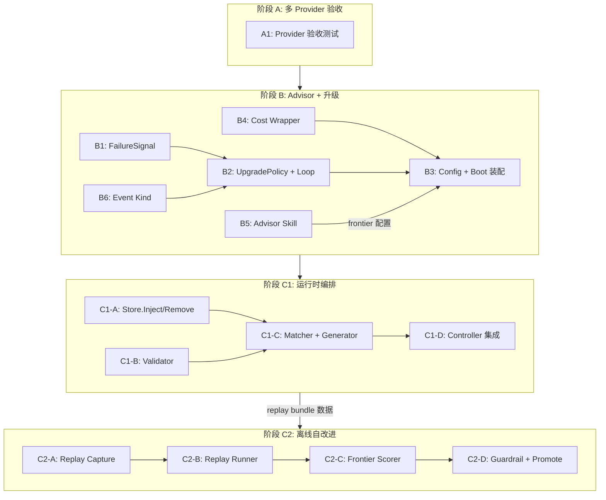

# maddog 融合方案 实施计划

## 概述

将 **Reasonix**（Go agent 运行时 + Wails 桌面 app）与 **tinyctx** 的"智能层"融合为单一 app。基座为 Reasonix，移植 tinyctx "半 B"（失败信号升级 / advisor / auto-skill / 自改进）。

**阶段路线**（保持 spec 的 A→B→C1→C2 排序，与 tech.md 一致）：

| 阶段 | 能力 | 价值 | 预估工作量 |
|---|---|---|---|
| **A** | 多 provider 验收 | 基线确认 | 1-2 pd |
| **B** | Advisor + 失败信号升级 | 提准确度（最快价值） | 10-14 pd |
| **C1** | 运行时 skill 编排 + Dynamic Skill | 自动优化 skill（运行时） | 12-16 pd |
| **C2** | 离线自改进闭环 | 自动优化 skill（离线） | 14-20 pd |

> **work-in-progress 安全**：每个阶段完成后可独立交付、独立回归测试；后续阶段依赖前序阶段的产物（数据格式、接缝、evidence），但不阻塞独立部署。

---

## 0. 延迟项决策（来自 tech.md §10.2）

以下 7 项在 spec → tech 阶段被延迟到规划阶段，在此落地：

### D1. 成功标准量化

| 指标 | 目标值 | 测量方式 |
|---|---|---|
| Advisor 路由可见性 | 100% 的升级/advisor 事件在 event stream 中可见 | event.Kind 新增 `Upgrade`/`SkillGenerated` 即可 |
| UpgradePolicy 评估延迟 | < 1ms | `FailureSignal()` 实时计算，不新增持久化 |
| Dynamic skill 生成延迟 | < 5s（含 1 次 LLM 调用） | 生成管线计时 |
| Validator 评估延迟 | < 10ms | 纯规则引擎，不依赖 LLM |
| Frontier provider 切换 | < 50ms | `switchToFrontier()` 新建 provider 实例 |
| **Task success rate lift** | 基线建立后对比（B 阶段上线后 2 周内校准） | 由 C2 replay 引擎提供数据 |

**验收原则**：B 阶段上线后，以 frontier 调用率 ≤ 20% 为合理区间（超过说明升级策略太激进）。

### D2. v1 优先级分级

- **Must-have（P0）**：B（advisor + 升级）— spec §5.B，最快提准确度
- **Must-have（P0）**：C1（运行时编排）— spec §5.C1，auto-skill 的核心
- **Should-have（P1）**：C2（离线自改进）— 依赖 C1 产生的 replay bundle，可延迟
- **Could-have（P2）**：桌面 UI 扩展（预算仪表、skill 编排 dashboard）— v1 最小范围：仅路由指示器 + advisor 嵌套显示

**v1 截止线**：B + C1 完成并验收通过。C2 如果来不及，放入 v1.1。

### D3. "什么都不做"基线

不单独做量化分析。现状痛点已在 spec §1 明确（双进程维护、线协议冲突、上下文哲学冲突）。融合后对比项：

| 维度 | 现状（分开用） | 融合后 |
|---|---|---|
| 进程数 | reasonix + tinyctx 双进程 | 单一进程 |
| 配置 | 两套配置 / provider / api key | 一套 |
| 调试 | 跨进程追踪困难 | event stream 统一 |
| 技能维护 | 人工编写/更新 | 自动编排 + 离线优化 |

将上述对比写入发布公告（Release Notes）即可，不另出文档。

### D4. Auto-skill 解耦

**C1（运行时编排）和 C2（离线自改进）独立交付**：

- C1 不依赖 C2：运行时编排自己就能选/生成 skill 并提升当前回合效果
- C2 依赖 C1：离线自改进需要 C1 产出的可回放 replay bundle 作为评测数据
- 结论：C1 standalone 先上线（v1），C2 作为增量（v1.1）

### D5. "高风险任务"判定标准

采用**硬编码禁用模式列表**（validator 规则引擎实现）：

```
# 高风险任务匹配模式（不区分大小写）
危险 shell 命令:
  - "rm -rf"、"rm -r /"、"dd if="、"mkfs."、"fdisk"
  - "chmod 777 /"、"chown .* /"
  - "> /dev/sd"、":(){ :|:& };:"

危险 SQL:
  - "DROP TABLE"、"DROP DATABASE"、"TRUNCATE"
  - "DELETE FROM.*WHERE"（无 WHERE 的数据删除）

系统文件操作:
  - "/etc/passwd"、"/etc/shadow"、"/etc/sudoers"
  - "/boot/"、"/sys/" 写入

内存/文件覆盖:
  - 不可覆盖 `REASONIX.md`、`AGENTS.md`、`SYSTEM.md`
  - 不可覆盖 memory（`remember`/`forget` 工具 restriction）
```

**v1 实现**：用简单的关键词匹配，匹配到则**不自动生成** dynamic skill，fallback 到无 skill 执行。**匹配前做 normalization**：NFKC 标准化（消解全角/半角混淆）+ 连续空白压缩为单个空格 + `.lower()`。这防止 Unicode 混淆绕过（如 `ｒｍ`→`rm`）。后续可升级为正则或 AST 分析，处理换行拆分（`REA\nSONIX`）和嵌入式指示（skill body 指令而非 tools）等高级绕过。

### D6. Frontier 成本护栏参数

| 参数 | 默认值 | 配置位置 | 说明 |
|---|---|---|---|
| `frontier_model` | — | `[agent]` toml | 指定升级目标 provider/model |
| `upgrade_threshold` | `3` | `[agent]` toml | 连续错误次数触发升级 |
| `frontier_budget` | `500000` tokens | `[agent]` toml | 每 session frontier 总输出 token 上限 |
| `upgrade_enabled` | `true` | `[agent]` toml | 全局开关 |

### D7. Desktop UI 最小范围（v1）

**必须做（v1 P0）**：

1. **路由指示器**：当前 provider 显示（default vs frontier），升级时显示原因。复用现有 event.Notice 机制，在 UI 消息流中标注 `[upgraded to claude: 连续 3 次 bash 失败]`
2. **Advisor 面板**：advisor 作为 subagent 执行，结果嵌套在触发它的 task call 下（利用现有 `subSink` 嵌套渲染）

**可选（v1 P2，C2 阶段做）**：

3. **Skill 编排状态**：当前任务匹配了哪些 skill、是否生成了 dynamic skill
4. **Budget 仪表**：剩余 frontier 预算

---

## 阶段 A: 多 Provider 验收

### 说明

multi-provider 已由 Reasonix 原生实现（spec §5.A）。本阶段仅做验收确认。

### Implementation Unit A1: Provider 验收测试

**文件变更**：仅测试文件

- `DeepSeek-Reasonix/internal/provider/openai/openai_test.go`（追加验收用例）
- `DeepSeek-Reasonix/internal/provider/anthropic/anthropic_test.go`（追加验收用例）

**验收标准**：

1. `kind="openai"` 能跑通一次 chat + 一次 tool-call（以 DeepSeek 为例）
2. `kind="anthropic"` 能跑通一次 chat + 一次 tool-call（以 Claude 为例）
3. 两项在配置 `[[providers]]` 后可同时可用

**测试场景**：

| # | 场景 | 预期 |
|---|---|---|
| T-A1 | openai kind chat 请求（无 tool） | 返回非空 text |
| T-A2 | openai kind tool-call（bash echo 42） | 返回 tool result = "42" |
| T-A3 | anthropic kind chat 请求 | 返回非空 text |
| T-A4 | anthropic kind tool-call | 返回 tool result |
| T-A5 | 两个 provider 同时注册，切换 model 名 | 各自正常工作 |

**依赖**：无。可独立验证。

**风险**：无。

---

## 阶段 B: Advisor + 失败信号升级

### 说明

实现 spec §5.B 的核心能力：Agent loop 内嵌 `UpgradePolicy`，在 tool-call 失败达到阈值时自动切换到 frontier provider；同时提供内置 advisor skill（`runAs: subagent`，pin 到 frontier model）用于显式/自动二次意见。

### Implementation Unit B1: Evidence Ledger — FailureSignal 方法

**文件新增/修改**：

- `DeepSeek-Reasonix/internal/evidence/evidence.go` — 新增 `FailureSignal()` 方法

**变更内容**：

```go
// FailureSignal 基于已有 receipts 实时统计
type FailureSignal struct {
    ConsecutiveErrors int     // 连续工具调用失败次数
    ErrorStreak       int     // 当前 turn 内总失败次数
    LastErrorTool     string  // 最近失败的工具名
    HealthScore       float64 // 0.0-1.0，滑动窗口成功率
}

func (l *Ledger) FailureSignal() FailureSignal
```

**设计要点**：

- 不新增持久化字段，所有统计从已有 `[]Receipt` 实时遍历（已验证：`Receipt.Success bool` 字段，`evidence.go:36`，`!r.Success` = 失败）

**设计决策**：`FailureSignal` 结构体放在 **evidence 包**（它计算的目标是 evidence receipts，evidence 包保持零依赖）。`UpgradePolicy` interface 和 `ThresholdUpgradePolicy` 放在 **agent 包**（它们是 agent 的决策逻辑）。

**HealthScore 窗口定义**：滑动窗口大小 = `min(len(receipts), 10)`，即取最近 10 个 receipt（或全部，如果不足 10 个）。窗口太小无统计意义，太大对短期波动不敏感。

**依赖**：无。

**测试场景**（`DeepSeek-Reasonix/internal/evidence/evidence_test.go`）：

| # | 场景 | 预期 |
|---|---|---|
| T-B1.1 | 全部成功的 receipts | ConsecutiveErrors=0, ErrorStreak=0, HealthScore=1.0 |
| T-B1.2 | 连续 3 次失败 + 1 次成功 | ConsecutiveErrors=0（因为最后1次成功）, ErrorStreak≥3, HealthScore<1.0 |
| T-B1.3 | 全部失败 5 次 | ConsecutiveErrors=5, ErrorStreak=5, HealthScore=0.0 |
| T-B1.4 | 空 receipts | 全零值，不 panic |
| T-B1.5 | 含 blocked call 的 receipts（blocked 调用不进入 Record） | blocked 不干扰统计——只有实际执行的 tool 计入 |

### Implementation Unit B2: UpgradePolicy 接口与内置策略

**文件新增/修改**：

- `DeepSeek-Reasonix/internal/agent/upgrade.go`（新文件：UpgradePolicy interface + ThresholdUpgradePolicy + UpgradeDecision）
- `DeepSeek-Reasonix/internal/agent/agent.go` — Agent 结构体新增字段 + New() + Run() loop 修改 + `switchToFrontier()` + `downgradeFromFrontier()`

**变更内容**：

```go
// internal/agent/upgrade.go
type UpgradeDecision struct {
    ShouldUpgrade bool
    Reason        string   // 用户可见的路由原因
    TargetModel   string   // "provider/model" 格式
    TriggerAdvisor bool    // 是否同时触发 advisor
}

type UpgradePolicy interface {
    Evaluate(sig FailureSignal, turn int, sessionCost int64) UpgradeDecision
}

// ThresholdUpgradePolicy — 内置默认实现
type ThresholdUpgradePolicy struct {
    Threshold    int     // ConsecutiveErrors >= threshold
    BudgetLimit  int64   // 输出 token 上限
}
```

**Agent 修改点**：

- `Agent.Options` 新增 `UpgradePolicy UpgradePolicy`、`FrontierProvider provider.Provider`、`FrontierPricing *provider.Pricing`、`FrontierContextWindow int` 字段（`internal/agent/agent.go:308 Options struct`）
- `Agent` 结构体新增升级/降级相关字段（详见上文 struct 字段清单）
- `Agent.Run()` 在 `evidence.Reset()` 之后**立马**加 `a.upgraded = false`（确保每个新 turn 重置升级状态）
- `Agent.Run()` 在 `executeBatch()` 返回后（约 line 451）、`maybeCompact()` 之前插入升级评估：

```go
if a.upgradePolicy != nil && !a.upgraded {
    sig := a.evidence.FailureSignal()
    decision := a.upgradePolicy.Evaluate(sig, step, a.sessionCost.Load())
    if decision.ShouldUpgrade {
        a.switchToFrontier(ctx, decision)
        a.upgraded = true
        a.sink.Emit(event.Event{Kind: event.Notice, Level: event.LevelInfo,
            Text: "upgraded to " + decision.TargetModel + ": " + decision.Reason})
    }
}
// 降级检查：升级后 frontier 也连续失败时回退
if a.upgraded && a.frontierFailed() {
    a.downgradeFromFrontier(ctx)
    a.sink.Emit(event.Event{Kind: event.Notice, Level: event.LevelWarn,
        Text: "frontier also failing, switched back to default"})
}
```

**`switchToFrontier` 方法**（新增）：

```go
func (a *Agent) switchToFrontier(ctx context.Context, d UpgradeDecision) {
    // 备份：保存 default provider 引用供降级使用
    a.defaultProv = a.prov
    a.defaultPricing = a.pricing
    a.defaultContextWindow = a.contextWindow
    // 替换 a.prov 为 frontier provider
    a.prov = a.frontierProv
    // 同步更新 a.pricing（用 frontier provider 的定价）
    a.pricing = a.frontierPricing
    // 重置 storm breaker：a.stormSig=""; a.stormCount=0
    // 保留 repeatSuccessCounts（防止同一 tool 重复成功循环）
    // 更新 context window 为 frontier 的
    a.contextWindow = a.frontierContextWindow
    // 不从零开始——当前 session messages 继续使用
    // 注意：stream() 的下一次调用自动使用新 provider，无需额外处理
}
```

**`downgradeFromFrontier` 方法**（新增，对应 tech.md §6.2「Frontier provider 请求失败：回退到 default provider continue」）：

```go
func (a *Agent) downgradeFromFrontier(ctx context.Context) {
    a.prov = a.defaultProv
    a.pricing = a.defaultPricing
    a.contextWindow = a.defaultContextWindow
    // 降级后不重置 upgraded=true——允许同一 turn 内再次尝试升级
    // （如果 default 再次连续失败）但保留 storm break 的复位
    a.stormSig = ""
    a.stormCount = 0
}
```

**`frontierFailed` 方法**（判断是否应该降级）：

```go
func (a *Agent) frontierFailed() bool {
    if !a.upgraded || a.defaultProv == nil {
        return false
    }
    sig := a.evidence.FailureSignal()
    // 升级后连续失败 ≥ upgrade_threshold ——和升级策略用同一阈值
    return sig.ConsecutiveErrors >= a.upgradeThreshold
}
```

**Agent struct 新增字段**：

```go
// 在 Agent struct 新增（agent.go:115+）
upgradePolicy        UpgradePolicy
frontierProv         provider.Provider
frontierPricing      *provider.Pricing
frontierContextWindow int
defaultProv          provider.Provider  // 降级时恢复到 default
defaultPricing       *provider.Pricing
defaultContextWindow  int
upgraded             bool
upgradeThreshold     int
frontierFailures     int  // 升级后的连续失败计数
```

**关键细节**：
- `upgraded` 在每个 `Agent.Run()` 开头（`evidence.Reset()` 之后）重置为 `false`——确保每个新 user turn 的升级状态重新评估
- `a.pricing` 必须同步为 frontier provider 的定价
- 降级回 default 后不把 `upgraded` 设回 `false`——只允许一次来回切换（升→降），避免 ping-pong
- `sessionCost` 原子计数器在 B4 cost wrapper 中管理，不在 switch/downgrade 中重置
- Context window 在升/降时同步更新——不同 provider 的 context window 不同
- **与 stormBreaker 的互补关系**：stormBreaker 检测"同一 error signature 重复 N=3 次"，触发时给模型一次改方法的机会；UpgradePolicy 检测 "任意连续 tool 失败 ≥ upgrade_threshold=3 次"，两者在默认阈值上对齐（均为 3）。stormBreaker 先于 UpgradePolicy 触发——如果模型在 storm 警告后成功改变策略，UpgradePolicy 的连续错误计数会被成功 call 中断，false-positive 升级自动避免

**测试场景**（`DeepSeek-Reasonix/internal/agent/agent_test.go`）：

| # | 场景 | 预期 |
|---|---|---|
| T-B2.1 | upgradePolicy=nil（未配置） | 正常运行，无升级 |
| T-B2.2 | upgradePolicy=ThresholdPolicy, threshold=3, 连续2次失败 | 不升级 |
| T-B2.3 | upgradePolicy=ThresholdPolicy, threshold=3, 连续3次失败 | ShouldUpgrade=true, TargetModel=frontier |
| T-B2.4 | 升级后继续 tool call | 使用 frontier provider 执行 |
| T-B2.5 | upgradePolicy 判定升级但 frontierProvider=nil | 静默不升级，不 panic |
| T-B2.6 | BudgetLimit 耗尽时不应升级 | 即使满足 threshold 也不触发 |
| T-B2.7 | 升级后 frontier 也连续 3 次失败 | 降级回 default provider，emit LevelWarn Notice |
| T-B2.8 | 多个 user turn：第一 turn 升级，第二 turn 开始 | 第二 turn 从头开始（upgraded 被 Reset），重新评估升级条件 |
| T-B2.9 | stormBreaker 触发后模型改变策略成功 | ConsecutiveErrors 被成功 call 中断，不触发 UpgradePolicy |

### Implementation Unit B3: AgentConfig 扩展 + boot 装配

**文件修改**：

- `DeepSeek-Reasonix/internal/config/config.go` — `AgentConfig` 新增字段

```go
// Frontier upgrade — 配置在 [agent] 节下
FrontierModel     string `toml:"frontier_model"`     // 升级目标 model
UpgradeThreshold  int    `toml:"upgrade_threshold"`  // 连续错误触发升级的阈值，默认 3
FrontierBudget    int64  `toml:"frontier_budget"`    // 每 session frontier OUTPUT token 上限，默认 500000
UpgradeEnabled    bool   `toml:"upgrade_enabled"`    // 全局开关，默认 true
```

**默认值策略**：`UpgradeThreshold` 为 0 时 → 不启用升级（0 = disabled）。`FrontierBudget` 为 0 时 → 不限制（仅内部开发者自用场景）。`UpgradeEnabled` 默认 true 但如果 `frontier_model` 未配置，实际不生效。

- `DeepSeek-Reasonix/internal/boot/boot.go` — `Build()` 中装配 UpgradePolicy 和 FrontierProvider

**Coordinator 兼容性**：当 `planner_model` 配置时，boot 创建 Coordinator（双 Agent：planner + executor）。UpgradePolicy **仅装配到 executor Agent**（不装配到 planner）。Planner 的职责是拆解任务，不应因 tool 失败而升级——那是 executor 的职责。

**装配逻辑**：

```go
// 在 boot.go Build() 中，构建完 default provider 之后
if cfg.Agent.UpgradeEnabled && cfg.Agent.FrontierModel != "" {
    frontierEntry, ok := cfg.ResolveModel(cfg.Agent.FrontierModel)
    if ok {
        frontierProv, err := NewProviderWithProxy(frontierEntry, proxySpec)
        // wrap with cost tracking
        frontierProv = costwrap.New(frontierProv, cfg.Agent.FrontierBudget)
        agentOpts.UpgradePolicy = &ThresholdUpgradePolicy{
            Threshold:   cfg.Agent.UpgradeThreshold,
            BudgetLimit: cfg.Agent.FrontierBudget,
        }
        agentOpts.FrontierProvider = frontierProv
    }
}
```

**测试场景**：

| # | 场景 | 预期 |
|---|---|---|
| T-B3.1 | `frontier_model` 未设置 | 不创建 UpgradePolicy |
| T-B3.2 | `upgrade_enabled=false` | 即使设置了 frontier_model 也不创建 |
| T-B3.3 | `frontier_model` 不存在于 providers | 非 fatal，emit notice 后跳过 |
| T-B3.4 | `upgrade_threshold=0` | 按 disabled 处理（阈值 0 = 不启用） |
| T-B3.5 | `frontier_budget=0` | 不限制使用（无限预算，仅内部开发者自用） |
| T-B3.6 | `planner_model` 配置时 | UpgradePolicy 仅装配到 executor，planner 不受影响 |

### Implementation Unit B4: Provider Cost Wrapper

**文件新增**：

- `DeepSeek-Reasonix/internal/provider/costwrap/costwrap.go`（新包）

**变更内容**：

```go
type CostTrackingProvider struct {
    inner       provider.Provider
    sessionCost *atomic.Int64
    budgetLimit int64
}

func (p *CostTrackingProvider) Stream(...) (<-chan provider.Chunk, error) {
    // 代理到 inner.Stream()
    // 从 Usage chunk 提取 output token 数，累计到 sessionCost
    // 超过 budgetLimit 时：emit BudgetExceeded event → 返回 BudgetExceededError
    // 注意：仅累计 output tokens（CompletionTokens），input 不在预算内
}
```

**BudgetExceeded event emit**（由 wrapper 直接 emit 到 Agent 的 sink——因此 wrapper 需要持有 sink 引用）：

```go
sink.Emit(event.Event{Kind: event.BudgetExceeded, Level: event.LevelWarn,
    Text: fmt.Sprintf("frontier budget exceeded: %d/%d tokens used", cost, limit)})
```

**Budget 超限后处理**：Agent loop 在 `stream()` 返回 BudgetExceededError 后，调用 `downgradeFromFrontier()` 回退到 default provider 并继续执行。

**测试场景**：

| # | 场景 | 预期 |
|---|---|---|
| T-B4.1 | Stream 正常返回 | Usage 被正确累计到 sessionCost |
| T-B4.2 | Token 累计超过 budgetLimit | 返回 budget exceeded 错误 |
| T-B4.3 | 多个 Stream 调用并发 | atomic 正确累计 |

### Implementation Unit B5: 内置 Advisor Skill

**文件新增**：

- `DeepSeek-Reasonix/internal/skill/builtin_advisor.go`（注册到 `builtinSkills()`）

**Skill 定义**：

```yaml
name: advisor
description: 用 frontier 模型给出二次意见 — 分析当前进展，列出 enumerated steps，标注风险
runAs: subagent
model: <frontier_model>
allowed-tools: read_file, grep, glob, ls, lsp_hover, lsp_definition, lsp_references
```

**Advisor 的 allowed-tools**：仅限只读工具（`read_file`, `grep`, `glob`, `ls` 以及 LSP 系列）。Advisor 的职责是观察和分析，不修改文件——因此它不能调用 `bash`, `edit_file`, `write_file` 等写工具。这消除了「advisor 二次意见时意外修改文件」的安全风险。

**变更内容**：

- `DeepSeek-Reasonix/internal/skill/skill.go` — `builtinSkills()` 列表加入 advisor
- advisor 的技能体沿用 tinyctx `ask_advisor` 契约：≤100 词、enumerated steps、`Risks:` 段

**触发机制**：

- 显式：`/advisor` slash command（由现有 slash 命令路由自动发现，因为 skill 注册后自动出现在技能列表）
- 自动（DEEPEN）：`UpgradePolicy.Evaluate()` 返回 `ShouldUpgrade=true` 时，可额外触发 advisor（**v1 先不做自动触发**，仅支持显式 `/advisor`）

**测试场景**：

| # | 场景 | 预期 |
|---|---|---|
| T-B5.1 | 显式调用 `/advisor` | 触发 subagent 执行，返回分析结果 |
| T-B5.2 | frontier provider 未配置时调用 `/advisor` | advisor skill 在 `List()` 中不可见，slash 无匹配 |
| T-B5.3 | Advisor 执行成功 | 结果通过 subSink 嵌套渲染 |

### Implementation Unit B6: Event Kind 扩展

**文件修改**：

- `DeepSeek-Reasonix/internal/event/event.go` — Kind 新增事件类型

```go
const (
    // ... 现有 kinds: TurnStarted=0 .. CompactionDone=10（假设） ...

    Upgrade         // 升级事件（阶段 B 新增）: Text = "upgraded to claude: 连续 3 次 bash 失败"
    SkillGenerated  // skill 生成事件（阶段 C1 新增）: Text = skill name
    BudgetExceeded  // 预算超限（阶段 B 新增）: Text = detail
    SkillPromoted   // 离线晋升（阶段 C2 新增）: Text = skill name + version
)
```

**实现策略**：在 `event.go` 的现有 Kind 常量末尾追加（CompactionDone → ToolProgress → MCPSurfaceReady 之后），**不插入到中间**——Go iota 依赖于常量位置，插入会改变后续常量的值。Kind 值用于内部事件路由，改变已有值会破坏 session 兼容性。在末尾添加注释 `// === REASONIX-FUSION: appended, do not insert before this line ===`。

**各 event 的 emit 点**：

| Event | 阶段 | Emit 点 |
|---|---|---|
| `Upgrade` | B | `Agent.Run()` loop 中 `switchToFrontier()` 之后（B2） |
| `BudgetExceeded` | B | `CostTrackingProvider.Stream()` 中检测到超限时（B4） |
| `SkillGenerated` | C1 | `OrchestrateSkills()` 中 Generate 成功后（C1-C） |
| `SkillPromoted` | C2 | `Promote` 写入新版本 skill 成功后（C2-D） |

**测试场景**：不需要单独测试，由各阶段的事件 emit 覆盖。**但必须验证现有 e2e 测试仍然通过**——Kind 值追加不应破坏已有事件的 JSON 序列化。在 Event struct 中 Kind 可能参与 JSON (un)marshal，新增最后一个值后现有 e2e 中的 Kind 编号不变。

### 阶段 B 依赖图

```
B1 (FailureSignal) → B2 (UpgradePolicy + loop) → B3 (config + boot)
                                                ↗
B4 (cost wrapper) ──────────────────────────────┘
B5 (advisor skill) ── 独立，仅依赖 B3 的 frontier 配置
B6 (event kind) ──── 被 B2 使用
```

**可并行**：B1 + B4 + B5 + B6 可并行。B2 依赖 B1。B3 依赖 B2 + B4。

**风险**：

| 风险 | 可能性 | 缓解 |
|---|---|---|
| `switchToFrontier` 切换时 session state 不一致 | 中 | 保留 session messages；重置 storm breaker；provider 实例无状态 |
| Frontier provider key 未配置 | 低 | boot 时 emit notice，静默不升级 |
| Budget 超限后用户期望 | 低 | emit notice 明确告知；本次 session 内不再自动升级 |

---

## 阶段 C1: 运行时 Skill 编排

### 说明

实现 spec §5.C1：每任务自动选/组合 skill；无匹配时生成一次性 dynamic skill → validator → 注入。这是 auto-skill 的运行时侧。

### Implementation Unit C1-A: Store.Inject() / Store.Remove()

**文件修改**：

- `DeepSeek-Reasonix/internal/skill/skill.go` — Store 新增 `Inject()` 和 `Remove()` 方法

**变更内容**：

```go
// 新增内存索引
type Store struct {
    // ... 现有字段 ...
    injected map[string]Skill // 内存注入的 skill，不写盘
}

func (s *Store) Inject(sk Skill) error {
    // 加入 injected map
    // 不创建文件，不触及 .reasonix/skills/
    // 命名空间与文件 skill 共享，injected 优先（同优先级）
}

func (s *Store) Remove(name string) {
    // 从 injected map 删除
}
```

**对 `List()` 和 `Read()` 的影响**：

- `List()` 需追加 injected skills（在文件 skills + builtins 之后或之前？建议在 custom 之后、builtin 之前——与持久 skill 共享命名空间，注入 skill 覆盖同名持久 skill）
- `Read()` 优先检查 injected（因为注入的 skill 应在 session 期间可见）

**测试场景**（`DeepSeek-Reasonix/internal/skill/skill_test.go`）：

| # | 场景 | 预期 |
|---|---|---|
| T-C1A.1 | Inject 一个新的 skill | List() 中出现，Read() 返回成功 |
| T-C1A.2 | Inject 后 Remove | List() 中消失 |
| T-C1A.3 | Inject 覆盖已有同名 file skill | 注入的版本优先 |
| T-C1A.4 | 多次注入同名，最后一次生效 | List() 返回最后一次注入的版本 |
| T-C1A.5 | 持久 skill 文件删除后，injected skill 不受影响 | 依然可用 |

### Implementation Unit C1-B: Dynamic Skill Validator

**文件新增**：

- `DeepSeek-Reasonix/internal/skill/validator.go`（新文件）

**变更内容**：

```go
type ValidationResult struct {
    Valid   bool
    Reason  string  // 拒绝原因，空表示通过
}

type Validator struct {
    // 硬编码禁用模式列表（见 D5 决策）
    forbiddenPatterns []string
}

func (v *Validator) Validate(sk Skill, task string) ValidationResult {
    // 1. 检查高风险任务匹配
    // 2. 检查 body 不含覆盖 system prompt / memory 的指令
    // 3. 检查 frontmatter 完整性
    // 4. 检查 body 长度 ≤ 2000 字符
    // 5. 检查 allowed-tools 不泄露敏感工具
}
```

**验证规则**（纯规则引擎，不依赖 LLM）：

| 规则 | 实现方式 |
|---|---|
| 高风险任务 | 关键词匹配（task 字符串 vs 禁用模式列表） |
| 覆盖 system prompt | 正则 `(?i)#\s*REASONIX`、`system_prompt`、`override` |
| 覆盖 memory | 检查 `allowed-tools` 不包含 `remember`/`forget` |
| Body 长度 | `len(sk.Body) > 2000` |
| Frontmatter 完整性 | `sk.Name == ""` 或 `sk.Description == ""` |

**测试场景**：

| # | 场景 | 预期 |
|---|---|---|
| T-C1B.1 | 合法 skill | Valid=true |
| T-C1B.2 | Body 含 "override SYSTEM_PROMPT" | Valid=false, Reason 指明规则 |
| T-C1B.3 | Body > 2000 字符 | Valid=false（截断并警告属于 fallback） |
| T-C1B.4 | 高风险任务（含 "rm -rf"） | Valid=false |
| T-C1B.5 | allowed-tools 含 remember/forget | Valid=false |
| T-C1B.6 | 空 name 或 description | Valid=false |

### Implementation Unit C1-C: Skill Matcher + Dynamic Skill 生成管线

**文件新增/修改**：

- `DeepSeek-Reasonix/internal/skill/matcher.go`（新文件：Skill Matcher）
- `DeepSeek-Reasonix/internal/skill/generator.go`（新文件：Dynamic Skill Generator）
- `DeepSeek-Reasonix/internal/control/controller.go` 或 `internal/boot/boot.go` — 编排管线入口

**Skill Matcher**：

```go
type MatchResult struct {
    Matched   bool
    Skills    []skill.Skill   // 匹配到的已有 skill（可能多个）
    TaskTask  string          // 原始 task
}

type Matcher struct {
    store *skill.Store
}

func (m *Matcher) Match(task string) MatchResult {
    // 基于 Store.List() 的关键词/语义匹配
    // 简单 v1: 关键词重叠（skill description vs task）
    // 阈值：≥2 个共同关键词（或匹配度 ≥50%），避免为所有 task 产生无意义匹配
    // 多个匹配时按匹配度排序，取最高分的
    // 无匹配时 Matched=false
}
```

**Dynamic Skill Generator**：

```go
type Generator struct {
    prov provider.Provider
}

func (g *Generator) Generate(ctx context.Context, task string) (skill.Skill, error) {
    // 调用 LLM 生成 skill markdown
    // prompt: "为以下任务生成一次性 skill：<task>"
    // 输出必须包含 frontmatter (name, description, runAs: inline)
    // 失败时重试 1 次
}
```

**编排管线**（在 controller 层或 boot 层实现，不在 agent loop 内）：

```go
func orchestrateSkills(ctx context.Context, task string, store *skill.Store, generator *Generator, validator *Validator) error {
    match := matcher.Match(task)
    if match.Matched {
        return nil // 已有 skill，直接使用
    }

    // 高风险任务不自动生成
    if validator.IsHighRisk(task) {
        return nil // fallback: 无 skill 执行
    }

    sk, err := generator.Generate(ctx, task)
    if err != nil {
        return err // fallback: 无 skill 执行
    }

    result := validator.Validate(sk, task)
    if !result.Valid {
        return fmt.Errorf("validator rejected: %s", result.Reason)
    }

    return store.Inject(sk)
}
```

**执行时机**：在 `Controller.Submit()` 中，Agent.Run() 之前调用编排管线。

**测试场景**：

| # | 场景 | 预期 |
|---|---|---|
| T-C1C.1 | Task 匹配已有 skill | Matched=true，不生成 |
| T-C1C.2 | Task 无匹配、非高风险 | 生成成功 → inject → skill 可用 |
| T-C1C.3 | Task 无匹配、高风险 | 不生成，fallback 静默 |
| T-C1C.4 | Generator LLM 调用失败 | 重试 1 次，仍失败 → fallback 静默 |
| T-C1C.5 | Validator 拒绝 | 不 inject，emit Notice，fallback |
| T-C1C.6 | 生成成功后 Store.Inject() | 当前 turn 的 run_skill 工具可见 |

### Implementation Unit C1-D: Controller 编排集成

**文件修改**：

- `DeepSeek-Reasonix/internal/control/controller.go` — 在 `Submit()` 或类似入口方法中插入编排管线

**变更内容**：

```go
func (c *Controller) Submit(ctx context.Context, input string) error {
    // ... 现有逻辑 ...

    // 新增：skill 编排（当启用时）
    if c.skillOrchestrator != nil {
        c.skillOrchestrator.Orchestrate(ctx, input)
    }

    // ... 继续执行 Agent.Run() ...
}
```

**注意**：编排应该在首次执行时做一次，后续 turn 不需要重新编排。可缓存 task→skill 的映射。

**测试场景**：

| # | 场景 | 预期 |
|---|---|---|
| T-C1D.1 | 正常 submit，匹配到已有 skill | 进入 Agent.Run 时 skill 已可用 |
| T-C1D.2 | 编排完成后的后续 turn | 不重复编排（缓存） |
| T-C1D.3 | 编排管线 panic | recover 后 fallback 到无 skill 执行 |

### 阶段 C1 依赖图

```
C1-A (Inject/Remove) ──→ C1-C (matcher + generator) ──→ C1-D (controller 集成)
                         ↗
C1-B (validator) ────────┘
```

**可并行**：C1-A + C1-B 可并行。C1-C 依赖两者。C1-D 依赖 C1-C。

**风险**：

| 风险 | 可能性 | 缓解 |
|---|---|---|
| Dynamic skill 生成质量差 | 中 | Validator 规则引擎拦截危险 skill；高风险任务禁用；可配置关闭 |
| Skill 注入后影响 cache 稳定性 | 低 | 注入的 skill 通过 `run_skill` 工具动态调用，不改变 system prompt 前缀 |
| 编排延迟增加首次响应时间 | 中 | 编排在 Agent.Run 前完成；LLM 生成 ≤5s 目标；无匹配时快速 path |

---

## 阶段 C2: 离线自改进闭环

### 说明

实现 spec §5.C2：治理式闭环——capture 可回放证据 → held-out replay 评测 → 打分前沿 → 过 guardrail/晋升 skill 版本。

**注意**：C2 依赖 C1 产生的 replay bundle 数据，应在 C1 上线并积累足够数据后才启动实施。v1 建议作为 v1.1 增量。

### Implementation Unit C2-A: Replay Bundle 格式与 Capture

**文件新增**：

- `DeepSeek-Reasonix/internal/eval/replay.go`（新包 `internal/eval/`）

**变更内容**：

```go
type ReplayBundle struct {
    SessionID   string
    Messages    []provider.Message     // 完整 message log
    Evidence    []evidence.Receipt     // tool receipt
    Outcome     OutcomeInfo            // 任务级别结果
    Timestamp   time.Time
    SkillName   string                 // 使用的 skill name（如果有）
}

type OutcomeInfo struct {
    Success     bool    // Agent.Run 返回 nil + ≥1 个 tool call + finalReadiness 通过
    FinalAnswer string
    TotalTurns  int
    ToolErrors  int     // 总 tool 失败次数
}

// Capture 在 turn 完成时异步写入 replay bundle
func Capture(session *agent.Session, evidence *evidence.Ledger, skillName string) (*ReplayBundle, error)
```

**写入时机**：`Agent.Run()` 结束时（TurnDone event 之后），异步 goroutine 写入 `config.SessionDir()/replay/`。

**测试场景**：

| # | 场景 | 预期 |
|---|---|---|
| T-C2A.1 | 正常 turn 完成 | replay bundle 成功写入磁盘 |
| T-C2A.2 | 写入磁盘失败 | emit notice，不阻塞主流程 |
| T-C2A.3 | 并行 capture 多个 session | 文件无冲突 |

### Implementation Unit C2-B: Replay Runner

**文件新增**：

- `DeepSeek-Reasonix/internal/eval/runner.go`

**变更内容**：

```go
type ReplayRunner struct {
    store    *skill.Store
    provider provider.Provider
}

// Run 用给定的 skill 重新执行一次 replay bundle
func (r *ReplayRunner) Run(ctx context.Context, bundle ReplayBundle, skill skill.Skill) (OutcomeInfo, error) {
    // 复用现有 RunSubAgent() 机制
    // 传入 session messages + skill definition
    // 重新执行并比较 outcome
}
```

**测试场景**：

| # | 场景 | 预期 |
|---|---|---|
| T-C2B.1 | 用相同 skill 回放 | outcome 与原始一致 |
| T-C2B.2 | 用改进版 skill 回放 | outcome 优于或等于原始 |
| T-C2B.3 | bundle 数据损坏 | 返回错误，不 panic |

### Implementation Unit C2-C: Frontier Scorer

**文件新增**：

- `DeepSeek-Reasonix/internal/eval/scorer.go`

**变更内容**：

```go
// Score 用 frontier 模型对比原始 outcome 和 replayed outcome
// 返回 0.0-1.0 的分数
func Score(ctx context.Context, frontier provider.Provider, original, replayed OutcomeInfo) (float64, string, error)
```

**测试场景**：

| # | 场景 | 预期 |
|---|---|---|
| T-C2C.1 | 原始与 replay 相同 | 返回高分（≥0.9） |
| T-C2C.2 | replay 明显更好 | 分数 > 原始 |
| T-C2C.3 | frontier 不可用 | 返回错误，回退到纯规则评分 |

### Implementation Unit C2-D: Guardrail + Skill 版本晋升

**文件新增**：

- `DeepSeek-Reasonix/internal/eval/guardrail.go`
- `DeepSeek-Reasonix/internal/eval/promote.go`

**变更内容**：

```go
type GuardrailResult struct {
    Pass      bool
    Reason    string
}

// CheckGuardrail 检查新版本 skill 是否满足晋升条件
func CheckGuardrail(bundles []ReplayBundle, oldResults, newResults []OutcomeInfo, frontierScores []float64) GuardrailResult {
    // 1. 回归检测：新版本 success rate ≥ 旧版本
    // 2. 质量阈值：frontier 评分 ≥ 0.7
    // 3. 至少 N=5 个 bundle 通过才晋升
}
```

**晋升动作**：将新版本 skill 写入 `.reasonix/skills/<name>.md`（使用 `Store.CreateWithContent()`）。

**测试场景**：

| # | 场景 | 预期 |
|---|---|---|
| T-C2D.1 | 5/5 bundle 通过，评分均 ≥0.7 | Guardrail pass → promote |
| T-C2D.2 | 3/5 bundle 通过 | Guardrail fail（数量不足） |
| T-C2D.3 | 评分 0.6 | Guardrail fail（质量不足） |
| T-C2D.4 | 旧版本更好 | Guardrail fail（回归） |

### 阶段 C2 依赖图

```
C2-A (capture) ─→ C2-B (replay runner) ─→ C2-C (scorer) ─→ C2-D (guardrail + promote)
```

**必须串行**：每个 unit 依赖前一个的输出。

**条件**：

- 依赖 C1 上线后产生的 replay bundle 数据
- 依赖 B 阶段的 frontier provider 配置（scorer 需要 frontier 模型）

**风险**：

| 风险 | 可能性 | 缓解 |
|---|---|---|
| Replay fidelity 不足 | 中 | Session message log 已完整；evidence ledger 补充 host-level info |
| 需要大量 bundle 才有统计意义 | 中 | N≥5 是 v1 起点，可在积累更多数据后提高 |
| Frontier 评分成本 | 中 | 每次评测的 frontier 调用受 B4 cost wrapper 保护；限制每批次调用次数 |
| Python eval 工具过渡 | 低 | v1 初期可保留 Python eval 脚本；长期 Go 重写 |

---

## 跨阶段依赖总图



---

## 文件变更清单汇总

### 新增文件

| 文件路径 | 阶段 | 内容 |
|---|---|---|
| `DeepSeek-Reasonix/internal/agent/upgrade.go` | B | UpgradePolicy interface + ThresholdUpgradePolicy |
| `DeepSeek-Reasonix/internal/provider/costwrap/costwrap.go` | B | CostTrackingProvider wrapper |
| `DeepSeek-Reasonix/internal/skill/builtin_advisor.go` | B | 内置 advisor skill 注册 |
| `DeepSeek-Reasonix/internal/skill/validator.go` | C1 | Dynamic Skill Validator |
| `DeepSeek-Reasonix/internal/skill/matcher.go` | C1 | Skill Matcher |
| `DeepSeek-Reasonix/internal/skill/generator.go` | C1 | Dynamic Skill Generator |
| `DeepSeek-Reasonix/internal/eval/replay.go` | C2 | ReplayBundle 格式与 Capture |
| `DeepSeek-Reasonix/internal/eval/runner.go` | C2 | Replay Runner |
| `DeepSeek-Reasonix/internal/eval/scorer.go` | C2 | Frontier Scorer |
| `DeepSeek-Reasonix/internal/eval/guardrail.go` | C2 | Guardrail 检查 |
| `DeepSeek-Reasonix/internal/eval/promote.go` | C2 | Skill 版本晋升 |

### 修改文件

| 文件路径 | 阶段 | 变更内容 |
|---|---|---|
| `DeepSeek-Reasonix/internal/evidence/evidence.go` | B | 新增 `FailureSignal()` 方法 |
| `DeepSeek-Reasonix/internal/agent/agent.go` | B | Agent struct 新增字段 + New() + Run() loop 修改 + switchToFrontier() |
| `DeepSeek-Reasonix/internal/config/config.go` | B | AgentConfig 新增 FrontierModel/UpgradeThreshold/FrontierBudget/UpgradeEnabled |
| `DeepSeek-Reasonix/internal/boot/boot.go` | B, C1 | 装配 UpgradePolicy + FrontierProvider + skill 编排管线 |
| `DeepSeek-Reasonix/internal/event/event.go` | B | Kind 新增 Upgrade（可能还有 SkillGenerated/SkillPromoted/BudgetExceeded） |
| `DeepSeek-Reasonix/internal/skill/skill.go` | C1 | Store 新增 injected map + Inject()/Remove()；List()/Read() 追加注入 skill |
| `DeepSeek-Reasonix/internal/control/controller.go` | C1 | 在 Submit() 插入编排管线 |

---

## 执行顺序建议

### v1（A + B + C1）

1. **A** — 多 provider 验收（1-2 pd）
2. **B1 → B2 → B3** — 核心升级链路（6-8 pd）
3. **B4 + B5 + B6** — 并行（2-3 pd）
4. **C1-A + C1-B** — 并行（2-3 pd）
5. **C1-C → C1-D** — 编排管线（4-5 pd）

**v1 总估算**：15-21 pd

**端到端集成测试**（v1 最后执行，跨 B + C1）：

| # | 场景 | 预期 |
|---|---|---|
| T-E2E.1 | 正常任务（bash echo 42）→ 无升级 | default provider 完成，无 frontier 调用 |
| T-E2E.2 | 连续 3 次故意失败 → 自动升级 → frontier 执行成功 | Upgrade event emit，frontier provider 完成 task |
| T-E2E.3 | 升级后 frontier 也连续 3 次失败 → 降级回 default | 2 个 event（Upgrade + 降级 notice），default 继续 |
| T-E2E.4 | 任务无匹配 skill → dynamic skill 生成 → inject → 执行 | SkillGenerated event emit，task 成功 |
| T-E2E.5 | 高风险任务 → dynamic skill 不生成 → 正常执行 | 无 SkillGenerated event，task 直接执行 |

**跨阶段风险（新增到风险管理）**：

| 风险 | 可能性 | 缓解 |
|---|---|---|
| B 阶段 UpgradePolicy 引入 bug 导致所有请求升级到 frontier，成本爆炸 | 低 | `upgrade_enabled` 默认 true 但 `frontier_model` 为空时不生效；上线后监控 frontier 调用率（≤20%）；`frontier_budget` 作为硬上限 |
| C1 orchestrateSkills 管线 panic 但 Inject 已部分完成 | 低 | Inject/Remove 需在事务中操作（先 validate→再 inject）；panic 时 recover 并清理 injected store |
| C2 依赖 C1 的数据积累——如果 C1 使用率低于预期 | 中 | C2 代码可先写完（不依赖实时数据，用 mock bundle 测试），等 C1 积累足够数据后再跑 promote |

### v1.1（C2）

1. **C2-A** — replay capture（3-4 pd）
2. **C2-B** — replay runner（4-6 pd）
3. **C2-C** — frontier scorer（3-4 pd）
4. **C2-D** — guardrail + promote（4-6 pd）

**v1.1 总估算**：14-20 pd（需 C1 上线后积累足量 replay bundle 数据）

---

## 开放问题（执行中发现）

### 已核实与已决策 ✅

- ~~`evidence.Receipt` 结构体字段名~~ ✅ 已核实：`Success bool`（`evidence.go:36`），`!r.Success` = 失败
- ~~`stormSig`/`stormCount` 复位策略~~ ✅ 已决策：`switchToFrontier` 时归零；`downgradeFromFrontier` 时也归零
- ~~`Store.injected` 并发安全~~ ✅ 已决策：需 `sync.RWMutex`，实现时补充
- ~~`upgraded` 标志位生命周期~~ ✅ 已决策：`Agent.Run()` 开头重置 `upgraded = false`
- ~~`FailureSignal` vs `UpgradePolicy` 包归属~~ ✅ 已决策：`FailureSignal`→evidence 包，`UpgradePolicy`→agent 包
- ~~降级逻辑~~ ✅ 已接入：`downgradeFromFrontier()` + `frontierFailed()` 检查 + B2 测试 T-B2.7
- ~~HealthScore 窗口~~ ✅ 已决策：`min(len(receipts), 10)`

### 待确认

- **桌面 UI binding**：Wails desktop 是否已有通用事件→JS 转发机制，还是需要为 Upgrade event 单独写 Go↔JS binding？
- **Import path 确认**：仓库 module path（`go.mod`）是 `reasonix` 还是 `DeepSeek-Reasonix`？
- **Matcher 阈值**：v1 关键词匹配阈值——≥2 个共同关键词匹配 skill description vs task，或匹配度 ≥ 50%？实施时由实现者选择更合适的。
- **Outcome 定义**（C2）：ReplayBundle.Success 判定规则为「Agent.Run 返回 nil + ≥1 个 tool call 执行 + finalReadiness 通过」——C2 实施时可根据实际数据精调。
- **Frontier budget 作用域**：500000 tokens 是 output-only。input 消耗不在 budget 内，需在实施时评估是否需要 input+output 的成本模式。

---

## 外部四组方案增强计划

2026-06-27 基于 sekkit starred repos 调研补充了一份后续增强计划，覆盖四组可落地方案：

- Provider/auth/成本组合
- Context 压缩组合
- Code intelligence/MCP 组合
- Skill 自进化组合

详细实施单元见：`docs/cc/maddog-fusion--3949/plan-external-schemes.md`
