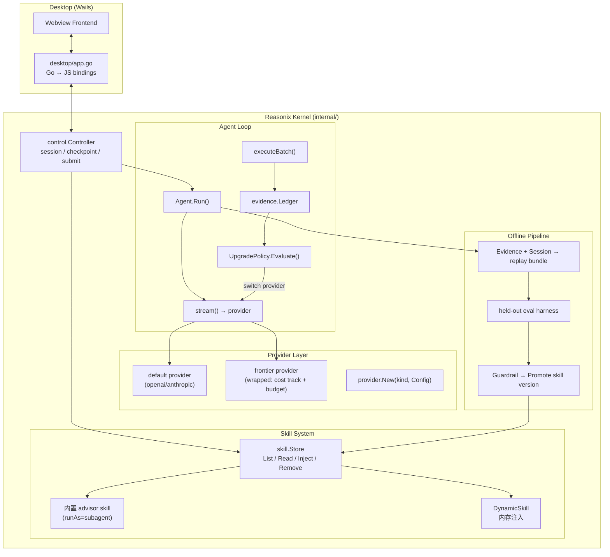
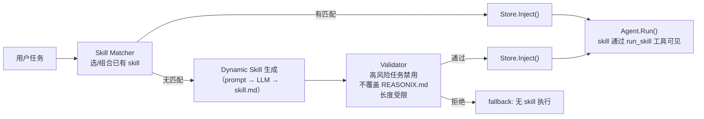
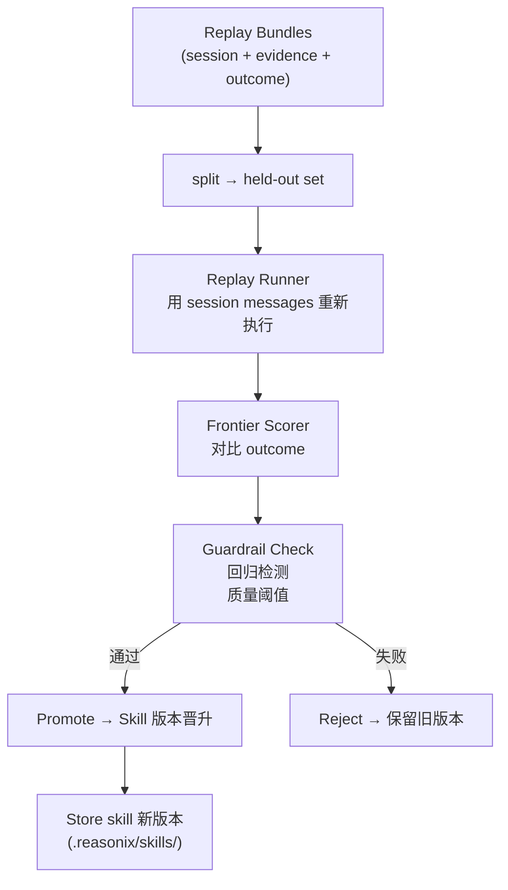
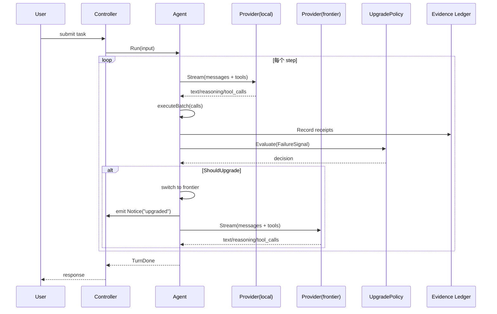
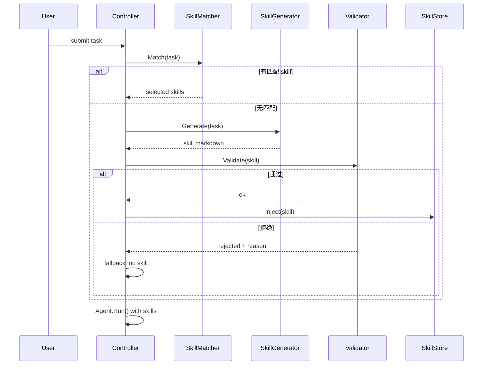

# maddog 融合方案 技术设计

## 1. 技术背景

### 1.1 背景描述

maddog 要将 **Reasonix**（Go agent 运行时 + Wails 桌面 app）与 **tinyctx**（Python "智能层"）融合为单一可分发产物。经代码核实，两者在三层存在硬冲突（线协议 / 上下文哲学 / 宿主循环），故采用**以 Reasonix 为基座、移植 tinyctx 机制**的单体方案。

Reasonix 现有架构已具备多 provider（openai + anthropic）、skill 系统（inline / subagent）、双模型 Coordinator（planner + executor）、evidence ledger（per-turn tool receipt）、hook 系统（PreToolUse / PostLLMCall 等 shell hook），以及 Wails desktop shell。**缺失**的能力正是 tinyctx "半 B" 要移植的三项智能：失败信号升级、advisor 二次意见、运行时 skill 编排 + 离线自改进。

### 1.2 解决的问题

基于 `spec.md` 的目标与能力范围：

| 能力 | spec 章节 | 技术回应 |
|---|---|---|
| **A. 多 provider** | spec §5.A | 已具备，验收即可。Reasonix `provider.New(kind, Config)` 已注册 openai + anthropic |
| **B. advisor + 失败信号升级** | spec §5.B | 新增 Agent-level `UpgradePolicy` + 内置 advisor subagent skill |
| **C1. 运行时 skill 编排** | spec §5.C1 | 新增 `Store.Inject()` 内存注入 + DynamicSkill 生成管线 |
| **C2. 离线自改进** | spec §5.C2 | 新增 session replay 引擎 + held-out eval harness + skill 版本晋升管线 |

### 1.3 关联的需求文档

- `docs/cc/maddog-fusion--3949/spec.md`

### 1.4 关联的技术文档

- Reasonix kernel: `DeepSeek-Reasonix/internal/`（agent, control, skill, provider, evidence, checkpoint, boot, event, hook）
- Desktop shell: `DeepSeek-Reasonix/desktop/`（Wails v2, Go ↔ JS bindings）
- tinyctx 参考: `docs/reasonix-evaluation.md`（不存在于仓库中——引用自 spec §4）

## 2. 方案收益

### 2.1 业务收益

- **准确度提升**：失败信号自动升级到 frontier 模型，避免本地模型在复杂任务上反复重试
- **Skill 自动优化**：运行时自动编排 + 离线自改进闭环，降低人工维护 skill 的成本
- **单一 app**：消除 Reasonix + tinyctx 双进程维护、调试和配置负担

### 2.2 技术收益

- **UpgradePolicy 可复用**：Agent-level 的升级策略可被未来的 runtime 路由场景（如按任务类型选模型）复用
- **内存 skill 注入**：`Store.Inject()` 为所有需要临时 skill 的场景提供统一机制
- **Replay 引擎**：session message log + evidence receipt 为离线评测、回归测试提供基础设施
- **Provider wrapper**：cost-tracking + budget-enforcing wrapper 可被任何 provider 类型复用

### 2.3 投入产出比

| 投入 | 产出 |
|---|---|
| Agent loop 修改（UpgradePolicy 接缝） | advisor + 升级能力（B） |
| 新增 UpgradePolicy + FailureSignal 类型 | 可配置的升级策略，未来场景可复用 |
| Skill Store 内存注入 API | C1 运行时编排 + 任何需要临时 skill 的场景 |
| Session replay 引擎 | C2 离线自改进 + e2e 回归测试基础设施 |
| Provider cost wrapper | frontier 成本控制 + 所有 provider 的用量可见性 |
| Desktop UI 扩展（路由指示器、advisor 面板） | 用户可见的路由决策（spec §5.B 要求） |

## 3. 竞品方案调研

> 本节省略。maddog 是内部开发者工具，融合方案是内部架构决策，不涉及外部产品竞争。

## 4. 方案对比

### 4.1 方案 A：Agent-level UpgradePolicy（✅ 推荐）

在 `Agent.Options` 中新增 `UpgradePolicy` 字段（interface），Agent loop 在每个 step 的 `executeBatch` 之后调用 policy 评估 evidence ledger 中的 failure signals。当 policy 判定需升级时，Agent 切换到 frontier provider 继续当前 turn。

**优点：**
- 与 Agent loop 紧密耦合，延迟最低（进程内决策）
- 可直接访问 evidence ledger 的所有 receipt 数据
- 不需要 shell 进程 / stdin/stdout 序列化开销
- 可扩展为任意策略（error streak、task type、budget-based）
- 不改变 hook 协议，不暴露实现细节

**缺点：**
- 需要修改核心 Agent loop（但改动点明确：`Agent.Run()` 中 `executeBatch` 之后插入一次 policy 调用）
- `UpgradePolicy` interface 设计需要稳定

### 4.2 方案 B：PostLLMCall Hook 外部决策

利用 Reasonix 已有的 `PostLLMCall` hook（每次模型调用后触发），通过外部 shell 脚本解析 stdin JSON 中的 turn 信息、读取外部状态文件（记录 error streak），并在 stdout 返回升级指令，然后通过 `/model` runtime switch 完成切换。

**优点：**
- 不改 Agent loop
- 利用已有 hook 基础设施

**缺点：**
- Shell 进程每次调用的 fork/exec 开销（~5-50ms per step）
- Failure signal 必须通过 stdin/stdout 传递，脆弱且难以保证一致性
- 需要外部状态文件记录 error streak（引入文件 I/O 和并发问题）
- `/model` runtime switch 改变的是 session 级别模型，而非 per-step 临时升级

### 4.3 推荐方案与理由

**推荐方案 A（Agent-level UpgradePolicy）**。理由：

1. Reasonix 的 Agent loop 是所有执行路径的唯一汇合点——在这里加升级逻辑，自动覆盖 CLI、desktop、headless run、subagent 等所有调用方
2. Evidence ledger 已在 Agent 中，升级决策所需数据（tool success/failure、tool name、连续失败次数）全在进程内存中，不需要外部状态
3. 方案 B 的 shell 开销和状态管理复杂度远超方案 A 的 Agent loop 修改成本
4. `UpgradePolicy` interface 只暴露一个方法，对 Agent loop 的侵入极小

## 5. 架构设计

### 5.1 整体架构图



### 5.2 技术边界

**本方案覆盖：**
- `internal/agent/` — UpgradePolicy interface + loop 修改 + FailureSignal 扩展
- `internal/evidence/` — FailureSignal 统计（error streak、consecutive failures、health score）
- `internal/skill/` — Store.Inject() / Store.Remove() 内存注入 API
- `internal/provider/` — CostTracking wrapper provider
- `internal/boot/` — 组装 UpgradePolicy、注册 advisor skill、wire up replay capture
- `internal/control/` — 暴露 upgrade 事件到 event stream
- `desktop/` — UI 路由指示器、advisor 面板（最小范围）
- `cmd/e2ebench/` — 复用为离线 skill 评测 runner（推断，待实施阶段确认）

**本方案不覆盖：**
- tinyctx wire 层（snapshot/ctx-pack/compactor/historian）— 明确丢弃
- 在线自我改写 — 明确非目标
- codex 相关集成 — 退役
- 多用户 / 多租户场景 — v1 仅 maddog 自用

### 5.3 核心模块设计

#### 5.3.1 UpgradePolicy & FailureSignal（能力 B）

**新增类型（`internal/agent/`）：**

```
方向性指引，非实现规格：

type FailureSignal struct {
    ConsecutiveErrors int       // 连续工具调用失败次数
    ErrorStreak       int       // 当前 turn 内总失败次数（不限连续）
    LastErrorTool     string    // 最近失败的工具名
    HealthScore       float64   // 0.0-1.0，综合成功率滑动窗口
}

type UpgradeDecision struct {
    ShouldUpgrade bool
    Reason        string   // 用户可见的路由原因（例如 "连续 3 次 bash 失败，切换到 claude"）
    TargetModel   string   // "provider/model" 格式
}

type UpgradePolicy interface {
    Evaluate(sig FailureSignal, turn int, sessionCost int64) UpgradeDecision
}
```

**Agent loop 修改点**（`internal/agent/agent.go:392 Agent.Run()`）：

在 `executeBatch()` 返回后、`maybeCompact()` 之前，插入：

```
方向性指引，非实现规格：

if a.upgradePolicy != nil && !a.upgraded {
    sig := a.evidence.FailureSignal()       // 新增方法
    decision := a.upgradePolicy.Evaluate(sig, step, a.sessionCost)
    if decision.ShouldUpgrade {
        a.switchToFrontier(ctx, decision)   // 新建 provider 实例，替换 a.prov
        a.upgraded = true
        a.sink.Emit(event.Event{
            Kind: event.Notice,
            Level: event.LevelInfo,
            Text: "upgraded to " + decision.TargetModel + ": " + decision.Reason,
        })
    }
}
```

**Evidence ledger 扩展**（`internal/evidence/evidence.go`）：

对 `Ledger` 新增 `FailureSignal()` 方法，基于当前 receipts 计算 `ConsecutiveErrors`、`ErrorStreak`、`HealthScore`。不新增持久化字段——所有统计从已有 `[]Receipt` 实时计算。

**Agent.Options 扩展**（`internal/agent/agent.go:308`）：

新增 `UpgradePolicy UpgradePolicy` 和 `FrontierProvider provider.Provider` 字段。

**AgentConfig 扩展**（`internal/config/config.go:414 AgentConfig`）：

新增 `FrontierModel string` 字段（toml: `frontier_model`），指定升级目标。新增 `UpgradeThreshold int`（toml: `upgrade_threshold`，默认 3），用于内置 `ThresholdPolicy`。

**内置策略**：提供一个 `ThresholdUpgradePolicy` 作为默认实现：`ConsecutiveErrors >= threshold` 或 `HealthScore < 0.3` 或 `ErrorStreak >= threshold*2` 时触发升级。

#### 5.3.2 Advisor Skill（能力 B）

**设计：**

Advisor 是一个**内置 skill**（`runAs: subagent`，`model: <frontier_model>`），用 Reasonix 现有 skill + subagent 机制实现，无需新增执行路径。

```
方向性指引，非实现规格：

skill frontmatter:
  name: advisor
  description: 用 frontier 模型给出二次意见
  runAs: subagent
  model: claude   # pin 到 frontier provider

skill body:
  沿用 tinyctx ask_advisor 契约：
  - ≤100 词
  - enumerated steps
  - Risks: 段
```

**触发方式：**
- 显式：用户输入 `/advisor`（slash command）
- 自动：`UpgradePolicy.Evaluate()` 返回 `ShouldUpgrade=true` 时，额外注入 advisor prompt（推断——自动 advisor 与自动升级的关系待 Phase 3 澄清：自动升级是切换 provider 继续执行，自动 advisor 是额外请求二次意见；两件事可独立触发）

**pin 到 frontier**：通过 skill frontmatter 的 `model: <frontier_provider>` 字段。现有 `subagentModelRef()` 已支持 per-skill model override（`internal/boot/boot.go:600`）。

**桌面 UI**：advisor 结果作为 subagent 的最终回答返回，嵌套在触发它的 task call 下显示（利用现有 `subSink` 嵌套机制）。

#### 5.3.3 Dynamic Skill 注入 & 运行时编排（能力 C1）

**内存注入 API（`internal/skill/skill.go`）：**

```
方向性指引，非实现规格：

func (s *Store) Inject(sk Skill) error   // 注入到内存索引，不写盘
func (s *Store) Remove(name string)      // 从内存索引移除
```

`Inject()` 将 skill 加入 `Store` 的内部 map（与 `List()` / `Read()` 共享同一个 `byName` 索引）。不创建文件，不触及 `.reasonix/skills/` 目录。`Remove()` 仅在 session 结束时清理，或在 validator 拒绝时立即移除。

**运行时编排流程：**



**安全性约束：**
- 高风险任务（定义见 §7.1）不自动生成 dynamic skill
- 生成的 skill body 长度 ≤ 2000 字符
- Validator 使用规则引擎（非 LLM——零成本、确定性）检查：
  - 不包含覆盖 `REASONIX.md` / system prompt / memory 的指令
  - 不包含 `allowed-tools` 泄露敏感工具
  - frontmatter 必须完整（name, description）

**与现有系统的复用：**
- Skill Matcher 可基于现有 `Store.List()` 的结果做关键词/语义匹配
- Dynamic skill 生成复用 `internal/provider` 的 provider 调用（推断）
- `run_skill` 工具自动发现注入的 skill（因为 `Store.List()` 返回所有 skill）

#### 5.3.4 离线自改进闭环（能力 C2）

**Replay Bundle 格式：**

```
方向性指引，非实现规格：

type ReplayBundle struct {
    Session    []provider.Message   // 完整 message log
    Evidence   []evidence.Receipt   // 对应 turn 的 tool receipt
    Outcome    OutcomeInfo          // 任务级别结果
    Timestamp  time.Time
    SkillName  string               // 本任务使用的 skill name
}

type OutcomeInfo struct {
    Success    bool
    GoalMet    bool
    Turns      int
    TotalCost  int64
    Duration   time.Duration
}
```

**Replay 采集点**（`internal/agent/agent.go:448`）：

在 `Agent.Run()` 正常返回（model 给出 final answer）时，采集当前 session messages + evidence receipts → 写入 replay bundle。采集**不阻塞** turn 完成（异步写入）。

**离线评测管线（独立 CLI 命令或复用 `cmd/e2ebench/`）：**



**Replay Runner** 复用现有 `RunSubAgent()` 机制（`internal/agent/task.go:229`）——给定 session messages + skill definition，重新执行并比较 outcome。

**打分前沿**：frontier 模型（最强模型）作为"裁判"，对比原始 outcome 和 replayed outcome，给出 0-1 分。

**Guardrail**：
- 回归检测：新版本 skill 在已有 bundle 上的 success rate 不得低于旧版本
- 质量阈值：frontier 评分 ≥ 0.7
- 至少 N 个 bundle（N≥5）通过才触发晋升

#### 5.3.5 Cost Guard & Provider Wrapper（能力 B 的边界）

**Provider wrapper（`internal/provider/costwrap/`）：**

```
方向性指引，非实现规格：

type CostTrackingProvider struct {
    inner       provider.Provider
    sessionCost *atomic.Int64
    budgetLimit int64
}

func (p *CostTrackingProvider) Stream(ctx context.Context, req provider.Request) (<-chan provider.Chunk, error) {
    // 代理到 inner.Stream()，从 Usage chunk 提取 tokens
    // 累计到 sessionCost，超过 budgetLimit 时返回错误
}
```

- `sessionCost` 原子变量，跨越 turn 持续累计
- `budgetLimit` 从 config 读取（`AgentConfig.FrontierBudget`）
- 超限时返回明确错误信息，Agent loop 捕获后 emit Notice + 切换回 default provider
- Desktop UI 显示剩余预算（通过新增 event kind 或复用 Notice）

### 5.4 数据模型变更

| 实体 | 变更类型 | 说明 |
|---|---|---|
| `Agent.Options` | 新增字段 | `UpgradePolicy`, `FrontierProvider` |
| `AgentConfig` | 新增字段 | `FrontierModel`, `UpgradeThreshold`, `FrontierBudget` |
| `Agent` | 新增字段 | `upgradePolicy`, `upgraded`, `sessionCost` |
| `evidence.Ledger` | 新增方法 | `FailureSignal()` |
| `skill.Store` | 新增方法 | `Inject()`, `Remove()` |
| `ReplayBundle` | 新类型 | Session replay 数据格式 |
| `UpgradePolicy` | 新 interface | 升级决策抽象 |
| `FailureSignal` | 新 struct | 失败信号统计 |
| `provider.Provider` wrapper | 新类型 | CostTrackingProvider |

## 6. 流程设计

### 6.1 核心业务流程

**Turn 内升级流程：**



**Dynamic skill 生成与注入流程：**



### 6.2 异常流程

| 场景 | 行为 |
|---|---|
| **Advisor 不可用**（frontier provider 未配置或无 key） | advisor skill 在 `List()` 中不可见；自动 advisor 触发静默跳过 |
| **Dynamic skill 生成失败**（LLM 返回无效 markdown） | 重试 1 次；仍失败则 fallback 到最近匹配的静态 skill 或直接无 skill 执行 |
| **Validator 拒绝** | log reason + emit Notice；不注入 skill |
| **Frontier provider 请求失败**（网络/auth error） | 回退到 default provider continue；不重试 frontier（避免成本放大） |
| **Replay bundle 损坏** | 丢弃该 bundle；不阻塞其他 bundle 的评测 |
| **Budget 超限** | emit Notice + 切换回 default provider + 本次 session 内不再自动升级 |
| **UpgradePolicy 判定升级但 frontier 未配置** | 静默不升级；不干扰正常执行 |

## 7. 安全性设计

### 7.1 安全设计要点

**Dynamic Skill Validator 规则：**

| 规则 | 检测方式 | 拒绝动作 |
|---|---|---|
| 不可覆盖 `REASONIX.md` 或 system prompt | 正则匹配 `#\s*REASONIX`、`system_prompt`、`override` 关键词 | 拒绝生成 |
| 不可覆盖 memory（`remember` / `forget`） | 检查 frontmatter `allowed-tools` 不包含 `remember`/`forget` | 拒绝生成 |
| 高风险任务不自动生成 | 任务涉及 `rm -rf`、`DROP TABLE`、`delete` 系统文件 → 硬编码禁用列表匹配 | 不自动生成 |
| 长度受限 | body ≤ 2000 字符 | 截断并警告 |

**Frontier Provider 安全：**
- Frontier provider 的 `api_key_env` 独立于 default provider（可配置不同的 API key）
- Budget 上限硬编码在 `AgentConfig.FrontierBudget`，运行时可读不可写
- 预算超限后自动禁用升级，不下发任何 frontier 请求

### 7.2 合规性要求

maddog 为内部开发者工具，不涉及 PII/PCI/GDPR 合规。但需注意：
- Frontier provider 的 API key 通过环境变量注入（复用 Reasonix 的 `api_key_env` 机制），不落盘
- Skill 版本晋升的历史记录（哪个版本何时被 promot）写入 session 日志，供审计

### 7.3 敏感数据处理

- Frontier API key：通过 `api_key_env` → `os.Getenv()` 读取，不在 config.toml 或 session 中持久化
- Replay bundle：存储完整 message log（可能包含代码、文件路径），存储在 `config.SessionDir()` 下，跟随 Reasonix 现有 session 存储权限（0600）
- Budget 数据：仅 session 内存中的原子计数器，不落盘

## 8. 性能设计

### 8.1 性能指标

| 指标 | 目标 | 测量点 |
|---|---|---|
| UpgradePolicy 评估延迟 | < 1ms | `UpgradePolicy.Evaluate()` 调用前后 |
| Dynamic skill 生成延迟 | < 5s（含 1 次 LLM 调用） | 生成管线总耗时 |
| Validator 评估延迟 | < 10ms（纯规则引擎） | `Validator.Validate()` |
| Replay bundle 写入 | 异步，不阻塞 turn 完成 | goroutine 写入 |
| Frontier provider 切换 | < 50ms（新建 provider 实例） | `switchToFrontier()` |

### 8.2 性能优化策略

- **UpgradePolicy**：`FailureSignal()` 基于已有 `[]Receipt` 实时遍历计算（典型每 turn < 50 receipts），无需额外持久化或缓存
- **Skill Matcher**：首次匹配后缓存结果（per-turn 内不变）
- **Replay bundle**：异步 goroutine 写入，不进入 Agent loop 的关键路径
- **Frontier provider**：新建实例复用 Reasonix 已有 `provider.New()` 工厂，provider 实例本身无状态（tokens、connection 等由 Stream 调用管理）

### 8.3 监控与可观测

**新增 Event Kind（`internal/event/event.go`）：**

```
方向性指引，非实现规格：

Upgrade            // 升级事件: Text = "upgraded to claude: 连续 3 次 bash 失败"
SkillGenerated     // skill 生成: Text = skill name
SkillPromoted      // 离线晋升: Text = skill name + version
BudgetExceeded     // 预算超限: Text = detail
```

**Desktop UI 暴露：**
- 路由指示器：当前使用哪个 provider（default / frontier），以及升级原因
- Advisor 面板：展示 advisor 的最终回答（复用 subagent 嵌套 UI）
- Skill 编排状态：当前任务匹配了哪些 skill、是否生成 dynamic skill
- Budget 仪表：剩余 frontier 预算（可选，最小范围）

**已有可复用机制：**
- `event.Notice` — 升级/降级/预算告警事件
- `event.Phase` — Coordinator 阶段切换（可复用展示"已升级到 frontier"）
- `inspect.Capabilities()` — 已暴露所有 provider 信息到前端

## 9. 第三方依赖

| 依赖项 | 版本 | 许可证 | 用途 | 维护状态 | 风险等级 |
|:---|:---|:---|:---|:---|:---|
| Reasonix openai provider | 已有 | — | Default provider（DeepSeek/OpenAI 兼容） | 活跃 | 低 |
| Reasonix anthropic provider | 已有 | — | Frontier provider（Claude） | 活跃 | 低 |
| tinyctx Python 离线工具 | 已有 | — | C2 离线自改进初期可复用部分 eval 脚本 | 需评估 | 中 |

> **tinyctx Python 留存范围**：C2 离线自改进的评测脚本（eval harness）初期可保留 Python，因为：(a) 不在请求路径上，(b) Python 生态中已有成熟的 eval 工具链，(c) 重写成本高且价值低。长期目标是用 Go 重写 eval harness，但 v1 不承诺。

## 10. 风险和遗留项评估

### 10.1 风险评估

| 风险 | 可能性 | 影响 | 缓解措施 |
|---|---|---|---|
| Reasonix evidence/agent hook 面不足以支撑 FailureSignal 计算 | 低 | 高 | 代码库已核实：evidence ledger 记录每条 tool call 的 success/failure；`stormSig` 机制已证明同类逻辑可行 |
| Frontier 模型成本失控 | 中 | 高 | Budget cap + provider wrapper 在请求路径上强制 enforce；Desktop UI 显示实时用量 |
| Dynamic skill 生成质量差、降低任务成功率 | 中 | 中 | Validator 规则引擎拦截危险 skill；高风险任务禁用 auto-generate；可配置关闭 |
| 离线自改进的 replay fidelity 不足 | 中 | 高 | Reasonix session message log 已完整记录所有 tool calls + results；evidence ledger 补充 host-level 信息；不足时可追加 snapshot 上下文 |
| 桌面 UI 工作量被低估 | 中 | 中 | spec §9 已将 UI 标记为"延迟到规划阶段"；v1 最小范围：路由指示器 + advisor 回答展示（均可复用现有 event/notice 渲染） |
| Python 离线工具维护负担 | 低 | 低 | 仅 C2 离线管线，out-of-band；v1 明确标注为"方向性指引"；长期迁移到 Go |

### 10.2 遗留项评估

延续 `spec.md` §9 的延迟项：

| spec 延迟项 | tech.md 处理 | 遗留到 cc-plan |
|---|---|---|
| 成功标准量化 | §8.1 给出了性能指标；量化 accuracy KPI 需 e2e 基准线建立后再校准 | 延迟：cc-plan 中建立 baseline benchmark |
| v1 优先级分级 | 已决策：全部 must-have，内部 A→B→C1→C2 staging | — |
| "什么都不做"基线 | spec §1 已描述现状痛点（双进程维护）；量化对比留待实施后 | 延迟：cc-plan 阶段不做额外基线分析 |
| auto-skill 解耦 | C1 和 C2 有明确依赖（C2 需要 C1 产生的 replay bundle），但 C1 可独立交付验证 | 延迟：cc-plan 按 A→B→C1→C2 排期 |
| "高风险任务"判定标准 | §7.1 给出了初步规则（rm -rf, DROP TABLE 等），完整列表留待实施 | 延迟：cc-plan 中列出完整禁用模式 |
| 各路径 fallback 策略 | §6.2 异常流程表逐项覆盖 | — |
| Frontier 成本护栏参数 | §5.3.5 定义了 budget limit 机制；具体数值留待配置 | 延迟：cc-plan 中确定默认值 |
| Desktop UI 最小范围 | §8.3 列出最小 UI 面（路由指示器、advisor 展示、预算仪表） | 延迟：cc-plan 中做 UI 工作量拆解 |

### 10.3 迁移 / 回归策略

**tinyctx → Reasonix 移植策略：**

| tinyctx 机制 | 移植目标 | 策略 |
|---|---|---|
| `router.py` 升级信号 | Agent-level UpgradePolicy | 设计层面借鉴（阈值、health score），不移植代码 |
| `ask_advisor` | 内置 advisor subagent skill | 契约移植（≤100 词、enumerated steps、Risks），实现用 Reasonix 原生 skill 系统 |
| `orchestration_injector` | Skill Matcher + Dynamic Skill Generator | 架构借鉴（match → generate → validate → inject），Go 重写 |
| `dynamic_skill` | In-memory Skill via Store.Inject() | 概念移植，实现用 Reasonix skill Store |
| self-improvement plan | Replay Engine + Eval Harness | 架构借鉴（capture → replay → score → promote），Go 重写核心管线 |
| `eval_harness` | 复用 `cmd/e2ebench/` + replay runner | 初期可保留 Python eval 脚本作为过渡 |

**回归测试策略：**
- 所有现有 e2e 测试（`benchmarks/e2e/`）在融合后必须通过
- UpgradePolicy 默认 off（`UpgradeThreshold: 0`），不影响未配置 frontier 的现有用户
- 新 skill（advisor）为内置 skill，不会与用户自定义 skill 冲突
- `Store.Inject()` 不影响持久化 skill（隔离在 `byName` map 的独立命名空间）

## 11. 参考资料

- 源 spec：`docs/cc/maddog-fusion--3949/spec.md`
- Reasonix Agent loop：`DeepSeek-Reasonix/internal/agent/agent.go`（Agent struct, Run, executeBatch, storm breaker）
- Reasonix Evidence：`DeepSeek-Reasonix/internal/evidence/evidence.go`（Ledger, Receipt, FailureSignal 扩展点）
- Reasonix Skill Store：`DeepSeek-Reasonix/internal/skill/skill.go`（Skill, Store.List, Store.Read, Inject 扩展点）
- Reasonix Provider：`DeepSeek-Reasonix/internal/provider/provider.go`（Provider interface, New, Config）
- Reasonix Config：`DeepSeek-Reasonix/internal/config/config.go`（AgentConfig, ProviderEntry, ResolveModel）
- Reasonix Boot：`DeepSeek-Reasonix/internal/boot/boot.go`（Build, Options, subagentModelRef, NewProviderWithProxy）
- Reasonix Coordinator：`DeepSeek-Reasonix/internal/agent/coordinator.go`（Coordinator, plan+execute 两阶段）
- Reasonix Subagent：`DeepSeek-Reasonix/internal/agent/task.go`（RunSubAgent, NestedSink）
- Reasonix Hook：`DeepSeek-Reasonix/internal/hook/hook.go`，`internal/hook/runner.go`（Event types, Runner, Payload）
- Reasonix Event：`DeepSeek-Reasonix/internal/event/event.go`（Kind enum, Event struct, Sink interface）
- Reasonix Checkpoint：`DeepSeek-Reasonix/internal/checkpoint/checkpoint.go`（Checkpoint struct, file-level snapshots）
- Reasonix Desktop：`DeepSeek-Reasonix/desktop/main.go`，`desktop/app.go`（Wails v2, Go↔JS bindings）
- Reasonix Session：`DeepSeek-Reasonix/internal/agent/session.go`（Session struct, Save, LoadSession）
- E2E bench：`DeepSeek-Reasonix/cmd/e2ebench/main.go`（可复用为离线评测 runner）
- tinyctx 参考：`docs/reasonix-evaluation.md`（仓库中不存在——引用自 spec §4）
- 历史 compounds：`docs/cc/compounds/`（空——无相关记录）
