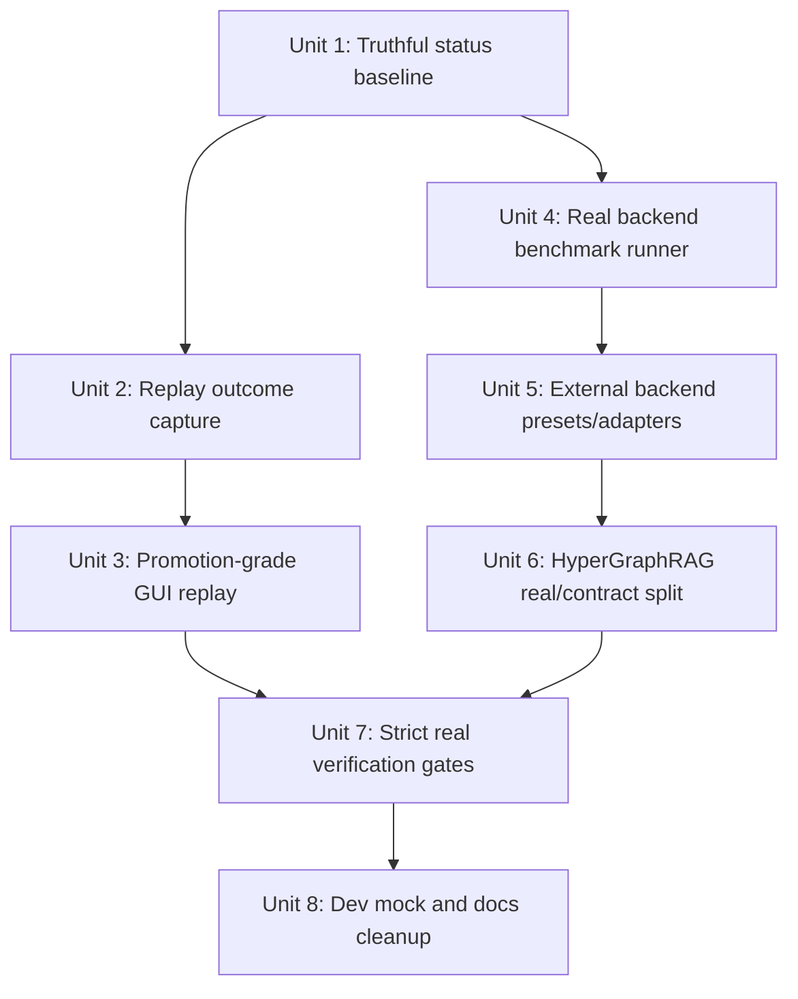
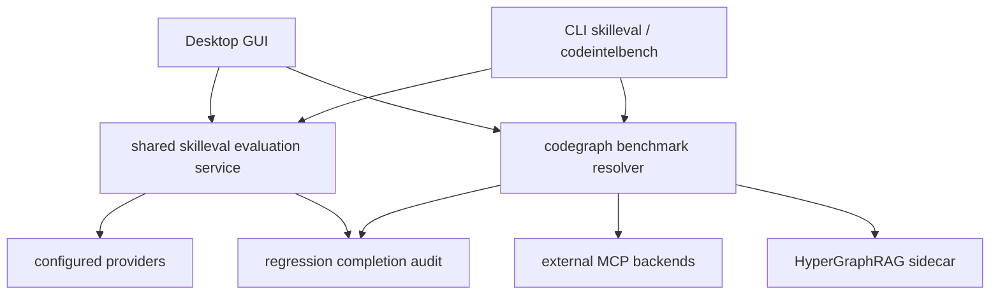

# Maddog Real Capability Gap Closure Plan

## 概述

本计划用于关闭当前审计中发现的“看起来已经完成，但实际仍是 smoke、dry-run、mock、sidecar contract 或文档引用”的缺口。目标不是删除所有测试 fixture，而是保证用户可见功能、验证矩阵和发布 gate 都只把真实能力算作完成证据。

核心原则：
- mock、fixture、dry-run 可以保留，但只能用于开发、单测或显式预览，不能作为 product completion proof。
- GUI 入口必须触发真实后端能力，或者在 UI 上明确显示“仅预览 / 仅本地 fixture / 需要配置真实后端”。
- 文档必须把“已实现、可选外部集成、研究参考、尚未实现”分清楚。
- 每个缺口必须有真实测试或真实 gate 证明，不再只靠 smoke。

## 问题框架

审计发现的主要问题来自 `maddog-fusion--3949` 这条工作线：部分功能已经有 UI、CLI 或文档入口，但底层仍是本地替身、固定结果、单 bundle dry-run、可选 smoke gate 或外部 sidecar contract。用户明确要求“不要 smoke，要真实的，不要占位”，因此本计划把“真实能力”和“验证真实性”都作为交付目标。

## 需求追溯

- R1. Code intelligence GUI benchmark 必须跑选中的真实 backend；不能把 `LocalFilesBenchmarkBackend` 改名成某个外部 backend。
- R2. `cmd/codeintelbench` 的 mock backend 不能默认混入真实 benchmark 结果；mock 只能显式启用或用于测试。
- R3. HyperGraphRAG 必须要么有真实可运行 sidecar/package 集成，要么在 UI/docs 中明确显示为 external contract，不能标成内置完成。
- R4. Serena、codebase-memory-mcp、claude-context、zvec 必须被分类为真实集成、可配置 preset、或研究参考；不能混在“已实现 backend”里。
- R5. Offline replay GUI evaluation 必须支持 promotion-grade provider replay、held-out bundles、默认 5 bundle guardrail、source bundle 排除和结果持久化。
- R6. Replay bundle 捕获不能无条件写 `Success: true` 和 `GoalMet: true`；需要基于真实 outcome signals 或明确标记 unknown/unverified。
- R7. Browser dev mock 不得显示会被误解为真实通过的固定高分或 guardrail pass。
- R8. Regression / release gate 必须区分 deterministic local checks、live provider checks、external benchmark real mode，并提供 fail-on-skipped-real-gates 的严格模式。
- R9. 文档和 verification matrix 必须同步更新，不能继续用 “Fulfilled” 包裹 scoped local smoke。

## 范围边界

- 不删除单元测试中的 fake provider、fixture server、mock backend；它们仍用于 deterministic tests。
- 不要求用户机器默认安装所有外部 code intelligence 项目；真实集成可以是 opt-in，但必须能被实际配置、启动、健康检查和 benchmark。
- 不把 zvec 强行声明为内置能力；若不能形成可运行 adapter，本计划要求降级为 research reference 并移除完成声明。
- 不在本计划中修改用户配置、重置配置或触发 clean build。

## 上下文与研究

### 相关代码与模式

- `maddog/desktop/app.go`：`EvaluateSkillCandidate`、`RunCodeIntelligenceBenchmark`、Capabilities projection。
- `maddog/internal/skilleval`：bundle、candidate、runner、scorer、guardrail。
- `maddog/internal/control/controller.go`：runtime replay bundle capture。
- `maddog/internal/codegraph`：backend registry、benchmark interfaces、local files backend。
- `maddog/cmd/codeintelbench`：CLI benchmark harness。
- `maddog/internal/hypergraphrag` 和 `maddog/internal/cli/hypergraphrag.go`：HyperGraphRAG sidecar contract/status。
- `maddog/internal/plugin/known_overrides.go`：known MCP server compatibility hints。
- `maddog/scripts/run-maddog-regression.ps1` 和 `maddog/scripts/run-coding-agent-benchmark.ps1`：release/regression gates。
- `maddog/desktop/frontend/src/lib/bridge.ts`：browser dev mock。
- `docs/cc/maddog-fusion--3949/*`：当前 claims、verification matrix 和历史执行记录。

### 组织积累的经验

- `docs/cc/maddog-fusion--3949/verification-matrix.md` 已经承认 desktop benchmark 是 local smoke。
- `docs/cc/maddog-fusion--3949/expert-verification-record.md` 记录过 selected backend benchmark、offline replay GUI、live evidence 等缺口，但后续状态表述偏乐观。
- 当前回归脚本已经有 live readiness/audit 概念，可扩展为 strict real gate，而不是另起验证系统。

### 外部参考资料

本计划不新增外部网页研究。外部项目只作为已有本地研究和配置目标：
- `research/github-stars-sekkit-2026-06-27/readmes/DeusData__codebase-memory-mcp.md`
- `research/github-stars-sekkit-2026-06-27/readmes/oraios__serena.md`
- `research/github-stars-sekkit-2026-06-27/readmes/zilliztech__claude-context.md`
- `research/github-stars-sekkit-2026-06-27/readmes/alibaba__zvec.md`

## 关键技术决策

- **先建立 truthful status，再扩展功能：** 第一阶段先让 UI/docs/tests 不再把 smoke 算完成，避免后续实现过程中继续制造假绿。
- **Replay evaluation 以 CLI 真实能力为源头：** CLI 已支持多 bundle/provider replay；GUI 应复用或抽取同一服务层，而不是继续维护一个 GUI-only dry-run path。
- **Benchmark backend 必须从 registry/config resolution 进入：** GUI 传入 backend id 后，应解析到真实 `codegraph.Backend` 或 explicit local benchmark mode；不能只改变 report ID。
- **External integration 分三类表达：** built-in、preset-configured external MCP、research reference。只有能启动/health/query/benchmark 的才进入前两类。
- **严格 gate 与开发便利分离：** deterministic local test 继续快速跑；release acceptance 用 strict mode 要求 live/real gates，否则明确失败。

## 计划结构

这些单元按阶段串行推进。文件层面存在有意的耦合：单元 1 先建立 characterization baseline，后续单元会在同一测试文件中把失败断言推进为通过断言；单元 8 最后再次收敛同一批文档和前端投影。因此执行时不要把这些单元作为独立并行 patch 分发，除非先进一步拆出 disjoint 文件范围。

## 实现单元

- [ ] **单元 1：建立真实状态基线和失败测试**

**目标：** 先把现有占位行为固定成可见失败，避免继续把 smoke/dry-run/mock 当完成。

**需求：** R1, R2, R3, R4, R5, R7, R9

**依赖：** 无

**Cluster:** coupled-real-gaps-sequential

**文件：**
- 修改：`docs/cc/maddog-fusion--3949/verification-matrix.md`
- 修改：`docs/cc/maddog-fusion--3949/expert-verification-record.md`
- 测试：`maddog/desktop/app_test.go`
- 测试：`maddog/desktop/skills_app_test.go`
- 测试：`maddog/cmd/codeintelbench/main_test.go`
- 测试：`maddog/desktop/frontend/src/__tests__/capabilities-code-intelligence.test.ts`
- 测试：`maddog/desktop/frontend/src/__tests__/capabilities-skill-candidates.test.ts`

**方案：**
- 把 verification docs 中的 “Fulfilled with scoped/local smoke” 改成真实状态：`implemented`、`external-contract`、`dev-only-mock`、`verification-pending`。
- 新增或调整 characterization tests，明确当前不接受的行为：
  - GUI benchmark 不能把 arbitrary backend id 跑成 local files backend。
  - GUI skill evaluation 不能只用 source bundle dry-run 来通过 promotion-grade guardrail。
  - dev mock 不能默认固定显示 guardrail pass。
  - CLI benchmark mock backend 不能默认进入 real report。

**执行备注：** characterization-first。先把当前缺口变成测试可见，再改实现。

**遵循的模式：**
- `maddog/desktop/skills_app_test.go` 现有 candidate lifecycle 测试。
- `maddog/desktop/app_test.go` 现有 benchmark running/latest report 测试。
- `maddog/cmd/e2ebench/regression_coverage_test.go` 对脚本覆盖的文本级 gate 测试。

**测试场景：**
- Happy path：docs 中每个 feature area 有明确 status，且不再把 local smoke 描述为真实完成。
- Error path：当 backend id 是外部 backend 时，旧的 local surrogate report 不再被接受。
- Error path：单 source bundle GUI eval 不能被记录为 promotion-grade pass。
- Integration：frontend capabilities tests 能区分 real evaluation、dry-run preview 和 dev mock state。

**验证：**
- 测试失败原因准确指向当前缺口，而不是泛化断言。
- 文档状态不再把 smoke、dry-run、mock、sidecar contract 写成完成证据。

- [ ] **单元 2：修正 replay bundle outcome 捕获**

**目标：** runtime capture 不再默认写死成功；bundle outcome 必须来自真实信号或显式 unknown。

**需求：** R5, R6

**依赖：** 单元 1

**Cluster:** coupled-real-gaps-sequential

**文件：**
- 修改：`maddog/internal/control/controller.go`
- 修改：`maddog/internal/control/turn_orchestrator.go`
- 修改：`maddog/internal/skilleval/bundle.go`
- 修改：`maddog/internal/skilleval/guardrail.go`
- 测试：`maddog/internal/control/controller_test.go`
- 测试：`maddog/internal/skilleval/guardrail_test.go`

**方案：**
- 扩展 `OutcomeInfo` 或 bundle metadata，表示 `verified` / `unknown` / `failed` outcome confidence。
- `captureReplayBundleAsync` 只在可证明成功时写 `Success/GoalMet=true`；否则保存 transcript、final answer、evidence、tokens，但标记 outcome unverified。
- Guardrail 对 unverified baseline 不允许 promotion pass，除非 implementation 阶段定义了明确的 human review 或 eval signal。

**遵循的模式：**
- `maddog/internal/skilleval/bundle.go` 的 v2 bundle 兼容策略。
- `maddog/internal/control/controller_test.go` 的 bundle capture helper。

**测试场景：**
- Happy path：一个有明确成功 outcome signal 的 turn 捕获为 verified success。
- Edge case：turn 正常返回但没有可证明成功信号时，bundle outcome 是 unverified 而不是 true。
- Error path：guardrail 遇到 unverified source/baseline bundle 时拒绝 promotion，并给出可读原因。
- Integration：controller capture 写出的 bundle 被 `skilleval.LoadBundle` 回读后保留 outcome confidence。

**验证：**
- 新 bundle 不再无条件成功。
- 旧 bundle 兼容读取，但 promotion-grade eval 会把缺失 confidence 当作风险处理。

- [ ] **单元 3：GUI offline replay 改为 promotion-grade evaluation**

**目标：** GUI 中的 EvaluateSkillCandidate 支持真实 provider replay、多 held-out bundle、默认 5 bundle guardrail，并拒绝 source bundle。

**需求：** R5, R6, R7

**依赖：** 单元 2

**Cluster:** coupled-real-gaps-sequential

**文件：**
- 修改：`maddog/desktop/app.go`
- 修改：`maddog/internal/skilleval/runner.go`
- 修改：`maddog/internal/skilleval/scorer.go`
- 修改：`maddog/internal/cli/skilleval.go`
- 修改：`maddog/desktop/frontend/src/components/CapabilitiesPanel.tsx`
- 修改：`maddog/desktop/frontend/src/lib/bridge.ts`
- 测试：`maddog/desktop/skills_app_test.go`
- 测试：`maddog/internal/cli/skilleval_test.go`
- 测试：`maddog/desktop/frontend/src/__tests__/capabilities-skill-candidates.test.ts`

**方案：**
- 抽取共享 evaluation service，使 CLI 和 GUI 使用同一套 bundle validation、provider replay、scoring、aggregate persistence。
- GUI evaluation 输入从单 hash 扩展为 evaluation request：candidate hash、held-out bundle paths/ids、model/provider selection、dry-run preview flag。
- GUI 默认 promotion-grade；dry-run 只能作为 preview，不能写入 passing promotion evaluation。
- Candidate view 显示 evaluation type、bundle count、source bundle exclusion、provider/model、aggregate score、每个 failed reason 的摘要。

**遵循的模式：**
- `maddog/internal/cli/skilleval.go` 的 held-out validation。
- `maddog/desktop/frontend/src/components/CapabilitiesPanel.tsx` 中现有 candidate action/mutate pattern。

**测试场景：**
- Happy path：5 个不同 held-out bundles + configured provider replay 成功后，candidate 记录 aggregate score 和 passing guardrail。
- Edge case：bundle 列表包含 source bundle，GUI evaluation 返回拒绝原因，不写 passing eval。
- Edge case：bundle id 或 path 重复，拒绝 evaluation。
- Error path：provider 未配置或 replay 返回错误时，candidate 状态不变，并显示 provider error。
- Integration：frontend action 调用新的 request shape，Capabilities 重新加载后展示 evaluation type 和 bundle count。
- Regression：旧单 hash EvaluateSkillCandidate path 不再产生 promotion-grade pass。

**验证：**
- GUI 能完成与 CLI 等价的真实 evaluation。
- Promote 只接受 promotion-grade passing evaluation，不接受 dry-run preview。

- [ ] **单元 4：Code intelligence GUI benchmark 跑真实选中 backend**

**目标：** `RunCodeIntelligenceBenchmark(id)` 根据 backend id 解析真实 backend 并执行对应 benchmark；local files benchmark 只能作为显式 local mode。

**需求：** R1, R2, R4

**依赖：** 单元 1

**Cluster:** coupled-real-gaps-sequential

**文件：**
- 修改：`maddog/desktop/app.go`
- 修改：`maddog/internal/codegraph/backend.go`
- 修改：`maddog/internal/codegraph/bench.go`
- 修改：`maddog/cmd/codeintelbench/main.go`
- 测试：`maddog/desktop/app_test.go`
- 测试：`maddog/internal/codegraph/backend_test.go`
- 测试：`maddog/internal/codegraph/bench_test.go`
- 测试：`maddog/cmd/codeintelbench/main_test.go`

**方案：**
- 新增 backend-to-benchmark adapter resolver：
  - built-in CodeGraph 使用真实 MCP/daemon benchmark adapter。
  - configured MCP backend 使用 tool mapping 调用真实 MCP tools。
  - HyperGraphRAG 使用 sidecar benchmark backend。
  - local files backend 只用于 explicit `local-files` 或 test mode。
- GUI report 中记录 `execution_mode`，例如 `real-backend`、`external-contract-failed`、`local-files-explicit`。
- `cmd/codeintelbench` 默认移除 mock backend；需要 mock 时显式传 flag 或仅在 tests 注入。

**遵循的模式：**
- `maddog/cmd/codeintelbench/main.go` 的 existing report save flow。
- `maddog/internal/codegraph/bench.go` 的 `BenchmarkBackend` interface。
- `maddog/desktop/app.go` 的 background running state/refcount pattern。

**测试场景：**
- Happy path：选中 built-in CodeGraph 时 report backend id/name/mode 与真实 CodeGraph adapter 匹配。
- Happy path：选中 configured MCP backend 时通过 mapped tool 执行 query，不创建 local files backend。
- Edge case：backend disabled 或不存在时返回明确错误，不写伪 report。
- Error path：MCP backend tool 缺失或健康失败时 report degraded/failure，但不标 ready。
- Regression：mock backend 不出现在默认 CLI report。
- Integration：Capabilities 只把最新 report attach 到同 id backend。

**验证：**
- GUI 点击哪个 backend，就实际 benchmark 哪个 backend。
- 默认 benchmark report 中没有 `MockGraph` 或伪装 local smoke。

- [ ] **单元 5：外部 code intelligence 项目真实接入或明确降级**

**目标：** 对 Serena、codebase-memory-mcp、claude-context、zvec 建立真实状态：可运行 preset/adapter，或明确 research-only，不再混作已实现。

**需求：** R3, R4

**依赖：** 单元 4

**Cluster:** coupled-real-gaps-sequential

**文件：**
- 修改：`maddog/internal/config/render.go`
- 修改：`maddog/internal/plugin/known_overrides.go`
- 修改：`maddog/internal/codegraph/backend.go`
- 修改：`maddog/desktop/app.go`
- 修改：`maddog/desktop/frontend/src/components/CapabilitiesPanel.tsx`
- 测试：`maddog/internal/config/render_test.go`
- 测试：`maddog/internal/plugin/plugin_test.go`
- 测试：`maddog/internal/codegraph/backend_test.go`
- 测试：`maddog/desktop/capabilities_app_test.go`

**方案：**
- 为 codebase-memory-mcp、Serena、claude-context 提供 first-party preset metadata：安装提示、command template、expected tools、health behavior、capability mapping。
- Preset 只在用户启用和配置后启动；未安装时 UI 显示 `not installed` / `needs setup`，而不是 `ready`。
- zvec 若没有当前可运行 MCP/sidecar contract，则只保留为 `research_reference`，从 backend completion list 中移除；若 implementation 阶段确认可运行 contract，则新增 `kind = "zvec"` adapter 并纳入真实 benchmark。
- Capabilities panel 对每个 external project 显示：`built-in`、`preset available`、`configured`、`ready`、`research only`。

**遵循的模式：**
- `maddog/internal/plugin/known_overrides.go` 的 first-party compatibility hints。
- `maddog/internal/config/render.go` 的 commented example rendering。
- `maddog/desktop/capabilities_app_test.go` 的 external backend projection tests。

**测试场景：**
- Happy path：配置 codebase-memory-mcp preset 后，Dir/priority/tool mapping 正确投影。
- Happy path：配置 Serena preset 后，symbol/context/health capability mapping 正确。
- Edge case：preset 未安装时 UI 不显示 ready，也不允许真实 benchmark pass。
- Error path：用户配置的 tool mapping 不符合 MCP namespace 时 validation 报错。
- Integration：Capabilities 能同时显示 built-in CodeGraph、configured external MCP、research-only zvec。

**验证：**
- 每个外部项目的状态可被用户准确理解。
- 至少一个 external MCP backend 可以完成真实 health/query/benchmark path；其余项目不再被文档或 UI 误写为已实现。

- [ ] **单元 6：HyperGraphRAG 从 sidecar contract 走向真实可验证集成**

**目标：** HyperGraphRAG 状态清晰：有真实 sidecar 可发现/运行/benchmark，或者 UI/docs 明确为 external contract required。

**需求：** R3, R4

**依赖：** 单元 5

**Cluster:** coupled-real-gaps-sequential

**文件：**
- 修改：`maddog/internal/hypergraphrag/sidecar.go`
- 修改：`maddog/internal/cli/hypergraphrag.go`
- 修改：`maddog/cmd/codeintelbench/main.go`
- 修改：`maddog/docs/HYPERGRAPHRAG.md`
- 修改：`maddog/desktop/frontend/src/components/CapabilitiesPanel.tsx`
- 测试：`maddog/internal/hypergraphrag/sidecar_test.go`
- 测试：`maddog/internal/cli/hypergraphrag_test.go`
- 测试：`maddog/cmd/codeintelbench/main_test.go`

**方案：**
- Status command 增加 optional `--check` 或 equivalent real health mode：只读 status 保留，但真实验证可以启动 command 执行 `health --json`。
- Sidecar validation 不仅检查 command 字段，还检查 command 可解析、health contract、index/query contract。
- Capabilities panel 将 HyperGraphRAG 显示为 `external sidecar`，并区分 `configured`、`health-ready`、`contract-failed`、`missing command`。
- Docs 明确：Maddog 不内置 Python/embedding/storage 实现；真实能力取决于 configured sidecar 成功通过 health/index/query。

**遵循的模式：**
- `maddog/internal/cli/hypergraphrag.go` 当前 status 输出和 env redaction。
- `maddog/cmd/codeintelbench/main_test.go` 的 helper process sidecar test。

**测试场景：**
- Happy path：helper sidecar 支持 health/index/query 时 benchmark 报 ready。
- Edge case：command 存在但 health JSON 不合法时 status 显示 contract failed。
- Error path：command 缺失时 CLI/GUI 都显示 missing command，不标 ready。
- Integration：`cmd/codeintelbench` 对 configured HyperGraphRAG 执行真实 sidecar query path，不走 mock。

**验证：**
- HyperGraphRAG 的“可配置 contract”和“真实已验证 sidecar”状态明确分离。
- 没有 sidecar 时不会产生看似通过的 benchmark。

- [ ] **单元 7：严格真实验证 gate**

**目标：** 回归脚本提供 strict real mode：缺失 live provider、official auth、external benchmark real mode 时可明确失败，而不是默认跳过后仍显示完成。

**需求：** R8, R9

**依赖：** 单元 3、单元 6

**Cluster:** coupled-real-gaps-sequential

**文件：**
- 修改：`maddog/scripts/run-maddog-regression.ps1`
- 修改：`maddog/scripts/run-coding-agent-benchmark.ps1`
- 修改：`maddog/cmd/e2ebench/regression_coverage_test.go`
- 修改：`maddog/benchmarks/REGRESSION.md`
- 测试：`maddog/cmd/e2ebench/regression_coverage_test.go`

**方案：**
- 新增 strict acceptance flag，例如 `-RequireRealCapabilities`，要求 live/frontier/official-auth/external-real/backend-real gates 满足，否则 exit non-zero。
- `completion_audit` 明确拆分：
  - `offline_verified`
  - `real_provider_verified`
  - `external_backend_verified`
  - `dev_fixture_only`
  - `blocked_missing_credentials`
- `run-coding-agent-benchmark.ps1` 增加 real model mode，不把 local fixture `local-smoke-model` 当 external benchmark completion。
- Release docs 写明：local deterministic checks 只能证明 harness wiring，不能证明 provider/frontier/external能力。

**遵循的模式：**
- `maddog/scripts/run-maddog-regression.ps1` 已有 Live Readiness 和 `-RequireComplete`。
- `maddog/cmd/e2ebench/regression_coverage_test.go` 的 script text coverage pattern。

**测试场景：**
- Happy path：所有 required real gates ready 且 passing 时 `completion_audit.complete=true`。
- Error path：strict mode 下缺少 provider credentials，脚本失败并报告 missing requirements。
- Error path：external benchmark 只跑 local-smoke-model 时 strict real external gate 不通过。
- Integration：JSON audit 字段能被 `-AuditOnly -RequireComplete` 复用。

**验证：**
- 开发者仍可跑快速本地回归。
- 发布/验收时可以强制真实能力，不再被 skipped smoke 掩盖。

- [ ] **单元 8：dev mock、防误导 UI 和文档收敛**

**目标：** 所有剩余 mock/dry-run/smoke 入口都显式标记，不再误导用户；最终文档只保留真实状态。

**需求：** R7, R9

**依赖：** 单元 7

**Cluster:** coupled-real-gaps-sequential

**文件：**
- 修改：`maddog/desktop/frontend/src/lib/bridge.ts`
- 修改：`maddog/desktop/frontend/src/locales/en.ts`
- 修改：`maddog/desktop/frontend/src/locales/zh.ts`
- 修改：`maddog/desktop/frontend/src/components/CapabilitiesPanel.tsx`
- 修改：`docs/cc/maddog-fusion--3949/verification-matrix.md`
- 修改：`docs/cc/maddog-fusion--3949/expert-verification-record.md`
- 修改：`maddog/docs/HYPERGRAPHRAG.md`
- 修改：`maddog/benchmarks/REGRESSION.md`
- 测试：`maddog/desktop/frontend/src/__tests__/capabilities-skill-candidates.test.ts`
- 测试：`maddog/desktop/frontend/src/__tests__/capabilities-code-intelligence.test.ts`

**方案：**
- Browser dev mock candidate evaluation 不再固定写 `score=0.91` 和 `guardrailPass=true`；改为 `mockPreview=true` 或明确 `notPromotionGrade`。
- UI 文案区分 “Preview”、“Dry run”、“Real provider evaluation”、“Real backend benchmark”。
- docs 中所有 “Fulfilled” 改为基于单元 1-7 结果的状态，不再保留 self-contradictory language。
- 添加最终 audit table：每个缺口、修复方式、真实验证方式、剩余非目标。

**执行备注：** direct -- 本单元主要是 projection、文案和文档收敛，但仍需要 frontend contract tests 防止回退。

**遵循的模式：**
- `maddog/desktop/frontend/src/lib/bridge.ts` 的 existing browser dev mock comments。
- `docs/cc/maddog-fusion--3949/verification-matrix.md` 的 matrix layout。

**测试场景：**
- Happy path：browser dev mock 显示 mock/preview 状态，不能触发 promotion-grade pass。
- Happy path：真实 evaluation result 仍可显示 score/guardrail/audit。
- Regression：Capabilities code intelligence row 不出现 local smoke label，除非 explicit local mode。
- Documentation：verification matrix 每个 feature area 都有真实 artifact 或明确 external/precondition。

**验证：**
- 用户从 GUI 和 docs 都能判断当前看到的是 preview、fixture、external contract 还是真实能力。
- 所有已知缺口都有对应状态和后续 owner，不再隐藏在 “fulfilled” 里。

## 系统级影响

- **交互图：**

- **错误传播：** provider、MCP、sidecar、missing credentials 的错误必须进入 result/audit，不能吞掉后改写为 pass。
- **状态生命周期风险：** candidate evaluation 从 dry-run preview 到 promotion-grade evaluation 后，需要防止旧 evaluation 被误用；candidate store 必须记录 evaluation type。
- **API 接口一致性：** Wails bindings、frontend bridge mock、TypeScript types 和 Go App 方法需要同步。
- **集成覆盖：** CLI 和 GUI 必须共享真实 evaluation/benchmark 逻辑，避免两个入口再次漂移。
- **不变量确认：** 快速本地测试仍可保留；本计划只禁止它们被记为真实验收证据。

## 风险与依赖

| 风险 | 可能性 | 影响 | 缓解措施 |
|------|--------|------|----------|
| 真实 provider replay 会变慢且依赖凭证 | 高 | 中 | GUI 提供明确 precondition/error；strict gate 只在验收模式强制 |
| 外部 MCP 项目安装方式变化 | 中 | 中 | first-party preset 只保存 contract/preset，不把第三方包 vendored 到默认路径 |
| zvec 无法形成短期可运行 adapter | 中 | 低 | 明确降级为 research-only，不再声明已集成 |
| 旧 bundle 缺少 outcome confidence | 高 | 中 | 兼容读取，但 guardrail 对 promotion-grade eval 采取保守拒绝 |
| benchmark resolver 触发长时间索引 | 中 | 中 | 继续使用 timeout/degraded report，不把 timeout 标 pass |
| 文档再次过度乐观 | 中 | 高 | 单元 8 增加最终 audit table，并让 regression strict mode 作为证据来源 |

## 分阶段交付

### 阶段 1：停止假绿
- 单元 1
- 单元 2

### 阶段 2：补真实 replay 和 benchmark
- 单元 3
- 单元 4

### 阶段 3：外部集成真实性
- 单元 5
- 单元 6

### 阶段 4：验收和文档收敛
- 单元 7
- 单元 8

## 延迟到实现阶段的问题

- 具体 provider selection UI 放在 Capabilities 还是 Settings：实现时根据现有布局和用户路径确定，但必须能从 GUI 触发真实 evaluation。
- zvec 是否做成 sidecar、MCP preset 还是 research-only：取决于实现时确认的可运行 contract；不能在没有 contract 时声明实现。
- HyperGraphRAG sidecar 是否由 Maddog 提供 helper installer：本计划要求真实状态可验证，不强制默认安装。
- 严格 gate 的 flag 名：实现时可沿用脚本命名风格，但必须具备 fail-on-skipped-real-gates 行为。

## 文档 / 运维说明

- 更新 `docs/cc/maddog-fusion--3949/verification-matrix.md`，把 smoke/local/mock/dry-run 状态改成真实 status。
- 更新 `maddog/benchmarks/REGRESSION.md`，说明 local checks 与 real acceptance 的差异。
- 更新 `maddog/docs/HYPERGRAPHRAG.md`，明确 external sidecar contract 和 real health/index/query 验证。
- Release checklist 应要求 strict real mode 或明确记录哪些 real gates 因 credentials/preconditions 缺失未跑。

## 成功指标

- GUI offline replay 可以完成 provider-backed held-out evaluation，并且默认不接受 source bundle 或少于 5 个 held-out bundles。
- GUI code intelligence benchmark 对 selected backend 执行真实 adapter，而不是 local files surrogate。
- `cmd/codeintelbench` 默认 report 不包含 mock backend。
- HyperGraphRAG 无 sidecar 时不会显示 ready；有 sidecar 时能真实 health/index/query。
- External project 状态可解释：built-in、preset configured、ready、research-only 不混淆。
- Browser dev mock 不再展示固定高分通过。
- Strict regression mode 能在缺少真实 gates 时失败。
- Verification docs 不再把 smoke/dry-run/mock 归为 fulfilled。

## 来源与参考资料

- 源码级对齐审计（2026-07-03，含 plan 未覆盖的新缺口与单元增补建议）：`docs/cc/maddog-real-gaps--7c21/source-alignment-audit.md`
- 需求来源：`docs/cc/maddog-fusion--3949/verification-matrix.md`
- 审计来源：`docs/cc/maddog-fusion--3949/expert-verification-record.md`
- 执行记录来源：`docs/cc/maddog-fusion--3949/tasks.md`
- Code intelligence：`maddog/desktop/app.go`, `maddog/internal/codegraph/backend.go`, `maddog/internal/codegraph/bench.go`, `maddog/cmd/codeintelbench/main.go`
- Offline replay：`maddog/desktop/app.go`, `maddog/internal/skilleval/runner.go`, `maddog/internal/skilleval/guardrail.go`, `maddog/internal/control/controller.go`
- HyperGraphRAG：`maddog/internal/hypergraphrag/sidecar.go`, `maddog/internal/cli/hypergraphrag.go`, `maddog/docs/HYPERGRAPHRAG.md`
- Regression：`maddog/scripts/run-maddog-regression.ps1`, `maddog/scripts/run-coding-agent-benchmark.ps1`, `maddog/benchmarks/REGRESSION.md`
