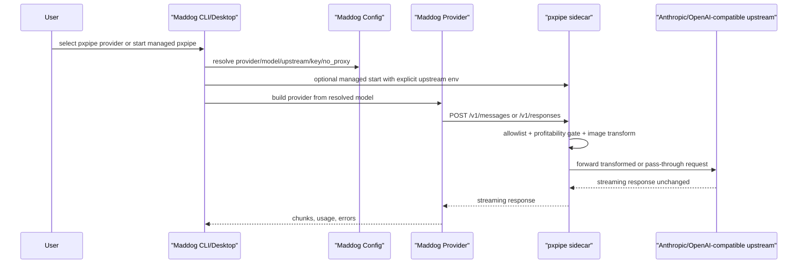

# feat: Add Optional pxpipe Gateway Integration

## Overview

Best path: integrate pxpipe as an optional local gateway/sidecar around Maddog's existing provider layer, not as a native Go port of pxpipe's renderer/transform logic.

Maddog already has the right extension points: `kind="anthropic"` emits Anthropic Messages, `kind="openai"` can emit OpenAI Responses, providers already carry `base_url`, `api_key_env`, `wire_api`, `reasoning_protocol`, `context_window`, and `no_proxy`. pxpipe already exposes exactly the needed HTTP gateway shape on `127.0.0.1:47821`. The missing work is lifecycle/configuration/health/model discovery, not a new provider abstraction.

## Problem Frame

pxpipe is a token-saving request proxy for Claude Code-style traffic. It renders bulky, stable input context into dense PNG image blocks and forwards model responses unchanged. Its README and docs state that this is useful only for allowlisted models and token-dense content; exact-string recall in imaged content is lossy, so byte-critical data must remain text.

Maddog's current architecture already has provider-driven routing and cache-aware context maintenance. The integration should preserve those boundaries:

- Maddog owns provider selection, session history, tools, compaction, auth prompts, and UI state.
- pxpipe owns request-body transformation, image rendering, profitability gating, dashboard metrics, and upstream proxying.
- The first Maddog integration should make pxpipe easy and safe to run, then let its telemetry prove whether deeper integration is worth it.

## Requirements Traceability

- R1. Keep Maddog as a Go single-binary agent app; pxpipe must be optional and must not become required for normal provider use.
- R2. Reuse Maddog provider config instead of inventing a parallel model/provider registry.
- R3. Support Anthropic Messages through `http://127.0.0.1:47821` and OpenAI Responses through `http://127.0.0.1:47821/v1`.
- R4. Configure pxpipe upstreams explicitly; a Maddog provider pointed at localhost is not enough because pxpipe defaults upstreams to first-party Anthropic/OpenAI.
- R5. Do not silently image models outside pxpipe's allowlist. In particular, GPT 5.5 is opt-in in pxpipe's current docs because image-reading quality is worse than GPT 5.6/Fable 5.
- R6. Keep exact identifiers, recent user turns, secrets, hashes, and failure diagnostics in text unless pxpipe itself classifies them as safe.
- R7. Surface health and failure states clearly: pxpipe absent, wrong upstream, missing key, unsupported model, dashboard disabled/off, or transform pass-through.
- R8. Add characterization coverage around provider resolution, model discovery, endpoint routing, and no-proxy behavior before broadening behavior.

## Scope Boundaries

- Do not port pxpipe's TypeScript renderer into Go for v1.
- Do not add pxpipe as a hard runtime dependency of Maddog.
- Do not make pxpipe the default path for DeepSeek, MiMo, or arbitrary OpenAI-compatible providers.
- Do not claim cost savings inside Maddog until Maddog-collected or pxpipe event-log evidence exists for Maddog sessions.
- Do not expose pxpipe's unauthenticated dashboard off-loopback from Maddog-managed defaults.

## Context And Research

### pxpipe Facts

- Repository cloned and inspected at `teamchong/pxpipe@b1f5a01`.
- Package: `pxpipe-proxy` version `0.8.0`, MIT license, Node `>=18`, CLI binary `pxpipe`.
- Main surfaces:
  - Node CLI proxy: `npx pxpipe-proxy`, default `127.0.0.1:47821`.
  - Library API: `transformAnthropicMessages`, `renderTextToImages`.
  - Worker adapter.
- Proxy routes:
  - Anthropic: `POST /v1/messages`, `/anthropic/v1/messages`, `/anthropic/messages`.
  - OpenAI: `POST /v1/chat/completions`, `POST /v1/responses`, plus `/v1/models` pass-through when auth looks OpenAI-like.
- Runtime env:
  - `PORT`, `HOST`.
  - `PXPIPE_UPSTREAM`, `ANTHROPIC_UPSTREAM`, `OPENAI_UPSTREAM`.
  - `OPENAI_API_KEY` optional override; Anthropic normally forwards the client's `x-api-key`.
  - `PXPIPE_MODELS`, default `claude-fable-5,gpt-5.6`; `off` disables imaging.
  - `PXPIPE_LOG`, default `~/.pxpipe/events.jsonl`.
- Important limitation: imaged exact strings can be silently misread; pxpipe docs explicitly treat Opus 4.8 and GPT 5.5 as opt-in rather than safe defaults.

### Maddog Facts

- Maddog is a Go app with provider kinds registered under `internal/provider`.
- `maddog/internal/provider/anthropic/anthropic.go` emits Anthropic Messages and normalizes `base_url` to a root before adding `/v1/messages`.
- `maddog/internal/provider/openai/openai.go` can route to `wire_api="responses"` and uses `base_url + /responses`.
- `maddog/internal/config/config.go` already includes provider fields needed for pxpipe: `BaseURL`, `Model`, `Models`, `ModelsURL`, `Default`, `APIKeyEnv`, `WireAPI`, `ReasoningProtocol`, `ContextWindow`, `NoProxy`.
- `Config.NoProxyHosts()` already derives hosts from providers marked `no_proxy`, which is correct for `127.0.0.1`.
- Current worktree already contains a partial pxpipe provider direction:
  - `pxpipe-claude` default provider pointed at `http://127.0.0.1:47821`.
  - `pxpipe-gpt` default provider pointed at `http://127.0.0.1:47821/v1`.
  - A test renamed to `TestDefaultIncludesPxpipeProvidersWithoutHardcodedGPTModel`.
- Risk in the current partial diff: removing `pxpipe-gpt.model` without replacing it with a valid model discovery/default path can make `ResolveModel`, `/model`, `/provider`, and provider initialization fail or hide the provider.

## Key Technical Decisions

- Use sidecar gateway integration for v1. This matches pxpipe's maintained API surface and avoids reimplementing image rendering, cache-control relocation, profitability gates, and model allowlist logic in Go.
- Treat pxpipe as an advanced optional provider profile. Built-in entries may exist, but active use should require either explicit provider selection or a managed `maddog pxpipe start` path.
- Keep Anthropic/Fable path as the primary compression target. GPT support should be available only when pxpipe reports/accepts an allowed GPT model or `PXPIPE_MODELS` is explicitly configured.
- Make upstream configuration explicit. For non-first-party upstreams, Maddog must set `ANTHROPIC_UPSTREAM` / `OPENAI_UPSTREAM` when it starts pxpipe, or document that users must set them when running pxpipe manually.
- Preserve Maddog's existing compaction and tool-output pruning. pxpipe compresses request payloads after Maddog constructs them; Maddog should still keep histories healthy and recoverable.

## Alternative Approaches Considered

| Approach | Decision | Reason |
|---|---|---|
| Native Go port of pxpipe transform/render | Reject for v1 | High maintenance surface: PNG atlas/rendering, cache-control invariants, model allowlist, eval-backed thresholds, and dashboard telemetry would all fork from upstream. |
| Use pxpipe Node proxy as sidecar | Recommended | Minimal Maddog changes, uses pxpipe's maintained logic, aligns with existing provider `base_url` model. |
| Call pxpipe library via Node subprocess per request | Reject for v1 | Adds process overhead and a mixed-runtime request path while still needing upstream proxy/auth/error handling. |
| Cloudflare Worker pxpipe | Defer | Useful for shared remote deployments, but it changes auth/security posture and is not needed for local desktop/CLI integration. |
| Just document manual pxpipe setup | Partial only | Good bootstrap, but misses health checks, model discovery, upstream safety, and UI clarity. |

## High-Level Technical Design

> This illustrates the intended approach and is directional guidance for review, not implementation specification. The implementing agent should treat it as context, not code to reproduce.

## Implementation Units

- [x] **Unit 1: Stabilize pxpipe Provider Defaults And Model Resolution**

**Goal:** Make built-in/configured pxpipe providers resolvable, selectable, and safe before adding sidecar management.

**Requirements:** R2, R3, R5, R8

**Dependencies:** None

**Files:**
- Modify: `maddog/internal/config/config.go`
- Modify: `maddog/internal/config/configured_test.go`
- Modify: `maddog/internal/config/fetch_test.go`

**Approach:**
- Keep `pxpipe-claude` as an Anthropic provider with an explicit safe default model, preferably `claude-fable-5`.
- Do not leave `pxpipe-gpt` with no model unless a runtime model-fetch/defaulting mechanism is added in the same unit.
- Preferred GPT shape: keep `wire_api="responses"` and make GPT pxpipe opt-in, with either:
  - explicit configured `models/default` chosen by setup or settings, or
  - a deterministic fallback model only when it is actually known to be supported by pxpipe.
- Ensure `no_proxy=true` remains present for localhost pxpipe providers.
- Keep root `maddog.toml` changes out of product defaults unless they are local development config; product-facing examples belong in Unit 4.

**Execution note:** Characterization-first because the current worktree already has a partial pxpipe default-provider diff.

**Patterns to follow:**
- `maddog/internal/config/config.go` `ProviderEntry.ModelList`, `DefaultModel`, `ResolveModel`.
- `maddog/internal/config/fetch.go` model-fetch candidate logic.
- Existing `TestProviderConfigured` and provider default tests.

**Test scenarios:**
- Happy path: `cfg.ResolveModel("pxpipe-claude")` returns `pxpipe-claude/claude-fable-5`.
- Happy path: `cfg.ResolveModel("pxpipe-gpt/<model>")` succeeds only for a model listed in `ModelList`.
- Edge case: `pxpipe-gpt` with empty model list is not presented as a selectable chat provider.
- Error path: `cfg.Validate("pxpipe-gpt")` reports an actionable unknown/missing-model state instead of constructing an OpenAI client with `Model=""`.
- Integration: `NoProxyHosts()` includes `127.0.0.1` once when pxpipe providers are enabled.

**Verification:** Provider list, model switcher, and config validation all behave deterministically with pxpipe present, absent, and keyless.

- [x] **Unit 2: Add Managed pxpipe Sidecar Command**

**Goal:** Let Maddog start/stop/status a local pxpipe process with the right upstream and model-scope environment.

**Requirements:** R1, R4, R7

**Dependencies:** Unit 1

**Files:**
- New: `maddog/internal/pxpipe/manager.go`
- New: `maddog/internal/pxpipe/manager_test.go`
- New: `maddog/internal/cli/pxpipe.go`
- Modify: `maddog/internal/cli/cli.go`
- Modify: `maddog/internal/i18n/messages_en.go`
- Modify: `maddog/internal/i18n/messages_zh.go`

**Approach:**
- Add a small manager that finds `pxpipe` or `npx pxpipe-proxy`, starts it bound to loopback, records PID/port/log path under Maddog state, and checks dashboard/API health.
- Derive `ANTHROPIC_UPSTREAM` and `OPENAI_UPSTREAM` from selected upstream provider config rather than assuming first-party APIs.
- Pass `PXPIPE_MODELS` explicitly from the selected model policy; default to pxpipe's documented safe set only when compatible with selected providers.
- Keep manual mode supported: if a user already runs pxpipe on the configured port, Maddog should detect it and avoid spawning a duplicate.

**Patterns to follow:**
- CLI command registration in `maddog/internal/cli/cli.go`.
- Existing environment registry command shape in `maddog/internal/cli/env.go`.
- Process-state style used by other Maddog runtime helpers, if present.

**Test scenarios:**
- Happy path: manager builds env with loopback host, chosen port, explicit upstreams, and `PXPIPE_LOG`.
- Happy path: status detects an already-running pxpipe dashboard without spawning.
- Edge case: configured port already bound by another process returns an actionable message.
- Error path: missing `node`/`npx`/`pxpipe` reports install instructions without changing provider config.
- Security: `HOST` defaults to `127.0.0.1`; setting `0.0.0.0` is never Maddog's default.

**Verification:** `maddog pxpipe status` can distinguish not-installed, not-running, running-unmanaged, running-managed, and unhealthy-upstream states.

- [x] **Unit 3: Surface pxpipe Health In Doctor And Environment Registry**

**Goal:** Make pxpipe readiness visible in diagnostics without leaking keys or request contents.

**Requirements:** R7, R8

**Dependencies:** Unit 2

**Files:**
- Modify: `maddog/internal/environment/environment.go`
- Modify: `maddog/internal/environment/environment_test.go`
- Modify: `maddog/internal/doctor/report.go`
- Modify: `maddog/internal/doctor/report_test.go`
- Modify: `maddog/docs/ENVIRONMENT_REGISTRY.md`

**Approach:**
- Add pxpipe runtime/tool detection alongside existing environment registry support.
- Doctor should report selected path/version/status, dashboard URL, configured log path, and whether the active pxpipe providers point to loopback.
- Do not read or print `~/.pxpipe/events.jsonl` raw contents in doctor; only report existence, size, and latest safe timestamp if useful.
- Preserve existing secret redaction behavior.

**Patterns to follow:**
- Existing doctor provider report redaction.
- Current environment registry JSON shape.

**Test scenarios:**
- Happy path: doctor JSON includes pxpipe status when pxpipe is installed/running.
- Edge case: pxpipe provider configured but sidecar missing produces a warning, not a panic.
- Error path: unreadable pxpipe log path is reported as diagnostic metadata only.
- Security: no API key, request body, or transformed prompt content appears in doctor text/JSON.

**Verification:** Doctor output gives enough information to fix pxpipe setup while preserving sensitive data boundaries.

- [x] **Unit 4: Document Manual And Managed Setup**

**Goal:** Give users a clear route for trying pxpipe safely before making it a first-class default.

**Requirements:** R1, R4, R5, R6, R7

**Dependencies:** Units 1-3

**Files:**
- New: `maddog/docs/PXPIPE.md`
- Modify: `maddog/README.md`
- Modify: `maddog/README.zh-CN.md`
- Modify: `maddog/maddog.example.toml`

**Approach:**
- Document manual sidecar mode:
  - start pxpipe,
  - set upstream envs,
  - select Maddog `pxpipe-claude` or `pxpipe-gpt`,
  - inspect pxpipe dashboard/log.
- Document managed sidecar mode if Unit 2 is implemented.
- Explicitly say GPT 5.5 and unsupported models pass through or require opt-in imaging.
- Explain exact-string risk and the recommended escape: keep byte-critical tasks on text path or unsupported-model pass-through.

**Patterns to follow:**
- Existing provider config examples in `maddog/README.md` and `maddog/maddog.example.toml`.
- Existing bilingual docs convention.

**Test scenarios:**
- Docs example: Anthropic/Fable local pxpipe provider uses `base_url="http://127.0.0.1:47821"`.
- Docs example: OpenAI Responses pxpipe provider uses `base_url="http://127.0.0.1:47821/v1"` and `wire_api="responses"`.
- Docs warning: exact IDs/hashes/secrets should not rely on imaged recall.
- Docs warning: upstream env must be set when using non-first-party gateways.

**Verification:** A user can follow docs to run one pxpipe-backed Maddog session without editing source code or leaking credentials into TOML.

- [x] **Unit 5: Optional pxpipe Event Summary Integration**

**Goal:** Add lightweight visibility into whether Maddog sessions actually benefit from pxpipe.

**Requirements:** R7

**Dependencies:** Units 2-4

**Files:**
- New: `maddog/internal/pxpipe/events.go`
- New: `maddog/internal/pxpipe/events_test.go`
- Modify: `maddog/internal/agent/usage.go`
- Modify: `maddog/internal/event/event.go`

**Approach:**
- Parse only safe aggregate fields from pxpipe JSONL: status, path, model, image count, baseline tokens, sent/cache tokens, reason, and compression status.
- Correlate at session level only when a stable request id or timestamp window is available.
- Do not ingest source text, image bodies, gzipped request samples, or dashboard HTML into Maddog logs.
- Treat this as observability, not billing truth, until validated on Maddog sessions.

**Patterns to follow:**
- Existing Maddog usage and cache diagnostics events.
- Existing redaction posture in doctor/reporting code.

**Test scenarios:**
- Happy path: parser summarizes compressed/pass-through rows without raw prompt content.
- Edge case: partial baseline probe rows are excluded from savings claims.
- Error path: malformed JSONL lines are skipped with count, not fatal.
- Security: body sample fields are ignored.

**Verification:** Maddog can report "pxpipe was used/pass-through/compressed" without claiming unverified cost savings.

## System-Wide Impact

- **Provider routing:** pxpipe providers are ordinary Maddog providers. This keeps `/model`, `/provider`, planner/subagent model refs, desktop settings, and headless `--model` semantics consistent.
- **Network proxy:** `no_proxy=true` is important because localhost pxpipe should not be routed through a corporate or custom proxy.
- **Auth:** Maddog still resolves keys from env/auth config. pxpipe should either forward those headers or be launched with explicit upstream override env. TOML must not store secrets.
- **Cache behavior:** Maddog's own cache diagnostics continue to describe the pre-proxy provider request shape. pxpipe's image/cache behavior is a downstream transformation and needs separate observability if shown.
- **Desktop:** A later GUI pass can expose sidecar status and dashboard link, but CLI/doctor support should land first.

## Risks And Mitigations

| Risk | Impact | Mitigation |
|---|---|---|
| pxpipe not running | pxpipe provider fails on first request | Add `maddog pxpipe status/start`, doctor warning, and clear docs. |
| Wrong upstream defaults | ICE or custom gateway key sent to first-party API, request fails | Managed sidecar must set `ANTHROPIC_UPSTREAM`/`OPENAI_UPSTREAM`; docs must call this out for manual mode. |
| Empty GPT model list | Provider hidden or fails to initialize | Unit 1 must keep valid model resolution or make provider intentionally unselectable with clear messaging. |
| Unsupported model silently imaged | Quality regression | Do not override `PXPIPE_MODELS` to include unsafe models by default; display pass-through/unsupported states. |
| Exact-string misread | Wrong hashes, IDs, names, secrets in model reasoning | Keep byte-critical work on text path; rely on Maddog's read-before-edit discipline; document risk. |
| Dashboard exposure | Captured prompt context visible on LAN | Maddog-managed mode binds loopback only and warns if user opts into non-loopback. |
| Upstream pxpipe API churn | Integration breakage | Depend on HTTP gateway contract first; keep library/native integration out of v1. |

## Deferred Implementation Questions

- Should pxpipe providers be built into `Default()` or added only when `maddog pxpipe setup` is run?
- Which upstream should managed pxpipe use when the active Maddog provider is an aggregator like icodeeasy that exposes both OpenAI and Anthropic-compatible routes?
- Does pxpipe's `/v1/models` pass-through return the right model list for the actual configured upstream in all Maddog-supported auth modes?
- Should desktop show pxpipe dashboard in-app, open browser, or only show status/link?
- Can Maddog attach a request id that pxpipe preserves for exact event correlation?

## Recommended Phased Delivery

### Phase 1: Safe Manual Integration

- Finish Unit 1.
- Add `maddog/docs/PXPIPE.md` manual setup subset from Unit 4.
- Keep pxpipe opt-in through provider selection.

### Phase 2: Managed Local Sidecar

- Implement Units 2 and 3.
- Make `maddog pxpipe status/start/stop` the recommended route.
- Add doctor checks before deeper telemetry.

### Phase 3: Evidence And UI

- Implement Unit 5 if Phase 1-2 shows real Maddog sessions benefit.
- Add desktop health/dashboard affordances after CLI contract stabilizes.

## Execution Record

- Implemented Units 1-5 in `codex/pxpipe-gateway`.
- Added optional `pxpipe-claude` and `pxpipe-gpt` provider support, with GPT hidden until a concrete supported model is selected.
- Added `maddog pxpipe status/start/stop`, loopback-managed sidecar defaults, derived upstream env, managed/unmanaged/unhealthy status detection, and safe event-log summaries.
- Added doctor/environment visibility and manual/managed setup docs.
- Added safe JSONL event parsing that ignores raw body samples and reports only aggregate pxpipe usage state.
- Verified with:
  - `go test ./internal/config ./internal/pxpipe ./internal/environment ./internal/doctor ./internal/event ./internal/agent ./internal/cli -count=1`
  - `go test ./...`
  - `git diff --check`
  - `go run ./cmd/maddog pxpipe status --json`
- Limitation: no real Maddog API-key-backed pxpipe upstream session was run in this implementation pass, so Maddog still reports pxpipe observability only and does not claim verified cost savings.

## Current Worktree Handling Notes

- Existing uncommitted changes in provider defaults, environment registry, doctor, i18n, and root `maddog.toml` should be treated as user work.
- Do not revert them blindly.
- The current `pxpipe-gpt` no-hardcoded-model direction is directionally reasonable, but it needs a real model discovery/default resolution path before it is complete.
- Root `maddog.toml` appears to be local configuration; product-facing defaults should be evaluated in `maddog/internal/config/config.go` and `maddog/maddog.example.toml`, not inferred from that root file alone.

## Validation Plan

- Static characterization:
  - Config/provider tests for `ResolveModel`, `Validate`, `NoProxyHosts`, `ModelList`, and `FetchModels`.
  - pxpipe manager tests using fake executable/HTTP server.
  - Doctor tests with redaction checks.
- Integration smoke:
  - Start fake pxpipe server implementing `/v1/messages`, `/v1/responses`, `/v1/models`.
  - Verify Maddog Anthropic provider posts `/v1/messages`.
  - Verify Maddog OpenAI Responses provider posts `/v1/responses`.
  - Verify `/v1/models` can populate/select GPT models if enabled.
- Manual QA:
  - Real local pxpipe on loopback.
  - One Anthropic/Fable Maddog turn through pxpipe.
  - One unsupported-model pass-through turn.
  - Dashboard shows compression/pass-through reason.

## Sources

- External source: `teamchong/pxpipe@b1f5a01`.
- External docs inspected: `README.md`, `docs/`, `src/core/proxy.ts`, `src/core/library.ts`, `src/core/applicability.ts`, `src/node.ts`.
- Maddog source inspected: `maddog/internal/config/`, `maddog/internal/provider/openai/`, `maddog/internal/provider/anthropic/`, `maddog/internal/cli/`, `maddog/internal/environment/`, `maddog/internal/doctor/`.
- Existing Maddog planning context: `docs/cc/maddog-fusion--3949/spec.md`, `docs/cc/maddog-fusion--3949/tech.md`, `docs/cc/maddog-fusion--3949/plan-external-schemes.md`.
