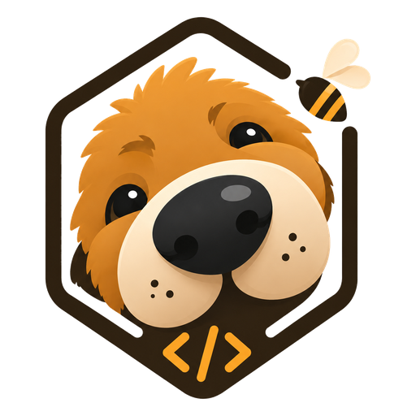

<p align="center">
  
</p>

<p align="center">
  <strong>English</strong>
  &nbsp;·&nbsp;
  <a href="./README.zh-CN.md">简体中文</a>
  &nbsp;·&nbsp;
  <a href="./docs/GUIDE.md">Guide</a>
  &nbsp;·&nbsp;
  <a href="./docs/SPEC.md">Spec</a>
  &nbsp;·&nbsp;
  <a href="https://sekkit.github.io/maddog/">Website</a>
  &nbsp;·&nbsp;
  <strong><a href="https://discord.gg/XF78rEME2D">Discord</a></strong>
</p>

> [!IMPORTANT]
> **Maddog 1.0 is a ground-up rewrite in Go** — this branch (`main-v2`) is the new default and where development happens now.
> The earlier `0.x` TypeScript releases are **legacy**, living on the [`v1`](https://github.com/sekkit/maddog/tree/v1) branch (maintenance only).
> See the **[migration guide](./docs/MIGRATING.md)**. `npm i -g maddog` stays the install command — `1.0.0`+ delivers the Go binary, `0.x` is the legacy TS build.

<p align="center">
  <a href="https://www.npmjs.com/package/maddog"></a>
  <a href="https://github.com/sekkit/maddog/actions/workflows/ci.yml"></a>
  <a href="./LICENSE"></a>
  <a href="https://www.npmjs.com/package/maddog"></a>
  <a href="https://github.com/sekkit/maddog/stargazers"></a>
  <a href="https://atomgit.com/sekkit/maddog"></a>
  <a href="https://github.com/sekkit/maddog/graphs/contributors"></a>
  <a href="https://github.com/sekkit/maddog/discussions"></a>
  <a href="https://discord.gg/XF78rEME2D"></a>
</p>

<p align="center">
  <a href="https://oosmetrics.com/repo/sekkit/maddog"></a>
  <a href="https://oosmetrics.com/repo/sekkit/maddog"></a>
  <a href="https://oosmetrics.com/repo/sekkit/maddog"></a>
</p>

<br/>

<h3 align="center">A DeepSeek-native AI coding agent for your terminal.</h3>
<p align="center">A config- and plugin-driven harness — a single static Go binary, tuned around DeepSeek's prefix cache so token costs stay low across long sessions.</p>

<br/>

> [!IMPORTANT]
> **Community · 加入社区** — bilingual Discord for setup help (`#help` / `#求助`), workflow showcases, and feature ideas. → **<https://discord.gg/XF78rEME2D>**

<br/>

## Features

- **Config-driven.** Providers, the agent, enabled tools, and plugins are all
  declared in `maddog.toml`. No hardcoded models.
- **Multi-model & composable.** DeepSeek (flash/pro) and MiMo ship as presets;
  any OpenAI-compatible endpoint is a config entry, not new code. Optionally run
  two models together (executor + planner) in separate, cache-stable sessions.
- **Plugin-driven.** External tools run as subprocesses over stdio JSON-RPC
  (MCP-compatible). Built-in tools self-register at compile time.
- **Zero-friction distribution.** `CGO_ENABLED=0` single binary; cross-compile
  to six targets with one command. The only dependency is a TOML parser.

## Install

```sh
npm i -g maddog                  # any OS; pulls the prebuilt native binary
brew install sekkit/maddog/maddog   # macOS
```

Prebuilt archives (`darwin|linux|windows × amd64|arm64`) and `SHA256SUMS` are on
every [GitHub release](https://github.com/sekkit/maddog/releases).

### Code signing

Windows builds are code-signed with a free certificate provided by the
[SignPath Foundation](https://signpath.org/), with signing through
[SignPath.io](https://signpath.io/).

### Build from source

```sh
make build      # -> bin/maddog(.exe)
make cross      # -> dist/ (darwin|linux|windows × amd64|arm64)
```

## Quick start

```sh
maddog setup                      # config wizard → ./maddog.toml
export DEEPSEEK_API_KEY=sk-...  # or put it in .env (see .env.example)
maddog chat                       # then run /init to generate AGENTS.md (project memory)
maddog run "implement the TODOs in main.go"
maddog run --model mimo-pro "add unit tests for this function"
echo "explain this code" | maddog run
```

## Configuration

Resolution order: **flag > `./maddog.toml` > `~/.config/maddog/config.toml` >
built-in defaults**. Secrets come from the environment via `api_key_env` and are
never stored in config files.

```toml
default_model = "deepseek-flash"   # executor; set [agent].planner_model to add a planner
# language    = "zh"               # ui language; empty = auto-detect from $LANG / $MADDOG_LANG

[agent]
# planner_model = "mimo-pro"          # optional low-frequency planner
# subagent_model = "deepseek-pro"     # optional default for runAs=subagent skills
# subagent_models = { review = "deepseek-pro", security_review = "deepseek-pro" }
auto_plan = "off"                  # off|on; off keeps plan mode manual
# auto_plan_classifier = "deepseek-flash"   # optional; only borderline tasks call it

[[providers]]
name        = "deepseek-flash"
kind        = "openai"
base_url    = "https://api.deepseek.com"
model       = "deepseek-v4-flash"
api_key_env = "DEEPSEEK_API_KEY"
# also preset: deepseek-pro, mimo-pro (mimo-v2.5-pro), mimo-flash (mimo-v2-flash) @ api.xiaomimimo.com/v1

[tools]
enabled = []   # omit/empty = all built-ins
bash_timeout_seconds = 120   # foreground safety cap; set 0 for no tool-local cap

[skills]
# paths = ["~/my-skills", "../shared/skills"]   # extra custom skill roots
# excluded_paths = ["~/.agents/skills"]         # hide convention roots without deleting folders
# disabled_skills = ["review"]                  # hide skills until /skill enable <name>

[permissions]
mode  = "ask"                                # writer fallback when no rule matches: ask|allow|deny
deny  = ["bash(rm -rf*)", "bash(git push*)"] # hard-blocked in every mode
allow = ["bash(go test*)"]                   # never prompted

[sandbox]
# workspace_root = ""          # file-writers confined here; empty = current dir
# allow_write    = ["/tmp"]    # extra dirs write_file/edit_file/multi_edit may touch

[[plugins]]
name    = "example"
command = "maddog-plugin-example"
```

Permissions gate each tool call: `deny` > `ask` > `allow` > fallback (readers
always allow; writers fall back to `mode`). `maddog chat` prompts before writers
(`y` once · `a` this session · `n` no); `maddog run` stays autonomous but still
honours `deny`. See [`docs/SPEC.md`](docs/SPEC.md) for the full schema and contract.

## Documentation

### Plugins (MCP)

Maddog is an MCP client. A `[[plugins]]` entry's `type` selects the transport:
`stdio` (default) launches a local subprocess (`command`/`args`/`env`); `http`
(Streamable HTTP) connects to a remote `url` with optional static `headers`
(`${VAR}` / `${VAR:-default}` expanded from the environment, so tokens stay out
of the file). Tools surface to the model as `mcp__<server>__<tool>`; a tool
declaring MCP's `readOnlyHint: true` joins parallel dispatch and the permission
reader-default.

A server's **prompts** surface as `/mcp__<server>__<prompt>` slash commands
(positional args after the command); its **resources** are pulled in by writing
`@<server>:<uri>` in a message; `/mcp` lists connected servers and what each
exposes. `make build` also produces `bin/maddog-plugin-example` — a runnable
reference stdio server (`echo`, `wordcount`, a `review` prompt, a style-guide
resource) you can copy.

```toml
[[plugins]]                       # local stdio server
name    = "example"
command = "maddog-plugin-example"

[[plugins]]                       # remote server over Streamable HTTP
name    = "stripe"
type    = "http"
url     = "https://mcp.stripe.com"
headers = { Authorization = "Bearer ${STRIPE_KEY}" }
```

Enabled MCP servers start connecting automatically in the background after a
session begins, so chat stays usable while tools come online. Use `/mcp` or the
desktop MCP panel to refresh status, reconnect a server, inspect failures, or
disable a server for the current session.

**Already have an `.mcp.json`?** Drop it in the project root and Maddog
reads it as-is — the `mcpServers` spec (`command`/`args`/`env`, `type`/`url`/
`headers`, `${VAR}` expansion) maps field-for-field onto `[[plugins]]`. Both
sources are merged; on a name collision `maddog.toml` wins.

```json
{
  "mcpServers": {
    "filesystem": { "command": "npx", "args": ["-y", "@modelcontextprotocol/server-filesystem", "/path"] },
    "stripe": { "type": "http", "url": "https://mcp.stripe.com", "headers": { "Authorization": "Bearer ${STRIPE_KEY}" } }
  }
}
```

**Upgrading from `0.x`?** Maddog no longer auto-reads `~/.maddog/config.json`.
That keeps an installed Maddog and Maddog isolated from each other.
Copy any MCP servers you still want into `maddog.toml`'s `[[plugins]]` or a
project `.mcp.json`.

### Slash commands

In `maddog chat`, built-in commands (`/compact`, `/new`, `/rewind`, `/tree`,
`/branch`, `/switch`, `/todo`, `/model`, `/effort`, `/mcp`, `/memory`, `/help`) run locally.
`/tree` shows saved conversation branches, `/branch [name]` forks the current
conversation tip, `/branch <turn> [name]` forks from an earlier checkpointed turn,
and `/switch <id|name>` loads another branch. **Custom commands** are Markdown files under
`.maddog/commands/` (project) or `~/.config/maddog/commands/` (user) —
`review.md` becomes `/review`, a subdirectory namespaces it (`git/commit.md` →
`/git:commit`). The body is a prompt template; invoking the command sends it as a
turn.

```markdown
---
description: Review the staged diff
argument-hint: [focus-area]
---
Review the staged diff. Focus on $ARGUMENTS, list bugs with file:line.
```

`$ARGUMENTS` expands to all space-separated args, `$1`…`$N` to positional ones.
MCP prompts also appear here as `/mcp__<server>__<prompt>`.

### @ references

Embed `@` references in a message and Maddog resolves them before sending, as
tagged context blocks: `@path/to/file` (or `@dir`) injects a local file's
contents (or a directory listing), and `@<server>:<uri>` injects an MCP
resource. A local path is only treated as a reference when it actually exists,
so ordinary `@mentions` stay literal. Typing `/` or `@` opens an autocomplete
menu — slash commands, or hierarchical file navigation (one directory level at a
time, descend into folders) plus MCP resources.

### Two-model collaboration (optional)

`maddog setup` keeps first-run minimal: pick provider → keys (every SKU of a
chosen provider is enabled). Running two models together (executor + planner,
separate cache-stable sessions) is a one-line edit afterwards — set
`planner_model` to any other enabled provider:

```toml
[agent]
planner_model = "deepseek-pro"   # used as the low-frequency planner
```

The planner sees loaded `MADDOG.md` / `AGENTS.md` memory and a small read-only
research tool set, so it can inspect relevant files before handing a plan to the
executor. Writer and workflow tools remain executor-only.

Subagent skills inherit the executor model by default. Set `subagent_model` to
run them on another configured model, or use `subagent_models` to override only
specific skills such as `review` or `security_review`.

For interactive frontends, plan mode is manual by default. Set
`agent.auto_plan = "on"` to make complex-looking tasks enter plan mode
automatically: Maddog first drafts a read-only plan, then waits for approval
before editing or running side-effecting commands. `auto_plan_classifier` can
name a cheap provider such as `deepseek-flash`; it is only called for borderline
inputs and falls back to the heuristic if classification fails. Use
`/auto-plan off|on` in `maddog chat` to change the user-level setting, or
`maddog config auto-plan off|on` from a shell/script. Pass `--local` to the
shell command only when you intentionally want a project-local override.

## Architecture

Three tiers of extensibility, all behind registries the core resolves by name:

1. **Registry** — `Provider` and `Tool` are interfaces; the core has no
   `switch model`.
2. **Compile-time built-ins** — providers (`provider/openai`) and tools
   (`tool/builtin`) self-register via `init()`; `main` blank-imports them.
   Adding a built-in is one file plus one import.
3. **Runtime plugins** — executables declared in config, spoken to over
   newline-delimited JSON-RPC 2.0 on stdin/stdout (the MCP stdio convention).
   Each remote tool is adapted to the `Tool` interface.

## Status

Done: registry-based providers/tools, OpenAI-compatible streaming with tool
calls (bounded retry on 429/5xx), built-in tools (read_file, write_file,
edit_file, multi_edit, bash, ls, glob, grep, web_fetch, task, todo_write, ask),
TOML config, an interactive `maddog setup` wizard, two-model collaboration
(executor + planner in separate, cache-stable sessions), low-frequency context
compaction, sub-agents (`task`), a bubbletea chat TUI (markdown, plan mode with
controller-driven approval, live token/activity readout, pinned task list,
`ask` question chooser, `/compact` `/new` `/tree` `/branch` `/switch` `/todo`), session persistence + resume,
per-call **permissions** (allow/ask/deny rules; chat prompts before writers, deny
rules hard-block everywhere), a **workspace sandbox** confining file-writers to
the project (symlink/`..`-safe), an MCP client — **stdio + Streamable HTTP**
transports, tools (`mcp__server__tool`, `readOnlyHint`-aware), prompts (slash
commands), resources (`@`-references), and `/mcp`, configured via `[[plugins]]`
or a project `.mcp.json` — custom slash commands (`.maddog/commands/*.md`),
`@file` / `@resource` references, plus a runnable reference plugin
(`cmd/maddog-plugin-example`), the harness loop, and CLI. A Wails desktop
client (`desktop/`) drives the same kernel. Next: an OS-level sandbox for `bash`
(macOS Seatbelt / Linux bubblewrap), an Anthropic-native provider, MCP OAuth +
legacy SSE. See `docs/SPEC.md` §9.

<br/>

## Star History

<a href="https://www.star-history.com/?repos=esengine%2Fmaddog&type=date&legend=top-left">
 <picture>
   <source media="(prefers-color-scheme: dark)" srcset="https://api.star-history.com/chart?repos=sekkit/maddog&type=date&theme=dark&legend=top-left" />
   <source media="(prefers-color-scheme: light)" srcset="https://api.star-history.com/chart?repos=sekkit/maddog&type=date&legend=top-left" />
   
 </picture>
</a>

<br/>

## Support

If Maddog has been useful and you'd like to say thanks, you can. It stays a coffee, not a contract — donations don't buy feature priority or change how issues get triaged.

- **International** — PayPal: [paypal.me/yuhuahui](https://paypal.me/yuhuahui)
- **国内** — 微信支付（扫码）

<p align="center">
  
</p>

<br/>

## Acknowledgments

A small list of folks whose work has shaped Maddog the most — measured
by both commit count and code volume. **Listed alphabetically, no ordering
of importance.** The full contributor graph is on
[GitHub](https://github.com/sekkit/maddog/graphs/contributors).

- [**ctharvey**](https://github.com/ctharvey)
- [**dimasd-angga**](https://github.com/dimasd-angga) (Dimas D. Angga)
- [**Evan-Pycraft**](https://github.com/Evan-Pycraft)
- [**ForeverYoungPp**](https://github.com/ForeverYoungPp)
- [**GTC2080**](https://github.com/GTC2080) (TaoMu)
- [**kabaka9527**](https://github.com/kabaka9527)
- [**lisniuse**](https://github.com/lisniuse) (Richie)
- [**wade19990814-hue**](https://github.com/wade19990814-hue)
- [**wviana**](https://github.com/wviana) (Wesley Viana)

Also a separate thank-you to [**Bernardxu123**](https://github.com/Bernardxu123)
for designing the project logo, and to
[AIGC Link](https://xhslink.com/m/80ngts127cA) for promoting the project on XiaoHongShu.

<p align="center">
  <a href="https://github.com/sekkit/maddog/graphs/contributors">
    
  </a>
</p>

<br/>

---

<p align="center">
  <sub>MIT — see <a href="./LICENSE">LICENSE</a></sub>
  <br/>
  <sub>Built by the community at <a href="https://github.com/sekkit/maddog/graphs/contributors">sekkit/maddog</a></sub>
</p>
